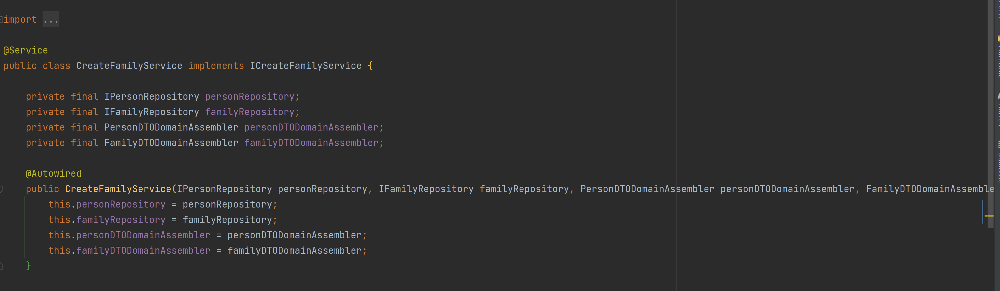
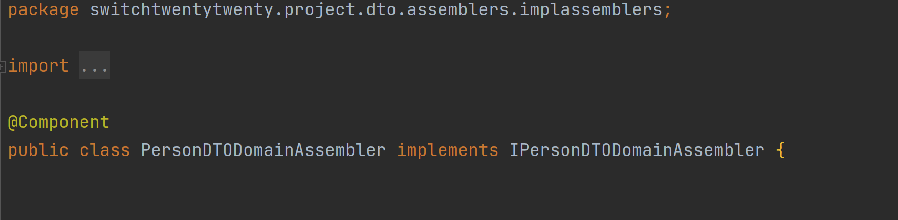
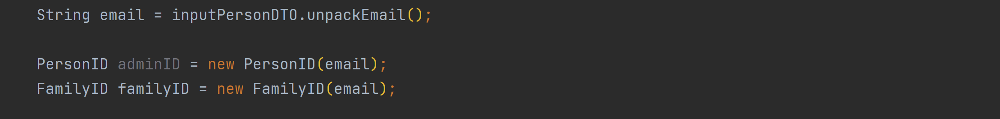
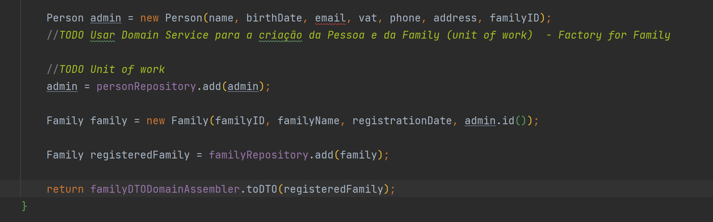

# Sprint 3

# This document keeps track of the different Class Diagrams throughout the sprint

    22 março 2021

    Log:

## 1. Retirada 2ª hipótese representação de agregado Category.

## 2. Hipóteses de ligação da Family às Categories:

### a. TreeTop ligado ao FamilyID (Uma treetop tem um familyID)

### b. Agregado Category tem uma Categoria Raíz.

Existe apenas Interface Category no Agregado Category (remover o TreeTop) implementada por Standard e Custom Category.  
Family tem ligação de 1 para 1 com um CategoryID (Value object) que corresponde a uma Standard Category.  
Esta Standard Category implementa a Interface Category (Root).

### PERGUNTA: Uma Root Entity de um agregado pode ser uma Interface?

### c. Três subtipos de Category que implementam a Interface Category.
A TreeTop será uma Category que não tem ParentID e possivelmente a Designação envolverá o nome da família.
NOTA: Pode-se eventualmente definir o parentID da TreeTop como um número "default" (exemplo -1)  
Este número quereria dizer que não há Categoria pai e o ciclo parava de iterar em busca de um parent.
##### Boa prática? Número mágico


## 3. Representação de ligação entre pessoas e famílias


### Versão 1
Family Members conhecem a sua família.  
Family não conhece os seus family Members  
FamilyMember tem um atributo ID (Email) e tem um outro atributo familyID (email do admin)


### Versão 2
Family conhece os seus members.   
Members não conhecem a família a que pertencem
Family tem uma lista de Family Members (emails)
Family Member tem um ID (email)


Hipotése C das Categories + Versão inicial de Family e Family Members (Antes da aula de LABPROJ II)


---

Hipótese B das Categories + versão 1 Family e Family Members


---  

Hipótese B das Categories + Versão 2 Family e Family Members


---
---
---
---

# Sprint 4


05/04/2021

Dúvida enviada à Prof Isabel em 09/04/2021

Opção Um:
```puml
hide empty members
skinparam linetype ortho

interface Account {
}

interface NonCashAccount{
}

class CashAccount {
}

class BankAccount {
}

class CreditCardAccount{}

class DebitCardAccount{}

class AccountData{}

CashAccount .--|> Account
NonCashAccount .-|> Account

BankAccount .-|> NonCashAccount
CreditCardAccount .-|> NonCashAccount
DebitCardAccount .-|> NonCashAccount

AccountData --* CashAccount
AccountData --* BankAccount
AccountData --* CreditCardAccount
AccountData --* DebitCardAccount

'note "Data dentro da AccountData. Cons: Codigo desnecessário (fowards em todas as contas) Pros: Private class data pattern;" as note

Note as N1
    - Data dentro da AccountData
    Cons:
    - Codigo desnecessário (forwards em todas as contas);
    - Acoplamento entre as implementações de Account e AccountData
    Pros:
    - Baixo custo de refactoring (feito no semestre passado)
    - Fácil acrescentar novos atributos
end Note

@enduml
```
Opção dois:
````puml
@startuml

hide empty members
'skinparam linetype ortho

interface Account{
}

abstract class AbstractAccount {}

abstract class NonCashAccount{
}

class CashAccount{
}

class BankAccount{
}

class BankSavingsAccount{
}

class CreditCardAccount{
}

AbstractAccount .-|> Account

CashAccount --|> AbstractAccount
NonCashAccount --|> AbstractAccount

BankAccount --|> NonCashAccount
BankSavingsAccount --|> NonCashAccount
CreditCardAccount --|> NonCashAccount

'note "Data dentro da AbstractAccount. Cons: herança; Pros:" as note

Note as N1
    - Data dentro da AccountData
    Cons:
    - Herança;
    - Acoplamento entre as implementações concretas de Account e AbstractAccount
    Pros:
    - Abstração da implementação;
    - Redução de codigo repetido 
    (evitar forwards para a classe que contém a data);
end Note

@enduml
````


---
---


## Discussão Possibilidades Domain Model (09/04/2021) :


###1. Atualmente implementada (09/04/2021):

   Accounts não conhecem os seus "owners". Person e Family é que conhecem as suas Accounts (através de um AccountID).  


   **Vantagens**:
   Permite iterar apenas dentro do Agregado pretendido.
   Isto é, as Accounts estão só na Person ou na Family e como tal não
   é necessário iterar por todas as Accounts existentes no Universo.

   **Desvantagens**:
   Necessidade de escrever em dois Agregados em simultâneo (Person + Account ou Family + Account).
   Assim, como a Account não conhece o seu OwnerID tem de se guardar a Account no AccountRepository e no Person ou FamilyRepository.


###2. Account conhece o Family Member a que pertence. Account conhece PersonID.
   Account também conhece a Family a que pertence (No caso da Family Cash Account)  
   

   **Vantagens**:
   Ao adicionar uma Account não necessitamos de escrever em dois repositórios (Family + Account ou Person + Account).
   Neste caso como temos o ID da Person ou Family, apenas é necessário guardar no Repository das Accounts, visto que já conhecem o seu Owner (Não tem de se escrever também
   no Repository de Person ou de Family).

   **Desvantagens**:
   Mais uma Interface que tem de ser criada (ownerID) que implementa a Interface ID e que servirá de atributo da Account
   (Assim, este atributo é o mais genérico possível podendo ser um identificativo
   de Person, Family, ou outra coisa que possa surgir).

   **NOTA: Inverso do que está atualmente implementado (09/04/2021)**

12.04.2021
---------------

Reunião com: todos

- Accounts:

   - Discussão entre as 2 hipoteses sugeridas antes. Verificação de vantagens e desvantagens entre cada solução.
   
   A class **PersonID** ou **FamilyID** é uma implementação de **OwnerID**, e cada conta teria como atributo um **OwnerId** em vez de ter um **PersonId** ou um **FamilyId**

   **A decisão de qual das alternativas a adoptar está dependente da resposta da prof Isabel ???**

- Next steps:


   

   Team1 :  US101, US150, US151
   
   Team2 : US170, US171, US172, US173, US120

   - Vamos avançar para qual ?
```US101 As a family administrator, I want to add family members.```
     
```US150 As a family member, I want to get my profile’s information.```

```US151 As a family member, I want to add an email account to my profile.```

- US101


------------------------------

## Dúvidas para Prof Nuno Silva - 13/04/2021

REF: SD US010/US101

**1. No SD representam-se os nomes das instâncias?** 

Refere-se que são Interfaces ou Implementações?

Referência - aula NB  

**Prof referiu que instanciação de Value Objects poderia (deveria??) ser feita na camada que faz fronteira com o Domínio.**

Dúvida: Se se entender que o Controller é essa "fronteira" e que criaria os Value Objects, de onde virão os DTO's (Que supostamente transitam do Controller
para o Service).

**2.** Onde instanciar os DTO?, controller?! AppService?

**3.** Explicação do SD do Prof Nuno Silva


Mapeamento automático, no controller, para DTO, qual a anotação?
Classe from data to DTO (Assembler)
Transferir dados entre camadas (Interface to AppServ e vice)
Classes de domínio dependentes de VO 
Criar VO na camada AppServices

por estereotipo no SD, interface 


-------------------------------------------------------------


## Dúvidas - 14/04/2021

**1. Qual é a terceira opção, a elegante? (Professora Isabel)**


-----------------------------------------------------


**2. O que faz sentido nos domain services?**

R: 


P.e. as transferencias têm que manipular dois ledgers, obrigando a ter lógica de negócio na sua manipulação

No caso de create Family and set Admin, como os domain services não têm contacto com a camada de repositórios, não podem fazer as validações necessárias...

**3. Como representar os Builders nos SDs?**

R: respondido e alterado.


Ver documentação da US150

## Decisões a 13/04/2021

AccountData para aglomerar os atributos gerais das Accounts
As Accounts conhecem os seus owners através do OwnerID
Repositorios recebem objetos de domain
Só representamos service para a frente nos SD e "abstraimos" do funcionamento dos repositórios
Mapper para fazer DTOs de saída (exemplo: ProfileInfoDTO)
ID SEMPRE EM CAPS
add no repo para adicionar e save para alterar

14.04.2021 12:01
---------------

Após a aula do PBS alterou-se o SD da US150 na parte do BuilderDTO

Definir o workflow:

- Aplicar o **SpringBoot** nas US010,US101,US101,US151,US001 (esta se conseguissemos fazer era mesmo TOP)

- Aprender a usar o **Mockito** correctamente

- Foi decidido a US010 - Create a  Family and Set Administrator para aplicar SpringBoot + Mockito
    Por esta US a funcionar desde o principio ao fim !!!!

- Testes de integração : abordamos qualquer coisa no final


16.04.2021 17:05
--------------

- Testes AddFamilyMemberServiceTest: getFamilyID

```

if (!personRepository.isPersonIDAlreadyRegistered(personID)) {
    Person admin = personRepository.getByID(loggedUserID);
    FamilyID familyID = admin.getFamilyID();

    Person person = new Person(name, birthDate, personID, vat, phone, address, familyID);
    personRepository.save(person);
}
        
 ``` 

1. A partir da implementação sabemos que este método não falha (visto que a Person na linha anterior foi instanciada num estado válido , com sucesso), sendo impossível não haver retorno deste ID.

2. Segundo a informação que temos sobre _Mock Tests_ estes não devem ser vocacionados para a implementação, e como tal a dúvida é se devemos testar/simular todas as condições inseridas dentro do método.


-----------------------------------------------

Discussão Controller/Service - 16/04/2021

Entre o AddFamilyMemberService e o CreateFamilyService e respetivos controllers, não havia congruência.

No CreateFamilyService o método do Service era boolean e no AddFamilyMember era Void. Ambos usavam a verificação de isPersonAlreadyRegistered que não lança exceção.

Assim, no AddFamilyMemberService se o isPersonAlreadyRegistered fosse true, o método não ia adicionar o Member mas não lannçava exceção para o Controller. Ou seja, o Controller assumia como True a adição da Person sem ela acontecer.

Criou-se uma PersonAlreadyRegisteredException para ambos os Services e converteu-se os métodos para Void pela lógica de poderem falhar por vários motivos (Ao contrário de um boolean que apenas diz true ou false, "sem se saber porquê").

-----

Aula Labproj II - Prof NB

**1** Nos testes do AddFamilyMemberService podemos optar por testar apenas o DTO com um dos Value Objects inválidos e verificar se o método parte por aí.
Ou seja, não é necessário testar todos os value objects e todas as exceções.

Podemos, no entanto, fazê-lo caso um dos objetivos seja verificar que ele parte pelas diversas exceções criadas (Esses testes podem ser feitos nas classes específicas dos Value Objects).

**2** No AddFamilyMemberService estava a haver uma validação para verificar se já existia um user na Aplicação com aquele ID e só depois de verificar é que era instanciado e depois guardado. Como o método do Repository é um Save, pode-se dar esta responsabilidade ao Repository. Ou seja, a pessoa é sempre criada desde que os Value Objects sejam válidos e de seguida é o Repository com a sua magia negra que quando recebe o objeto verifica se já existe algum com aquele ID.

Onde é que isto pode correr mal? perguntou nenhum de vocês...

Se quisermos ter alguma adição ao objeto temos de ponderar uma forma de _update_ em detrimento de um _save_ (Neste momento não é um requisito)

--- 

**Discussão** - 19/04/2021

Nos Repositories ter dois métodos distintos - add e update (Em vez do save() que é ambíguo)

Assim os _adds_ seriam sempre de acréscimo de algo inexistente e o _update_ um overwrite de algum objeto já existente.

## Dúvidas para Prof Nuno Silva - 20/04/2021

1. Repositories CRUD ou JPA? Qual vai ser utilizado?

(Em função disso, usarmos a nomenclatura adequada.)

2. Dúvida sobre representação das associações/generalizações no diagrama de classes onion.

Como determinada classe é atributo de outra, representar como associação é errado?

---------------------------------------------------------

## JPA - tutorial

1. Criar versão **JPA** das classes envolvidas.
2. Anotar com  **_@Entity_** todas as classes que vão ter uma tabela (em classes de Domínio que têm uma colecção, a própria colecção vai gerar uma tabela , ver o caso das _Relations_ na classe _Family_)
3. Anotar com **_@Id_** a classe chave
4. Anotar com **_@Embedded_** as classes relativas a value objects (serve para criar uma coluna com o respectivo _value object_ na tabela da entidade)  
Anotar com **_@Embeddable_** as classes que podem ser "embebidas" na tabela. 
   
5. Anotar com **_@OneToMany_** as coleções que vão gerar tabelas.

 ```
@Entity
public class FamilyJPA {

@Id
private FamilyIDJPA id;

@Embedded
private FamilyNameJPA name;

@Embedded
private RegistrationDateJPA registrationDate;

@Embedded
private PersonIDJPA admin;

@OneToMany
private List<RelationJPA> relations = new ArrayList<>();
//...
}


@Table(name="relations")
@Entity
public class RelationJPA {

    static class FamilyRelationJPA {

        @Getter
        @ManyToOne
        @JoinColumn(name = "


}
 ```


_____________________________________________________________

21.04.2021
----------------

Em sala:

Implementação JPA

Novas classes:
|

| Class    | Interface | IAssembler |
|------------|----------|---------|
| PersonJPA | + Interface | PersonAssembler.toDATA() + .toDomain() |
| PersonIDJPA | + Interface |  |
| FamilyJPA |   |    |
| FamilyIDJPA |   |    |
| FamilyRepositoryJPA |   |   |


Decidido que os atributos ID (PersonID e FamilyID) não seriam convertidos para JPA.
Com a anotação @ToString nestas Classes converte-se sempre o objeto de domínio para String (Dado Primitivo) e assim a passagem de camadas não é errada.

## JPA - Objectos em JPA

Decidimos que as classes JPA (ex.: PersonJPA, PersonIDJPA, FamilyJPA) não devem implementar interfaces tal como as classes do domínio, pois apenas deve existir uma implementação destas. Também temos em conta que estas classes não têm comportamento para além de getters e setters e um método toString, pelo que seria mais trabalhoso criar interfaces para cada uma.

19:00
--------------

Ponto de situação:

1. os atributos de FamilyJPa podem/devem ser **@Embeddable** ?

2. Assumindo que o PersonJPA tem o AddressJPA  
   (PersonJPA , AddressJPA ) é 
   necessário AddressJPA ter o PersonJPA como atributo?  Se sim , o AddressJPA tem de ser set no PersonJPA.

# Sprint 5

— Divisão de tarefas de acordo com a popular série de animação _South Park_

Grupo Timmy - SD
- US101 As a family administrator, I want to add family members.
- US151 As a family member, I want to add an email account to my profile.
- US150 As a family member, I want to get my profile’s information.

Grupo Cartman - SD
- US120 As a family administrator, I want to create a family cash account.
- US170 As a family member, I want to create a personal 74 cash account.
- US171 As a family member, I want to add a bank account I have.
- US172 As a family member, I want to add a bank savings account I have.
- US173 As a family member, I want to add a credit card account I have.
- US001 As a system manager, I want to create a standard category.

---

Aula LABPROJ 26/04/2021

 1. Prof. Bettencourt referiu que em DDD os Value Objects que apenas têm uma propriedade/atributo podem não ser representados por forma a minimizar a complexidade do Diagrama (Isto no Modelo de Domínio)

2. Diagrama de Classes - Supostamente não deve conter os Packages.

3. Bidirecionalidade entre Family e Person deve ser removida:

    3.1. Supostamente cria-nos o problema do tipo "espiral infinita de falos".


Hipóteses em discussão:

1. Family tem list<PersonID> members e PersonID admin
2. Person tem FamilyID familyID e boolean isAdmin
3. Person tem subtipo Admin


** Grupo Timmy**

US101 - On hold até decisão de como fica o familyID

Validação de Admin está definida como sendo implícita na App. (Cagamos para validar o admin!)


## Perguntar Prof. Nuno Silva se o Class Diagram tem os métodos dentro das Classes.


### Tabela métodos HTTP


| **_Método_**         | **_Cenas que faz / Cenários_**                                                                   |
| :-------------------------- | :------------------------------------------------------------------------------------- |
| **GET**                    | Autoexplicativo. Dados estão "seguros". Não edita/cria nada.                                                                       |
| **POST**               | Adicionar algo específico/concreto. Depende da validação do Backend. Exemplo da nossa App: Um pedido POST para adicionar email irá validar junto do Backend se o email já existe e consequentemente falhar. O PUT já aceitaria sempre!
| **PUT**                 | O Batista quando está muito bêbado -> Aceita tudo! Não depende de validações do Backend. Vai sempre aceitar o que lhe for deitado.                                                                     |
| **PATCH**               | Usado para alterar algo cujo outcome não é específico. Exemplo: Pedir para atualizar o saldo de todas as contas com mais de 100€ e passar esse saldo para 0€. Apesar de ser possível executar não é específico. O client não sabe quantas contas vão ser afetadas.                                       |
| **DELETE**            | Autoexplicativo.                                          |
| **OPTIONS**             | Utilizado para listar um determinado conjunto de opções de determinado recurso.                                          |

### Dúvida mapeamento:

Categories

1. Mapear as Custom Categories por URI de _families_ e as Standard Categories pelo URI de _categories_?
2. Mapear todas as categories pelo URI _categories_?

---
##27/04/2021
## REST Controllers planning


---

---

REST Controllers planning


---

### Decisão do Autowired ser colocado no construtor e não nos atributos.
Nos testes evita o problema de haver objetos instanciados como nulos. Nas classes "finais" como DTOs recorrer a anotações de _allargsconstructor_

#28/04/2021

Ter em atenção os equals - deve ter apenas os atributos que dão a identidade ao objeto. Em OneToMany/ManyToOne, quando temos o JoinColumn, pode originar uma EIDC e consequentemente um StackOverflow

Foi retirado o admin ID do InputPersonDTO (não era necessária essa informação para a criação de Person)

03.05.2021
-------------

Duvidas:

* Após gravar no Repositorio JPA devemos retornar uma "representação" do que foi gravado ?
  Ou seja , por ex. no SD US101 no ponto 10, o método **save** deve return uma **savedPerson** , de modo a que se consiga aferir se este método realmente realizou esse _save_. Com o método a ser _void_ não temos como saber se a _Person_ foi adicionada.
  
  
* as "entradas" via GET podem ser pelo string que vem do uri, ou temos que entrar com um DTO , por ex. na US150 podemos ter `.../{PersonID}/`
  em vez de "entrar" com um **_inputDTO_**.

REST Controllers planning

````java
@Requestmapping(value="/persons/")
public class PersonController {
    // devolve pessoa com {id} (US150)
    GET /"*{id}/"
    
    // adiciona um email à pessoa com {id} (US151)
    POST /"*{id}/emails/" 
    
    // add member (US101)
    POST /"*" 
}

@Requestmapping(value="/families/")
public class FamilyController {
    // criar família e set admin (US010)
    POST /"*"
    
    // lista de family members e suas relações (US104)
    GET /"*/{familyID}/members/"
    
    // criar relação (US105)
    POST /"*/{familyID}/relations/"

    // alterar relação (US105)
    POST /"*/{familyID}/relations/{relationID}"
    
    // obter category tree da família (US110)
    GET /"*/{familyID}/Categories/"
    
    // adicionar categoria custom (US111)
    POST /"*/{familyID}/Categories/"
}

@Requestmapping(value="/categories/")
public class CategoryController {
    // criar standard category (US001)
    POST /"*"
    
    // obter standard category tree (US002)
    GET /"*"
}

@Requestmapping(value="/accounts/")
public class AccountController {
    // Create an account (US120, US170-173)
    POST /"*"
    
    // Get balance
    GET /"*/{accountID}/balance"
    
}
````

03/05/2021 - Aula LABPROJ

Cada funcionalidade deve ter no final do seu método as opções que se pretendem para o final de cada passo. Exemplo, no próprio método do CreateFamilyandSetAdmin, no final deve ter também um OPTIONS com aquilo que depois de adicionar a família e definir o admin, o user pode fazer.


Acrescentar mais um Assembler para fazer a conversão de "outsideDTO" para inputDTO. 
R: SIM

Vai-se manter o "problema" do acoplamento do Controller com um DTO externo + 2 DTO's internos, mas assim já não se andam com get() no Controller nem new xxxDTO. Converte recorrendo a um assembler antes de enviar para o Service.

Professor referiu que a Interface ID não precisa de receber um <T> porque os IDs vão ser todos primitivos.


## 04/05/2021

- Visto que o ID do admin e o ID da familia são o mesmo, ir buscar uma cash account do admin ou da familia seria indistinguivel. Como tal, familyID será sempre no formato "@+adminID".


### 04/05/2021 - Aula DSOFT II

### 1. Conversão de DTO externo ou String para DTO interno no Controller é sempre correto. Na dúvida, faz-se sempre a conversão mesmo que só entre uma String.

### 2. Depois de alterar um objeto e enviar para a persistência há situações em que não é necessário retornar esse objeto depois de transformado em Data, há situações em que é conveniente e outras em que é mandatório. Isto tudo para dizer o quê? Talvez seja preferível ter sempre essa devolução e operar com os dados daí provenientes (Exemplo SD do US001 ponto 5).

### 3. Os OutputDTOs devem ser manipulados no Service por forma a que dos objetos de domínio sejam convertidos para DTO contendo apenas o necessário para depois exteriorizar.

Exemplo: Um personOutputDTO pode não ter todos os dados do objeto Person. Dependendo de quem está a fazer o pedido para aceder aquele recurso, podemos limitar a quantidade de informação exteriorizada.

### 4. No Controller, ao OutputDTO que vem do Service é são acrescentados os links referentes ao recurso.


## 04/05/2021 - tarde

Accounts - todas as accounts usam um DTO de entrada único. Apenas um serviço que trabalha com interface Account. O assembler toDomain é que deve processar a informação que recebe no DTO e criar então o tipo de account específico. O DTO tem um atributo que especifica o tipo de conta, para alem de tudo o resto necessario para criar a conta

Assim para a criação de qualquer tipo de account apenas existe um método em controller, serviço e repositório.

Mais tarde se necessário diferenciar accounts pelos seus atributos (por exemplo bank account ter mais uma série de atributos que cash account), pode ser feito mais um pedido para adicionar a informação complementar.

----
### 10/05/2021 - Manhã -> Decisões naming e Assemblers

Decidiu-se que no Controller haverá um Assembler por Agregado e que essa Class terá a responsabilidade de converter dados externos que chegam ao Controller em qualquer tipo de DTO necessário para as User Stories desse Agregado.

### Naming

Do Controller para o Service será usada a nomenclatura nos métodos do Assembler como _toInput{US}DTO()_

O DTO que vai para o Service depois de convertido pelo Assembler do Controller -> _Input{US}DTO_


---

### Aula DSOFT - 11/05/2021

Service instancia Objetos de Domínio recebendo Value Objects.

Repository também vai instanciar Objetos de Domínio recebendo os Value Objects que o Assembler estrairá dos objectos JPA.

Factories e Builder -> Prof referiu que o Builder não é necessário para o que estamos a fazer. Que as Factories cumprem o necessário.

No entanto deixou em aberto que também gostaria de ver o Builder.

# Decisão -> Factories vs Builder

# Sprint 6

## Discussão de implementação das USs em atraso

- US001 As a system manager, I want to create a standard category{
 + CategoryRESTController + metodo  
 + CreateStandardCategoryDTO (o que vem de fora)
 + InputCreateStandardCategoryDTO
 + Assembler para o DTO acima
 + Create Standard Category Service
 + Assembler com metodos toDomain para criar value objects e que cria o Output tambem
 + Factory (?)
 + Repositório de Categorias (standard e custom)
 + Assembler to Data (JPA) que faz o reverse tambem
 + Mirror objects em JPA
 + StandardCategoryOutputDTO para levar info + links
}
   
- US002 As a system manager, I want to get the standard categories tree.{
 + Metodo no Controller  
 + GetStandardCategoryTreeService
 + StandardCategoryTreeOutputDTO
 + O OutputDTO acima seria feito pelo mesmo assembler da US anterior
}

- US110 As a family administrator, I want to get the list of the categories on the family’s category tree.{
+ Metodo no controller da Family
+ InputGetFamilyCategoryTreeDTO 
+ Assembler para fazer o DTO acima (poderá ser o assembler da Family)
+ GetFamilyCategoryService (vai interagir com o repositorio de categorias)
+ OutputCustomCategoriesDTO
+ DTO acima será feito pelo good ol' assembler de categorias
}
   
- US105 As a family administrator, I want to create a relation between two family members.{
+ Metodo no family Controller
+ CreateRelationDTO
+ InputRelationDTO
+ Assembler para o dto acima
+ CreateRelationService (vai interagir com o repo da Familia para a updatar)
+ Assembler para fazer os ValueObjects (pode ser o assembler da Familia?)
+ RelationJPA e tudo o resto em termos de mirror que seja preciso
+ OutputRelationDTO (criado com o assembler que ja existe da Familia)
  (Verificação de ambos os membros na mesma familia + não é relação com o proprio)
}

- US104 As a family administrator, I want to get the list of family members and their relations.{
+ Metodo no family Controller
+ InputRelationListDTO
+ Assembler (provavelmente o que ja existe)
+ GetRelationListService
+ DomainService para ir buscar as pessoas
+ OutputRelationListDTO
+ DTO acima usa o assembler existente
}
  

###Novas:
- US003 As a System Manager I want that the list of standard categories to include those loaded (whenever needed) from a complementary system defined by configuration. => Perguntar ao Professor NB
  
- US111v2 As a Family Administrator, I want to add a custom category to the family’s category tree "extended" from either external or internal standard categories.
  
- US080 As a System User, I want to login into the application in order to use it.


### Aula Labproj 24/05/2021

Relativamente à questão das configurações de sistemas externos.

Previsto sermos capazes de importar Categories de outros grupos. 
Temos de aplicar o padrão Adapter para poder traduzir toda a informação proveniente dos grupos para adaptar aquilo que os outros disponibilizam na API deles, para aquilo que precisamos para a nossa aplicação.


Autowired desnecessário no Construtor:


Anotação Component desncessária nos Assemblers (Assemblers deixam de ser Autowired porque pode haver várias instâncias de Assembler e não precisa de ser só uma específica - Que é o que se consegue com Autowired)




Em vez de usar o unpack Cenas mais unpack outras cenas, usar uma variável para ambas:



Garantir que o email que é usado para identificar o admin é o proveniente da persistência e não aquele que é passado inicialmente. 




### Discussões - Relations / Histórias Maravilhosas de Superação

1º Relation no domínio

- Manter Relation na Family implica que para a user story de obter as pessoas e as suas relações temos de ir ao agregado da família e das pessoas. Isto é demasiado?  
  
- Se relation estivesse no agregado das pessoas poupavamos entrar num dos agregados. No entanto ao criar uma relação, teríamos de a adicionar às duas pessoas para que as duas saibam que têm uma relação.  
  
- Um terceiro agregado Relation também seria uma solução, mas se calhar implicava mais complicações?  


2º Identidade da Relation

- Ao criar uma Relation, se quisermos que o ID venha da persistência, temos de obter primeiro a família, fazer set da Relation na família, guardar a família, obter a família guardada e ir buscar a Relation com o ID à família guardada e de alguma forma não perder a relation que acabamos de criar na lista de relations da família
  
- Outra opção é o RelationID serem as duas pessoas envolvidas na relação. Entra aquele ponto de só poder haver uma relação entre duas pessoas (não pode haver de A para B e B para A, são a mesma relação). 
  
Poderia haver um RelationID cujos atributos são dois PersonIDs e haver um método compareTo que diz que uma relação é igual a outra se as pessoas envolvidas forem as mesmas, independentemente da ordem. No entanto, a ordem dos PersonIDs é importante para saber a quem se refere a relação, isto é: Se a relação de A para B é pai, então A é o pai de B. Num json de saída, esta relação deve aparecer no membro A. Se tentarmos criar uma relação de B para A, deve dar erro porque já existe uma relação entre eles.


# Decisões Relations - 25/02/2021

Decisão -> Relations permanecem na Family.

Não pode haver uma relação inversa entre dois membros. Isto é garantido pelo nosso Equals da Relation:

Valida se A == B && B == A || A==B && B==A.

Relation tem ID que é gerado por nós na Aplicação através do hashcode do objeto Relation. 

Garante-se que não há hashcodes repetidos graças ao equals (Validação é responsabilidade da Family no momento do family.addRelation()).


### Reunião com Prof. Nuno Silva - 25/05/2021

Quando o Serviço fizer o pedido de Categorias vai ter de verificar em 2 repositórios diferentes. O nosso e um de outro Grupo.

Por configuração vamos definir que em dado momento esteja a aceder ao Repositório de Categorias de um Grupo. O que temos de preparar é as duas configurações para que, quando quisermos, alternamos de uma para a outra.


Vamos aceder a um Repositório HTTP dos outros grupos (Ver slide 11 de _Something About Layers and Onions_)

O Service vai definir uma Interface de Repository HTTP que vai ter lá um equivalente a um findAll 

A configuração é que vai dizer ao Spring qual é a implementação da Interface RepositoryHTTP que o Service vai "escolher".

_Full Qualified Names_ -> Endereço HTTP para um recurso.

A Categoria já não vai ser reconhecida pelo seu ID mas sim pelo seu endereço "completo", ou seja "http/cenas/cenas/grupo3/categories/id"

Podemos ter o "problema" de estar ligados ao Grupo 1 e termos uma custom category que é filha de uma relação anterior com o Grupo 2. Aqui as Customs Categories vão guardar o URL inteiro como o seu "ParentID" (Ou parentLink) para que se consiga sempre conhecer a localização da Parent Category. 


findAllCategories


### Manhã - 28/05/2021

O DTODomainAssembler de relations tem a criação do link lá dentro. Normalmente é uma tarefa do controller.

No entanto, ao controller devolvemos um DTO que é uma lista de DTOs, logo não conseguimos adicionar links aos DTOs que lá dentro.

Solução A:
- Manter como está, quando cada DTO é criado é logo adicionado o link no assembler.

Solução B:
- O serviço passa ao controller uma lista de DTOs e o controller faz um loop a cada um para adicionar o link e depois adiciona-os ao DTO de saída.


Esclarecer Unit of Work com o prof Nuno Silva se possível. Unit of Work é uma classe? Ou pode ser uma interface que o domain service (ou outra classe) implementa? Se for uma classe, em que layer deve estar o UnitOfWork?

Sendo uma class:
- Só precisa de ter um atributo para uma family, uma person e respectivos repositórios, mais métodos set (ou register). Um método commit deve enviar para o repositório as alterações a fazer.

Sendo uma interface:
- O DomainService implementa UnitOfWork, tem como atributo uma person e family que vai criar e conhece os repositórios destas. Faz overwrite dos métodos registerNew() e commit().


### Decisões prioridades Sprint 6:

**1.** - Servers e Base de Dados no Servidor.

    1 - Frontend
    2 - Backend
    3 - Database

1 interage com 2 e 2 interage com 3;


**2.** - API - Ligação com outros grupos

    1. US 003
    2. US111v2 (Menos prioritário)

**3** Frontend

---

Cenas do JPA com o Lazy/Eager -> Lazy traz apenas aquilo que é diretamente pedido (exemplo, family, traz apenas a family). Eager, traz tudo o que estiver associado a essa family (por exemplo relações).

Quando há mais que uma lista para ser retornada na mesma Class é necessário definir o _@Fetch(FetchMode.SUBSELECT)_ para ele não se borrar todo e saber quais são as tasks prioritárias.


---

# Autenticação
Link Prof Nuno Silva:

https://bezkoder.com/spring-boot-jwt-authentication/

Wiki:

Partes da Wiki com texto a cinzento, não mexe.

Contents:

Problemas: Em formato de US, com os requisitos e os critérios.

Em Implementation Constraints: JAVA, Hibernate JPA, Single Page App, Usar DDD, Client-Server,...

Architectural Approaches > Praticamente copy paste dos requisitos não funcionais (Níveis 1, 2 e 3)


Mapping between Views - > NÃO FAZER.

Referrenced Materials e Glossário não é mandatório mas pode-se fazer.