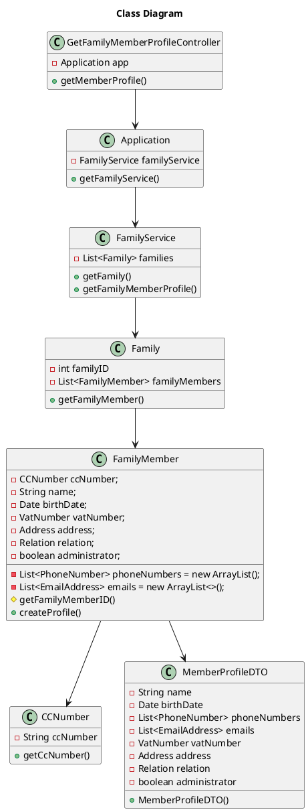

# US150 Get Family Member Profile Information
=======================================


# 1. Requirements

*As a family member, I want to get my profile’s information*


**Demo1** As a family member, I want to get...

- Demo1.1. My family member profile information

We interpreted this requirement as the function of a user to receive their personal profile information.

- A MemberProfile needs to have the following information:
    - Name;
    - Birth Date;
    - Phone Number(none or multiple);
    - Email (none or multiple);
    - VAT Number;
    - Address;
    - Relation with Administrator(none or one);
    - If member is administrator.

# 2. Analysis

In order to fulfill this requirement, we need two main data pieces:
- Family ID of the actor's family
- Family Member ID of the actor's profile

At a later iteration, both the family ID and the family member's ID would be acquired through the Log In information. For this sprint, the IDs will have to be inputted.

This User Story is highly reliant on both the Family and FamilyMember classes, particularly the last one. A DTO approach was chosen to encapsulate the required information, as well as to provide more control over which member information is transmitted.


# 3. Design

The main process to fulfill this requirement would require the actor to select they want to add an email in the UI, which would then prompt the retrieval of their familyMemberID and familyID. In lieu of not having an UI, the Int *familyMemberID* and *familyID* will be directly inputed into the GetFamilyMemberProfileController. 
````puml
@startuml

autonumber
title Get Profile Info
actor "Family Member" as familyMember
participant ": UI" as ui
participant ": GetFamilyMemberInfoController" as controller
participant ": FFM Application" as app
participant "famServ : FamilyService" as familyservice
participant "aFamily : Family" as family
participant "aFamilyMember : FamilyMember" as fm
participant "aProfile : MemberProfile" as profile

activate familyMember
familyMember -> ui: Request Profile Information
activate ui
ui -> familyMember: Request familyID and familyMemberId
deactivate ui
familyMember -> ui: input familyID and familyMemberId
activate ui
ui -> controller: getMemberProfile(familyId, familyMemberId)
activate controller
controller -> app: getFamilyService()
activate app
app -> controller: famServ
deactivate app
controller -> familyservice: getMemberProfile(familyId, familyMemberId)
activate familyservice
loop find family
    familyservice -> familyservice: findFamily(familyID)
    end
familyservice -> family: getMemberProfile(familyMemberId)

activate family
loop find family member
    family -> family: findFamilyMember(familyMemberID)
    end
family -> fm: getMemberProfile()
activate fm
fm -> profile**: createProfile()

fm -> family: aProfile
deactivate fm
family -> familyservice: aProfile
deactivate family
familyservice -> controller: aProfile
deactivate familyservice
controller -> ui: aProfile
deactivate controller
ui -> familyMember: aProfile

@enduml
````

## 3.1. Functionality Use
The GetFamilyMemberProfileController will invoke the Application object, which stores the FamilyService object. The Application will return the FamilyService to the Controller, and the getMemberProfile method is called to retrieve the Profile as a MemberProfileDTO object, using the familyID and familyMemberID. The Family is retrieve in the FamilyService instantiation and Family Member is then retrieved from the corresponding family.
The Family Member the uses the method createProfile to generate a new object of the type MemberProfileDTO, which is then returned to the FamilyService and then to the Controller.


## 3.2. Class Diagram
The main Classes involved are:
- GetFamilyMemberProfileController
- Application
- FamilyService
- Family
- FamilyMember
- MemberProfileDTO
- CCNumber



## 3.3. Applied Patterns
We applied the principles of Controller, Information Expert, Creator and PureFabrication from the GRASP pattern.
We also used the SOLID SRP principle.

## 3.4. Tests 
    
The following preparation was made for the execution of the tests:

    The tests were conducted on FamilyMemberTest, FamilyServiceTest and GetFamilyMemberProfileControllerTest.
    For the purpose of these tests, it was assumed that all classes and methods that were created in which this implementation depends, have been properly tested.
    

**Test 1:** Verify that a correct email is accepted

    @Test
    public void checkifEmailAdded() {
    assertTrue(controller.addEmail("test@isep.ipp.pt", 666));
    }

**Test 2:** Verify that a correct email is not accepted if already entered before

    @Test
    public void checkEmailAlreadyPresent() {
        controller.addEmail("test2@isep.ipp.pt", 666);
        assertFalse(controller.addEmail("test2@isep.ipp.pt", 666));

    }
**Test 3:** Verify that an exception is thrown when there is no family member with the inserted ID

    @Test
    public void checkIfThrowsWhenNoSuchID() {
        assertThrows(IllegalArgumentException.class, () -> controller.addEmail("test3@isep.ipp.pt", 888));
    }
**Test 4:** Verify that an exception is thrown when there is a space in the inserted email string

    @Test
    public void CreatingEmailAddressWithSpace() {
        Throwable exception =
                assertThrows(IllegalArgumentException.class, () -> {
                    EmailAddress badEmail = new EmailAddress("11207 17@isep.ipp.pt");
                });
    }
**Test 5:** Verify that an exception is thrown when there is an illegal character in the inserted email string

    @Test
    public void CreatingEmailAddressWithIllegalCharacters() {
        Throwable exception =
                assertThrows(IllegalArgumentException.class, () -> {
                    EmailAddress badEmail = new EmailAddress("!1120717@isep.ipp.pt");
                });
    }
**Test 6:** Verify that an exception is thrown when there are two Ats in the inserted email string

    @Test
    public void CreatingEmailAddressWithTwoAts() {
        Throwable exception =
                assertThrows(IllegalArgumentException.class, () -> {
                    EmailAddress badEmail = new EmailAddress("1120717@@isep.ipp.pt");
                });
    }
**Test 7:** Verify that an exception is thrown when the inserted email is Blank

    @Test
    public void CreatingEmotyEmailAddress() {
    Throwable exception =
    assertThrows(IllegalArgumentException.class, () -> {
    EmailAddress badEmail = new EmailAddress("");
    });
    }
**Test 8:** Verify that an exception is thrown when the inserted email is null

    @Test
    public void CreatingNullEmailAddress() {
        String nullEmail = null;
        Throwable exception =
                assertThrows(IllegalArgumentException.class, () -> {
                    EmailAddress badEmail = new EmailAddress(nullEmail);
                });
    }

# 4. Implementation

**Finding the correct FamilyMember**

In order to find the relevant FamilyMember by its ID, a method was constructed to retrieve their index in the FamilyMember array in the Family Class:

    private int findFamilyMemberIndexByID(int familyMemberID){
        int index = 0;
        for (FamilyMember member : this.family) {
            if (member.getID() == familyMemberID) {
            return index;
            }
            index++;
        }
        throw new IllegalArgumentException("No family member with that ID was found");
    }

Following that, we can use it to retrieve the correct FamilyMember object:

    public boolean addEmail(String emailToAdd, int familyMemberID) {
        return family.get(findFamilyMemberIndexByID(familyMemberID)).addEmail(emailToAdd);
    }

**Creating and Adding the EmailAddress Object**

In the FamilyMember Class, we must first check if the email to add is already present in the EmailAddress array list. For that, the following method is used:

    private boolean isEmailAlreadyPresent(String emailToCheck){
        for (EmailAddress email : emails) {
            if (email.getEmail().equalsIgnoreCase(emailToCheck)) {
                return true;
            }
        }
        return false;
        }

So we can now create and add the EmailAddress object to the array list (emails):

    public boolean addEmail(String emailToAdd) {
        if (!isEmailAlreadyPresent(emailToAdd)) {
            EmailAddress newEmail = new EmailAddress(emailToAdd);
            emails.add(newEmail);
            return true;
        }
        return false;
    }

# 5. Integration/Demonstration

As of this sprint, this function has no integration with other functions.

# 6. Observations

In the future, the Family Member ID would ideally have to be retrieved by a method that checks the log in info of the current user, instead of the ID being manually inputted.  


