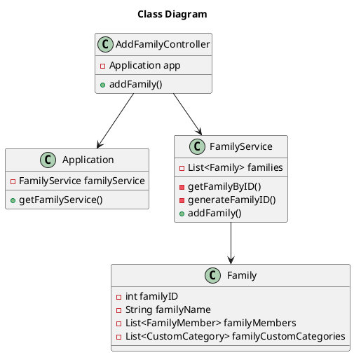

# US010 Add a Family
=======================================


# 1. Requirements

*As a system administrator, I want to add a family*


**1** As a system administrator, I want to add...

- 1.1. The new family "Moreira"

- 1.2. The already existing family "Moreira"

We interpreted this requirement as the function of a user to add a new Family.
The name of the Family must not be empty.

# 2. Analysis

In order to fulfill this requirement we need the input of the name of the Family

- 1. Family Name - the designation of the family

The registration date of the family is also kept and is equal to the system's date at the time of registration
A new Family identificator is generated when the family is created.

# 3. Design

The process to fulfill this requirement requires the actor to select they want to create a new family, 
which would prompt the input of the designation or name for that family.
Given the current absence of an UI layer the String *familyName* will be passed directly into the AddFamilyController. 

````puml
@startuml
autonumber
title createFamily
actor "System Manager" as systemManager
participant ": UI" as UI
participant ": CreateFamilyController" as controller
participant ": FFMApplication" as application
participant ": FamilyService" as famServ
participant "newFamily : Family" as family

activate systemManager
systemManager -> UI: create a new Family
activate UI
UI --> systemManager: ask new family name
deactivate UI
systemManager -> UI: input family name
activate UI
UI -> controller: addFamily(name)
activate controller
controller -> application: getFamilyService()
activate application
application --> controller: familyService
deactivate application
controller -> famServ: addFamily(name)
activate famServ

famServ -> family**: create(name)
famServ -> famServ: addFamily(newFamily)
famServ --> controller: ok
deactivate famServ
controller --> UI: ok
deactivate controller
UI --> systemManager: inform success
deactivate UI


@enduml
````

## 3.1. Functionality Use
The AddFamilyController will invoke the Application object, which stores a FamilyService object.
The Application will return the FamilyService, which contains a list of all Families.
The FamilyService then creates a new Family Object and adds it to the existing list.


## 3.2. Class Diagram


## 3.3. Applied Patterns
We applied the principles of Controller, Information Expert, Creator and PureFabrication from the GRASP pattern.
We also used the SOLID Single Responsibility Principle.

## 3.4. Tests 
    
Several cases where analyzed in order to test the creation of a new class Family    

**Test 1:** Test that it is possible to create a new instance of Family receiving a name and a categoryID 

**Test 2:** Test that it is not possible to create a new instance of Family receiving a **familyName** that is null

**Test 3:** Test that it is not possible to create a new instance of Family receiving a **familyName** that is empty

**Test 4:** Test that it is not possible to create a new instance of Family receiving a **familyName** that is blank

The whole user story was tested for the case of success and for failure

**Test 5:** Success
````   @Test
    void addFamily_testSuccess() {
        //Arrange
        Application FFMapp = new Application();
        AddFamilyController controller = new AddFamilyController(FFMapp);
        String familyName = "Moura";
        //Act
        boolean result = controller.addFamily(familyName);
        //Assert
        assertTrue(result);
    }
````
  
**Test 6:** Failure
````    @Test
    void addFamily_testFailure() {
        //Arrange
        Application FFMapp = new Application();
        AddFamilyController controller = new AddFamilyController(FFMapp);
        String familyName = "";
        //Act
        boolean result = controller.addFamily(familyName);
        //Assert
        assertFalse(result);
    }
````

# 4. Implementation

After providing a family name the FamilyService class creates a new Family object.

# 5. Integration
 
The development of this user story was the basis for the family structure where the FamilyMembers are stored and was thus crucial for the development of the other User Stories

#6. Observations

As with the Standard Category the family ID will probably need to be reworked in a future sprint to allow for more complex ID information if needed (probably using a UUID)