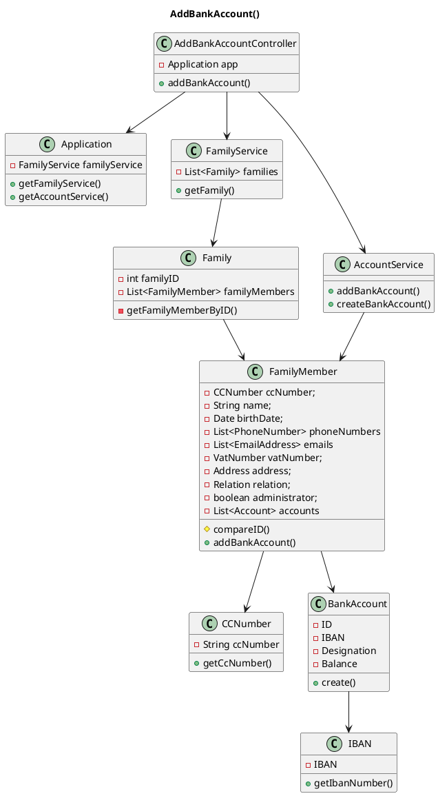

# US171 Add Bank Account to Family Member
=======================================


# 1. Requirements

### 1.1 Client's Sheet

- As a family Administrator, I want to add a familyMember to a family.

We interpreted this requirement as the function of a FamilyMember to add a Bank Account to his application account.

- A BankAccount needs to have:
    - ID (unique and generated by the Application);
    - IBAN;
    - Name;
    - Account Owner(s);
    - Current Balance;
  
The same Bank Account can be added to more than one Family Member;
The account balance can be negative;

  

### 1.2 System Sequence Diagram

```` puml

    autonumber
    title US171 - Add Bank Account SSD
    actor "Family Member" as familyMember
    participant "System" as system

    activate familyMember
    familyMember -> system: addBankAccount()
    activate system
    system -> familyMember: require data
    familyMember -> system: input data
    alt failure
    system -> familyMember : Inform Failure
    
    else sucess
    system -> familyMember : Inform Success
    end
    deactivate system
    deactivate familyMember

@endpuml
````


### 1.3 Dependencies

This user story has a dependency with these **1** user stories:

- **[US101](US101_AddFamilyMember.md)** *(As a family Administrator, I want to add a familyMember to a family)*
  - In order to add a bank account, the system needs to have that Family Member.
  
# 2. Analysis

In order to fulfill this requirement, we need three main data pieces:
- Family Member ID;
- IBAN;
- Bank Account Name;

The IBAN will be used to determine if the bank account has been created already by iterating through all members' Account Lists. If it hasn't, a new bank account will be created and added to the Family Member, if it has the same account object will be added to the family member.

At a later iteration, the family member's ID would be acquired through the Log In information. For this sprint, the ID will have to be inputted along with the Bank Account information.

# 3. Design

````puml
@startuml
autonumber
title US171 - AddBankAccout Sequece Diagram

actor "FamilyMember" as actor
participant ": UI" as UI
participant ": addBankAccountController" as controller
participant ": FFM Application" as app
participant "accServ : AccountService" as accServ
participant "famServ : FamilyService" as famService
participant "aFamily : Family" as family
participant "aFamilyMember : FamilyMember" as person
participant "aBankAccount : BankAccount" as bankAcc
participant "aIban : Iban" as iban

activate actor
actor -> UI: addBankAccount(iban,balance)
activate UI
UI -> actor: ask data
deactivate UI
actor -> UI: inputs required data
activate UI
UI -> controller: addBankAccount(familyID,familyMemberID,iban,balance)
activate controller
controller -> app: getFamilyMemberId(familyID,familyMemberID)
activate app
app -> famService: getFamilyMemberId(familyID,familyMemberID)
activate famService
famService -> family: getFamilyMemberId(familyID,familyMemberID)
activate family
family -> famService: getFamilyMemberId(familyID,familyMemberID)
deactivate family
famService -> app: getFamilyMemberId(familyID,familyMemberID)
deactivate famService
app -> controller: getFamilyMemberId(familyID,familyMemberID)
deactivate app

controller -> app: addBankAccount(familyID,familyMemberID,iban,balance)
activate app
app -> accServ: addBankAccount(familyID,familyMemberID,iban,balance)
activate accServ

accServ -> bankAcc **: create(id,iban,balance)
activate bankAcc
bankAcc -> iban **: create(iban)
deactivate bankAcc

accServ -> person: addAccount(aBankAccount)
activate person
person -> person: addAccount(aBankAccount)
person -> accServ: ok
deactivate person
accServ -> app: ok
deactivate famService
app -> controller: ok
deactivate app
controller -> UI: ok
deactivate controller
UI -> actor: informs success
deactivate UI

@enduml
````


## 3.1. Functionality Use
The AddBankAccountController will invoke the Application object, which returns the Family Service.
The Family Service will get the Family, which in turn will return the Family Member.
The Account Service will now be called to add the bank account to the family member in question. The Bank Account. First, there will be an email validation inside the Application to ensure that is unique, then the same will be done to the vatNumber inside the Family object because we are assuming that the same Person can be part of different Families. If any of those validations turn to be true the method fails, otherwise the method is executed by calling the FamilyMember constructor, creating a new Person and storing it inside the Family object. 
To finish this process, the Application return a confirmation message to the controller that will inform the UI, and therefore the user, that the method succeeded. 


## 3.2. Class Diagram
The main Classes involved are:
- AddBankAccountController
- Application
- FamilyService
- Bank Account
- Family
- FamilyMember
- BankAccount
- IBAN

**AddBankAccount()**


## 3.3. Applied Patterns
We applied the principles of Controller, Information Expert, Creator e PureFabrication from the GRASP pattern.
We also used the SOLID SRP principle.

## 3.4. Domain Tests 

###Test 1: Verify that a vatNumber is accepted -> Class VatNumber
- **1.1.** VatNumber is not created, and an error is thrown because **vatNumber** is null

- **1.2.** VatNumber is not created, and an error is thrown because **vatNumber** is incorrect

- **1.3.** VatNumber is created because **vatNumber** is correct
    
###Test 2: Verify that an address is accepted -> Class Address
- **2.1.** Address is not created, and an error is thrown because **street** is null
  
- **2.2.** Address is not created, and an error is thrown because **street** is empty
  
- **2.3.** Address is not created, and an error is thrown because **street** is blank
  
- **2.4.** Address is created because **street** is correct
  
- **2.5.** Address is not created, and an error is thrown because **postalCode** is null
  
- **2.6.** Address is not created, and an error is thrown because **postalCode** is empty
  
- **2.7.** Address is not created, and an error is thrown because **postalCode** is blank
  
- **2.8.** Address is not created, and an error is thrown because **postalCode** is incorrect

- **2.9.** Address is created because **postalCode** is correct

- **2.10.** Address is not created, and an error is thrown because **local** is null

- **2.11.** Address is not created, and an error is thrown because **local** is empty

- **2.12.** Address is not created, and an error is thrown because **local** is blank

- **2.13.** Address is created because **local** is correct

- **2.14.** Address is not created, and an error is thrown because **city** is null

- **2.15.** Address is not created, and an error is thrown because **city** is empty

- **2.16.** Address is not created, and an error is thrown because **city** is blank

- **2.17.** Address is created because **city** is correct

###Test 3: Verify that a phone is accepted -> Class PhoneNumber and FamilyMember
- **3.1.** Phone is not created, and an error is thrown because **phoneNumber** is null
  
- **3.2.** Phone is not created, and an error is thrown because **phoneNumber** is incorrect
  
- **3.3.** Phone is created because **phoneNumber** is correct
  
- **3.4.** With FamilyMember constructor from **FamilyAdministrator**, the constructor is executed without phone being created when **phone** is null
````
@Test
    void CreateMember_PhoneNull_NoAdmin() {
        Integer phone = null;
        FamilyMember person = new FamilyMember(cc, name, date, phone, email, nif, rua, codPostal, local, city);
        assertFalse(person.validatePhone(phone));
    }
````

###Test 4: Verify that an email is accepted -> Class Email and FamilyMember
- **4.1.** All email tests are in **[US151]**
  
- **4.2.** With FamilyMember constructor from **FamilyAdministrator**, the constructor is executed without email being created when **email** is null
````
@Test
void CreateMember_EmailNull_NoAdmin() {
    String emailx = null;
    FamilyMember person = new FamilyMember(cc, name, date, numero, emailx, nif, rua, codPostal, local, city);
    assertFalse(person.validateEmail(emailx));
}
````

###Test 5: Verify that a birthDate is accepted -> Class FamilyMember
- **5.1.** With FamilyMember constructor from **FamilyAdministrator**, BirthDate is not created, and an error is thrown because **birthDate** is null

- **5.2.** With FamilyMember constructor from **FamilyAdministrator**, BirthDate is created because **birthDate** is correct

###Test 6: Verify that a Name is accepted -> Class FamilyMember
- **6.1.** With FamilyMember constructor from **FamilyAdministrator**, name is not created, and an error is thrown because **name** is null

- **6.2.** With FamilyMember constructor from **FamilyAdministrator**, name is not created, and an error is thrown because **name** is empty

- **6.3.** With FamilyMember constructor from **FamilyAdministrator**, name is not created, and an error is thrown because **name** is blank

- **6.4.** With FamilyMember constructor from **FamilyAdministrator**, name is created because **name** is correct

###Test 7: Verify if the VatNumber already belongs to a familyMember from user's family -> Class Family
- **7.1** FamilyMember is not created and not added to the family, and an error is thrown because the **vatNumber** already exists in this family
````
@Test
void NotAddFamilyMember_VatExists() {
    FamilyMember pessoa1 = new FamilyMember(cc, name, date, numero, email, nif, rua, codPostal, local, city);
    String familyName = "Moreira";
    int familyID = 1;
    Family familia = new Family(familyName, familyID);
    familia.addFamilyMember(pessoa1);
    assertThrows(IllegalArgumentException.class, () -> familia.addFamilyMember(cc2, name2, date2, numero2, email2, nif, rua2, codPostal2, local2, city2));
}
````
- **7.2** FamilyMember is created and added to the family because the **vatNumber** does not exists in this family
````
@Test
void AddFamilyMember_VatNotExists() {
    FamilyMember pessoa1 = new FamilyMember(cc, name, date, numero, email, nif, rua, codPostal, local, city);
    String familyName = "Moreira";
    int familyID = 1;
    Family familia = new Family(familyName, familyID);
    familia.addFamilyMember(pessoa1);
    assertTrue(familia.addFamilyMember(cc2, name2, date2, numero2, email2, nif2, rua2, codPostal2, local2, city2));
}
````

###Test 8: Verify if the ccNumber already belongs to a familyMember from user's family -> Class Family
- **8.1** FamilyMember is not created and not added to the family, and an error is thrown because the **ccNumber** already exists in this family
````
@Test
void NotAddFamilyMember_CCExists() {
    FamilyMember pessoa1 = new FamilyMember(cc, name, date, numero, email, nif, rua, codPostal, local, city);
    String familyName = "Moreira";
    int familyID = 1;
    Family familia = new Family(familyName, familyID);
    familia.addFamilyMember(pessoa1);
    assertThrows(IllegalArgumentException.class, () -> familia.addFamilyMember(cc, name2, date2, numero2, email2, nif2, rua2, codPostal2, local2, city2));
}
````

- **8.2** FamilyMember is created and added to the family because the **ccNumber** does not exists in this family
````
@Test
void AddFamilyMember_CCNotExists() {
    FamilyMember pessoa1 = new FamilyMember(cc, name, date, numero, email, nif, rua, codPostal, local, city);
    String familyName = "Moreira";
    int familyID = 1;
    Family familia = new Family(familyName, familyID);
    familia.addFamilyMember(pessoa1);
    assertTrue(familia.addFamilyMember(cc2, name2, date2, numero2, email2, nif2, rua2, codPostal2, local2, city2));
}
````

###Test 9: Verify if the email already exists in the system -> Class FamilyService
- **9.1** FamilyMember is not created and not added to the family, and an error is thrown because the **email** already exists in the Application
````
@Test
void NotAddFamilyMember_EmailPresent() {

    FamilyMember diogo = new FamilyMember(cc, name, date, numero, email, nif, rua, codPostal, local, city, true);
    int familyID = 1;
    String familyName = "Ribeiro";
    Family ribeiro = new Family(familyName, familyID);
    ribeiro.addFamilyMember(diogo);
    FamilyService familias = new FamilyService(ribeiro);
    assertThrows(IllegalArgumentException.class, () -> familias.addFamilyMember(cc, cc2, name2, date2, numero2, "abc@gmail.com", nif2, rua2, codPostal2, local2, city2, 1));
}
````
- **9.2** FamilyMember is created and added to the family because the **email** does not exists in the Application
````
@Test
void AddFamilyMember_EmailNotPresent() {
  FamilyMember diogo = new FamilyMember(cc, name, date, numero, email, nif, rua, codPostal, local, city, true);
  int familyID = 1;
  String familyName = "Ribeiro";
  Family ribeiro = new Family(familyName, familyID);
  ribeiro.addFamilyMember(diogo);
  FamilyService familias = new FamilyService(ribeiro);
  assertTrue(familias.addFamilyMember(cc, cc2, name2, date2, numero2, email2, nif2, rua2, codPostal2, local2, city2, 1));
}
````
###Test 10: Verify if the Family exists in the system -> Class FamilyService
- **10.1** FamilyMember is not created and not added to the family, and an error is thrown because the **Family** does not exists in the Application
````
@Test
void NotAddFamilyMember_FamilyNotExists() {
    FamilyMember diogo = new FamilyMember(cc, name, date, numero, email, nif, rua, codPostal, local, city, true);
    int familyID = 1;
    String familyName = "Ribeiro";
    Family ribeiro = new Family(familyName, familyID);
    FamilyService familias = new FamilyService(ribeiro);
    assertThrows(IllegalArgumentException.class, () -> familias.addFamilyMember(cc, cc2, name2, date2, numero2, email2, nif2, rua2, codPostal2, local2, city2, 2));
}
````
- **10.2** FamilyMember is created and added to the family because the **Family** exists in the Application
````
@Test
void AddFamilyMember_FamilyExists() {
    FamilyMember diogo = new FamilyMember(cc, name, date, numero, email, nif, rua, codPostal, local, city, true);
    int familyID = 1;
    String familyName = "Ribeiro";
    Family ribeiro = new Family(familyName, familyID);
    ribeiro.addFamilyMember(diogo);
    FamilyService familias = new FamilyService(ribeiro);
    assertTrue(familias.addFamilyMember(cc, cc2, name2, date2, numero2, email2, nif2, rua2, codPostal2, local2, city2, 1));
}
````
###Test 11: Verify if the User is Admin -> Class FamilyService
- **11.1** FamilyMember is not created and not added to the family, and an error is thrown because the user is not **admin**
````
@Test
void NotAddFamilyMember_NotAdmin() {
    FamilyMember diogo = new FamilyMember(cc, name, date, numero, email, nif, rua, codPostal, local, city);
    int familyID = 1;
    String familyName = "Ribeiro";
    Family ribeiro = new Family(familyName, familyID);
    ribeiro.addFamilyMember(diogo);
    FamilyService familias = new FamilyService(ribeiro);
    assertThrows(IllegalArgumentException.class, () -> familias.addFamilyMember(cc, cc2, name2, date2, numero2, email2, nif2, rua2, codPostal2, local2, city2, 1));
}
````
- **11.2** FamilyMember is created and added to the family because the user is **admin**
````
@Test
void AddFamilyMember_isAdmin() {
    FamilyMember diogo = new FamilyMember(cc, name, date, numero, email, nif, rua, codPostal, local, city, true);
    int familyID = 1;
    String familyName = "Ribeiro";
    Family ribeiro = new Family(familyName, familyID);
    ribeiro.addFamilyMember(diogo);
    FamilyService familias = new FamilyService(ribeiro);
    assertTrue(familias.addFamilyMember(cc, cc2, name3, date3, numero3, email3, nif3, rua3, codPostal3, local3, city3, 1));
}
````

# 4. Implementation

During this feature implementation extra code was added to avoid the UI limitation. These scenarios were the following:

- ####Verify if the user is a FamilyAdmin

With the UI and login layer implemented, this info is already defined and the controller doesn't need to ask the Family his selfCCNumber to assure the user is Admin.

- ####Get the FamilyID 

With the UI and login layer implemented, it is not necessary to ask which family this user belongs to.

# 5. Integration/Demonstration

As it was said before, this UserStory dependes on both **[US010 - Add Family]** and **[US011 - Add Family Administrator]**.

# 6. Observations

In the future, both issues presented in implementation section will be solved when the UI, and login layer are set up.
With the login layer, the user ID will be already available before the UserStory gets executed, avoiding the method *getFamily(familyID)* execution. 
A similar scenario will happen with *selfCCNumber*, because the UI will already know which user is executing this UserStory and therefore don't need confirm if he has permissions to do it.


