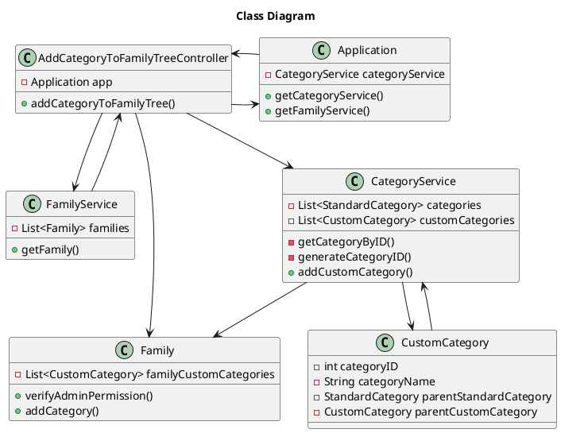

# US111 Add Category to Family Tree
=======================================

# 1. Requirements

*As a family administrator, I want to add a category to the family’s category
tree*

**1** As a family administrator, I want to add a category to the family’s
category tree...

- 1.1. ...with no parent (root Category).

- 1.2. ...with a Custom Category parent.

- 1.3. ...with a Standard Category parent.

We interpreted this requirement as the function of a Family Administrator to
create a new Custom Category for their family, with the option to have it be a
child of an existing one.

### System Sequence Diagram

```` puml

    autonumber
    title Add Category to Family Tree SSD
    actor "Family Administrator" as systemManager
    participant "System" as system

    activate systemManager
    systemManager -> system: Add Category To Family Tree
    activate system
   system --> systemManager: Ask for Category name and Parent
   systemManager->system: Input Category name and Parent
    system --> systemManager: Inform success
    deactivate system
    deactivate systemManager
@endpuml
````

# 2. Analysis

In order to fulfill this requirement we need four pieces of data

-
    1. Category Name - the designation of the custom category to create.
-
    2. Family ID - The ID of the family of which the family admin is a part of.
-
    3. AdminCC - The CC number of the actor.
-
    4. parentID (can be null) - The ID of the Category to which the new one will
       be a child of.

# 3. Design

The process to fulfill this requirement requires the actor to select they want
to create a new custom category, which would prompt the input of the designation
or name for that category, as well as optionally selecting the parent category.
Given the current absence of an UI layer the Int *familyID* and String *adminCC*
will be passed directly into the AddCategoryToFamilyTreeController.

```` puml

autonumber
title Add Category To Family Tree
actor "Family Administrator" as actor
participant ": UI" as UI
participant ": AddCategoryToFamilyTreeController" as controller
participant ": FFMApplication" as application
participant ": CatgoryService" as catServ
participant ": FamilyService" as famServ
participant ": Family" as fam
participant "newCategory : CustomCategory" as cat
   
    
   
activate actor
actor -> UI: Add Category to Family Tree
activate UI
UI --> actor: ask for Category name and parent.
deactivate UI
actor -> UI: input Category name and parent.
activate UI
UI -> controller: AddCategoryToFamilyTree(adminCC, familyID, categoryName, parentID)
activate controller
controller -> application: getCategoryService()
activate application
application --> controller: CategoryService
controller -> application: getFamilyService()
application --> controller: FamilyService
deactivate application
controller -> famServ: getFamily(adminCC,familyID)
activate famServ
famServ-> famServ: getFamily(familyID)
famServ->famServ: checkAdminPermission(adminCC)
famServ-->controller: return Family
deactivate famServ
controller->catServ: addCategoryToFamilyTree(family, categoryName, parentID)
activate catServ
   
alt parentID is for a StandardCategory
  catServ->catServ: getStandardCategoryByID(parentID)
else parentID is for a CustomCategory
  catServ->catServ: getCustomCategoryByID(parentID)
else parentID is null
  catServ->catServ: null Parent
  end
catServ->catServ: generateCustomCategoryID
catServ->cat**: newCustomCategory(categoryName, parentCategory, categoryID)
activate cat
cat->cat: isNameValid
cat-->catServ
deactivate cat
catServ->fam: addCategory(newCustomCategory)
activate fam
fam-->catServ: Success
deactivate fam
catServ-->controller: Success
deactivate catServ
controller-->UI: Success
deactivate controller
UI --> actor: Inform Success
deactivate UI
deactivate actor

@endpuml
````

## 3.1. Functionality Use

The AddCategoryToFamilyTreeController will invoke the Application object, which
stores CategoryService and FamilyService objects. The Application will return
both Services. The FamilyService will be used to retrieve the Family object,
using the FamilyID, and to verify if the actor is the Admin, using the provided
CC number. The CategoryService will be used to generate the new Category's ID
number, retrieve the Standard or Custom Category to which the parentID
corresponds to, and to use that data to create the new Custom Category object.
Finally, the Custom Category object will be added to the Family's Category List.

## 3.2. Class Diagram



## 3.3. Applied Patterns

We applied the principles of Controller, Information Expert, Creator and
PureFabrication from the GRASP pattern. We also used the SOLID SRP principle.

## 3.4. Tests

Several cases where analyzed in order to test the creation of a new Category and adding it to the Family's Category List.

**Test 1:** Testing if the Controller successfully creates and adds a
Custom Category with a Standard Category for a parent.

**Test 2:** Testing if the Controller successfully creates and adds a
Custom Category with a Custom Category for a parent.

**Test 3:** Testing if the Controller successfully creates and adds a
Custom Category with no parent.

**Test 4:** Test that it is not possible to create a new Category with a
Blank name.

**Test 5:** Test that it is not possible to create a new Category with a
Empty name

**Test 6:** Test that it is not possible to create a new Category with a
Null name

**Test 7:** Test that it is not possible to create a new Category when the provided FamilyID doesn't match any family.

**Test 8:** Test that it is not possible to create a new Category when the provided CC Number doesn't belong to a member with admin permissions.

**Test 9:** Test that it is not possible to create a new Category when the provided parentID doesn't match any existing Category.


The whole user story was tested for the case of success and for failure

# 4. Implementation

After providing an account name and initial balance the AccountService class
prompts the FamilyMember to create a new CashAccount object if the information
given follows the rules previously discussed in the Requirements section

# 5. Integration

The development of this user story was dependant on the US001. 

# 6. Observations

As of the implementation of this US, the StandardCategory and CustomCategory classes are seperate. Ideally, they will both implement the same Interface, to avoid duplicate code.