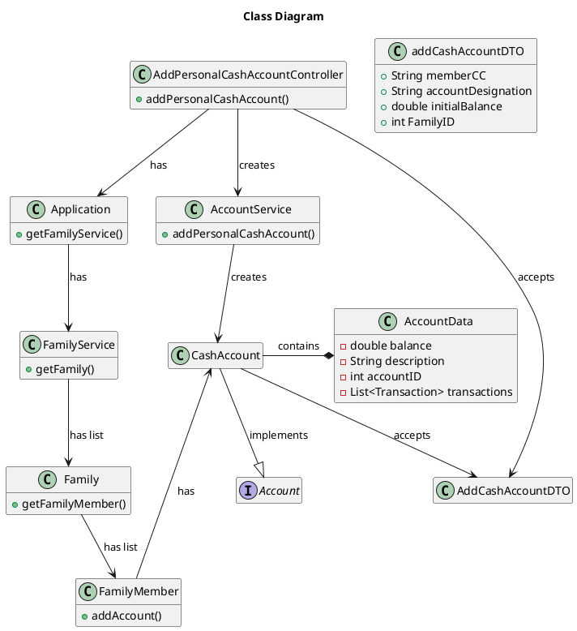

# US170 Create a Personal Cash Account
=======================================

# 1. Requirements

*As a family member, I want to create a personal cash account.*

**1** As a family member, I want to create a Personal Cash Account...

- 1.1. ...with 0 balance.

- 1.2. ...with a positive balance.

- 1.3. ...and then another Personal Cash Account;

We interpreted this requirement as the function of a Family Member to create a
cash account associated with their profile, with an initial balance and
description/name for the account. This description must not be empty, and the
balance cannot be negative. The name of the account is case-insensitive.

### System Sequence Diagram

```` puml

    autonumber
    title Create Personal Cash Account SSD
    actor "Family Member" as systemManager
    participant "System" as system

    activate systemManager
    systemManager -> system: create Personal Cash Account
    activate system
   system --> systemManager: ask for Name and Balance
   systemManager->system: input Name and Balance
    system --> systemManager: inform success
    deactivate system
    deactivate systemManager
@endpuml
````

# 2. Analysis

In order to fulfill this requirement we need four pieces of data

-
    1. Cash Account Name - the designation of the cash account to add
-
    2. Family ID - The ID of the family of which the family member is a part of.
-
    3. FamilyMemberID - The ID of the actor.
-
    4. Initial Balance - The starting balance of the cash account.

# 3. Design

The process to fulfill this requirement requires the actor to select they want
to create a new personal cash account, which would prompt the input of the
designation or name for that account and the initial balance. Given the current
absence of an UI layer the Int *familyID* and Int *familyMemberCC* will be
passed directly into the CreatePersonalCashAccountController.

```` puml

   autonumber
   title Create Personal Cash Account
   actor "Family Member" as member
   participant ": UI" as UI
   participant " newDTO : AddCashAccountDTO" as dto
   participant ": CreatePersonalCashAccountController" as controller
   participant ": FFMApplication" as application
   participant ": AccountService" as accServ
   participant ": FamilyService" as famServ
   participant ": Family" as fam
   participant ": FamilyMember" as fammemb
   participant "newCashAccount : Account" as cashacc
   participant "newAccountData : AccountData" as data
    
   
   activate member
   member -> UI: create a Personal Cash Account
   activate UI
   UI --> member: ask for Account name
   deactivate UI
   member -> UI: input Account name
   activate UI
   UI -> dto**: createDTO(name,familyID, familyMemberCC,initialBalance)
   activate dto
   dto-->UI
   deactivate dto
   UI -> controller: createPersonalCashAccount(addCashAccountDTO)
   activate controller
   controller -> application: getAccountService()
   activate application
   application --> controller: AccountService
   controller -> application: getFamilyService()
   application --> controller: FamilyService
   deactivate application
   controller -> famServ:getFamilyMember(familyID, familyMemberCC)
   activate famServ
   famServ-> fam: getFamilyMember(familyMemberCC)
   activate fam
   fam --> famServ: FamilyMember
   deactivate fam
   famServ --> controller: FamilyMember
   deactivate famServ 
   controller -> accServ: createPersonalCashAccount(addCashAccountDTO)
   activate accServ
   accServ -> accServ: generateAccountID()
   accServ -> cashacc**: newCashAccount(addCashAccountDTO)
   activate cashacc
   cashacc -> cashacc: validateName(name)
   cashacc->cashacc: validateBalance(balance)
   cashacc->data**: createAccountData(name, initialBalance, accountID)
   activate data
   data-->cashacc: becomes CashAccount.AccountData
   deactivate data
   cashacc-->accServ: Success
   deactivate cashacc
   accServ->fammemb: addAccount(newCashAccount)
   activate fammemb
   fammemb-->accServ: Success
   deactivate fammemb
   accServ-->controller: Success
   deactivate accServ
   controller --> UI: Success
   deactivate controller
   UI --> member: Inform Success
   deactivate UI
   deactivate member

@endpuml
````

## 3.1. Functionality Use

The CreatePersonalCashAccountController will invoke the Application object,
which stores AccountService and FamilyService objects. The Application will
return both Services. The FamilyService will be used to retrieve the
FamilyMember object of the actor, using the FamilyID and FamilyMemberCC. The
FamilyMember object will then be passed, along with the AccountName and
InitialBalance to the AccountService, which will prompt the FamilyMember to
create the CashAccount after having generated the accountID. The CashAccount
will validate its name and balance upon creation. Finally, the CashAccount
object will be added to the FamilyMember's Account List.

## 3.2. Class Diagram



## 3.3. Applied Patterns

We applied the principles of Controller, Information Expert, Creator and
PureFabrication from the GRASP pattern. We also used the SOLID SRP principle.

## 3.4. Tests

Several cases where analyzed in order to test the creation of a new personal
cash account associated with a Family Member.

**Test 1:** Testing if the Controller successfully creates and adds a
CashAccount to a Family Member

**Test 2:** Test that it is possible to create a second cash account and
associate it with the same Family Member.

**Test 3:** Test that it is not possible to create a new CashAccount with
negative balance.

**Test 4:** Test that it is not possible to create a new CashAccount with a
Blank description.

**Test 5:** Test that it is not possible to create a new CashAccount with an
Empty description.

**Test 6:** Test that it is not possible to create a new CashAccount with a Null
description.

**Test 7:** Test that it is not possible to create a new CashAccount with a
long (>10 characters) description.

The whole user story was tested for the case of success and for failure

# 4. Implementation

After providing an account name and initial balance the AccountService class
prompts the FamilyMember to create a new CashAccount object if the information
given follows the rules previously discussed in the Requirements section

# 5. Integration

The development of this user story was the basis for the Cash Account related
User stories.
[US130][US135][US180][US181][US185] used the implementation of this US

# 6. Observations

There is a need to review responsibility of the creation of CashAccounts. Should
the AccountService create the account, or should it be the responsability of the
FamilyMember, which stores the Account?