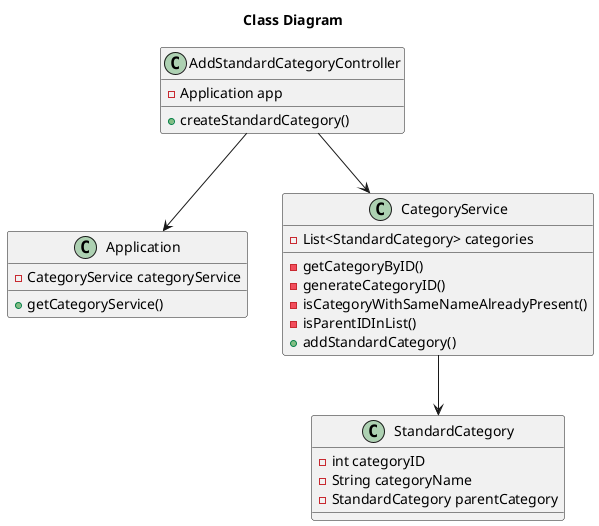

# US170 Create a Personal Cash Account
=======================================


# 1. Requirements

*As a family member, I want to create a personal cash account.*


**1** As a system manager, I want to create...

- 1.1. The new standard category "Habitação", at the root level;

- 1.2. The already existing category "Habitação";

- 1.3. The new standard category "Renda", as a sub-category of Habitação; 

We interpreted this requirement as the function of a system manager to create a new standard category that can be accessed by all users. 
The name of the category must not be empty, and it can't exist in the current list of standard categories.
A standard category can be a sub-category of an existing standard category.
The name of a standard category must be case-insensitive.

### System Sequence Diagram

```` puml

    autonumber
    title Create Personal Cash Account SSD
    actor "Family Member" as systemManager
    participant "System" as system

    activate systemManager
    systemManager -> system: create Personal Cash Account
    activate system
   system --> systemManager: ask for Name and Balance
   systemManager->system: input Name and Balance
    system --> systemManager: inform success
    deactivate system
    deactivate systemManager
@endpuml
````
# 2. Analysis

In order to fulfill this requirement we need two pieces of data

- 1. Category Name - the designation of the standard category to add
- 2. Parent Category ID - if it is a subcategory the parent category must be indicated

# 3. Design

The process to fulfill this requirement requires the actor to select they want to create a new standard category, 
which would prompt the input of the designation or name for that category and the id of its parent category.
Given the current absence of an UI layer the Int *parentCategoryID* and String *standardCategoryName* will be passed directly into the AddStandardCategoryController. 
 
```` puml

   autonumber
   title Create Personal Cash Account
   actor "Family Member" as member
   participant ": UI" as UI
   participant ": CreatePersonalCashAccountController" as controller
   participant ": FFMApplication" as application
   participant ": AccountService" as accServ
   participant ": FamilyService" as famServ
   participant ": Family" as fam
   participant "aFamilyMember : FamilyMember" as fammemb
    participant ": Account" as account
    participant "newCashAccount : Account" as cashacc
    
   
   activate member
   member -> UI: create a Personal Cash Account
   activate UI
   UI --> member: ask for Account name
   deactivate UI
   member -> UI: input Account name
   activate UI
   UI -> controller: createPersonalCashAccount(name,familyID, familyMemberID,initialBalance)
   activate controller
   controller -> application: getAccountService()
   activate application
   application --> controller: AccountService
   controller -> application: getFamilyService()
   application --> controller: FamilyService
   deactivate application
   controller -> accServ: createPersonalCashAccount(name, familyID, familyMemberID, initialBalance, familyService)
   activate accServ
   accServ -> famServ: getFamilyMember(familyID, familyMemberID)
   activate famServ
   famServ-> fam: getFamilyMember(familyMemberID)
   activate fam
   fam --> famServ: FamilyMember
   deactivate fam
   famServ --> accServ: FamilyMember
   deactivate famServ
   accServ -> fammemb**: createPersonalCashAccount(name, initialBalance)
   activate fammemb
   fammemb-> account: newCashAccount(name, initialBalance)
   activate account
   account -> account: validateName();
   account -> account: generateAccountID()
   account-> cashacc**: newCashAccount(accountID,name, initialBalance)
   activate cashacc
   deactivate account
   cashacc->cashacc: validateBalance()
   cashacc--> fammemb: success
   deactivate cashacc
   fammemb -> fammemb: addCashAccount()
   fammemb --> accServ: success
   deactivate fammemb
   accServ --> controller: success
   deactivate accServ
   controller --> UI: success
   deactivate controller
   UI --> member: Inform Success
   deactivate UI
   deactivate member

@endpuml
````

## 3.1. Functionality Use
The AddStandardCategoryController will invoke the Application object, which stores a CategoryService object.
The Application will return the CategoryService, which contains a list of all StandardCategories.
The CategoryService then creates a new StandardCategory Object and adds it to the existing list.


## 3.2. Class Diagram


## 3.3. Applied Patterns
We applied the principles of Controller, Information Expert, Creator and PureFabrication from the GRASP pattern.
We also used the SOLID SRP principle.

## 3.4. Tests 
    
Several cases where analyzed in order to test the creation of a new class    

**Test 1:** Test that it is possible to create a new instance of StandardCategory receiving a name, a categoryID and a parent category 

**Test 2:** Test that it is not possible to create a new instance of StandardCategory receiving a **categoryName** that is null

**Test 3:** Test that it is not possible to create a new instance of StandardCategory receiving a **categoryName** that is empty

**Test 4:** Test that it is not possible to create a new instance of StandardCategory receiving a **categoryName** that is blank

We also tested several scenarios regarding the way the information is stored for example

**Test 5:** Test to verify that the category designation is case insensitive
 
````
    @Test
    void isDesignationOfThisCategoryTest2_designationHasDifferentCase() {
        String categoryName = "Habitação";
        int categoryID = 2;
        StandardCategory newStandardCategory = new StandardCategory(categoryName, parentCategory,categoryID);
        String nameToTest = "HABITAÇÃO";

        boolean result = newStandardCategory.isDesignationOfThisCategory(nameToTest);

        assertTrue(result);
    }
````

The whole user story was tested for the case of success and for failure

# 4. Implementation

After providing a category name and, optionally, selecting a parent category (currently this is done by its ID), the CategoryService class creates a new Category object if the information given follows the rules previously discussed in the Requirements section

# 5. Integration
 
The development of this user story was the basis for the financial categories of the application and was thus crucial for the development of other User Stories
Both [US002](US002_GetStandardCategoriesTree.md) and [US110](US110_GetCategoryTree.md) used the implementation of this US

#6. Observations

The way to generate an ID for a Standard Category will probably need to be reworked in a future sprint to allow for more complex ID information if needed