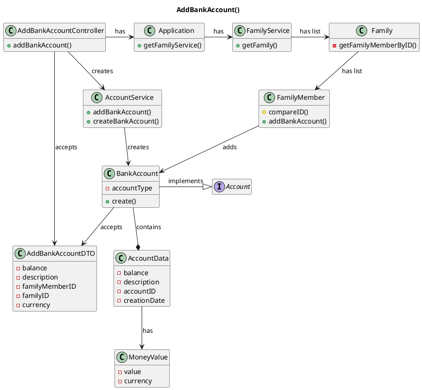

# US171 Add Bank Account to Family Member
=======================================


# 1. Requirements

### 1.1 Client's Sheet

- As a family member, I want to add a Bank Account I have.

We interpreted this requirement as the function of a FamilyMember to add a Bank Account to his application account.

- A BankAccount needs to have:
    - Account Type;
    - Account Data:
      - Description;
      - Account ID;
      - Date of Creation;
      - Current Balance;
  
The same Bank Account can be added to more than one Family Member;
The account balance can be negative;


### 1.2 System Sequence Diagram

```` puml

    autonumber
    title US171 - Add Bank Account SSD
    actor "Family Member" as familyMember
    participant "System" as system

    activate familyMember
    familyMember -> system: add Bank Account
    activate system
    system -> familyMember: ask for designation, balance and currency
    familyMember -> system: input desgination, balance and currency
    system -> familyMember : inform Success
    deactivate system
    deactivate familyMember

@endpuml
````


### 1.3 Dependencies

This user story has a dependency with these **2** user stories:

- **US101_AddFamily.md** *(As a system manager, I want to create a family.)*
  - In order to have a Family Administrator and Family Member, the system needs to have that Family.
- **US101_AddFamilyAdministrator.md** *(As a system manager, I want to add a family administrator)*
  - The Family Administrator, being a Family Member, can have bank accounts, but is also required to create further Family Members where accounts are created.
- **US101_AddFamilyMember.md** *(As a family Administrator, I want to add a familyMember to a family)*
  - In order to add a bank account, the system needs to have a Family Member.
  
# 2. Analysis

In order to fulfill this requirement, we need three main data pieces:
- Family Member ID;
- Family ID;
- Balance;
- Currency;
- Bank Account Description;

The account will be stored inside the Family Member. The Family and Family Member IDs will be used to identify the correct user where to add the account. The basic information required for the account creation is the description, the current balance and the currency of the account.

At a later iteration, the family member's ID would be acquired through the Log In information. For this sprint, the ID will have to be inputted along with the Bank Account information.

# 3. Design

````puml
@startuml
autonumber
title US171 - AddBankAccout Sequece Diagram

actor "FamilyMember" as actor
participant ": UI" as UI
participant ": addBankAccountController" as controller
participant ": FFM Application" as app
participant "accServ : AccountService" as accServ
participant "famServ : FamilyService" as famService
participant "aFamily : Family" as family
participant "aFamilyMember : FamilyMember" as person
participant "aBankAccount : BankAccount" as bankAcc
participant "aMoneyValue : MoneyValue" as moneyV

activate actor
actor -> UI: addBankAccount(addBankAccountDTO)
activate UI
UI -> actor: ask data
deactivate UI
actor -> UI: inputs required data
activate UI
UI -> controller: addBankAccount(addBankAccountDTO)
activate controller
controller -> app: getFamilyMember(addBankAccountDTO)
activate app
app -> famService: getFamilyMember(addBankAccountDTO)
activate famService
famService -> family: getFamilyMember(addBankAccountDTO)
activate family
family -> family : getFamilyMember(FamilyMemberID)
family -> famService: ok
deactivate family
famService -> app: ok
deactivate famService
app -> controller: ok
deactivate app

controller -> app: addBankAccount(addBankAccountDTO)
activate app
app -> accServ: addBankAccount(addBankAccountDTO)
activate accServ
accServ -> accServ : generateID(FamilyMember)
accServ -> bankAcc **: create(id,description,balance,currency)
bankAcc -> moneyV **: create(balance,currency)

accServ -> person: addAccount(aBankAccount)
activate person

person -> person: addAccount(aBankAccount)

person -> accServ: ok
deactivate person
accServ -> app: ok
deactivate accServ
app -> controller: ok
deactivate app
controller -> UI: ok
deactivate controller
UI -> actor: informs success
deactivate UI
deactivate actor

@enduml
````


## 3.1. Functionality Use
The AddBankAccountController will invoke the Application object, which returns the Family Service.
The Family Service will get the Family, which in turn will return the Family Member.
The Account Service will now be called to add the bank account to the family member in question. The Bank Account. First, there will be an email validation inside the Application to ensure that is unique, then the same will be done to the vatNumber inside the Family object because we are assuming that the same Person can be part of different Families. If any of those validations turn to be true the method fails, otherwise the method is executed by calling the FamilyMember constructor, creating a new Person and storing it inside the Family object. 
To finish this process, the Application return a confirmation message to the controller that will inform the UI, and therefore the user, that the method succeeded. 


## 3.2. Class Diagram
The main Classes involved are:
- AddBankAccountController
- Application
- FamilyService
- Family
- FamilyMember
- AccountService
- Bank Account
- AccountData
- MoneyValue

**AddBankAccount()**


## 3.3. Applied Patterns
We applied the principles of Controller, Information Expert, Creator e PureFabrication from the GRASP pattern.
We also used the SOLID SRP principle.

## 3.4. Domain Tests 

###Test 1: BankAccount tests

####Test 1.1: Verify description 

- **1.1.1** If the description is **null**, the BankAccount is created with a standard name **"BankAccount + ID"** 

- **1.1.2** If the description is **empty**, the BankAccount is created with a standard name **"BankAccount + ID"**

- **1.1.3** If the description is **blank**, the BankAccount is created with a standard name **"BankAccount + ID"**

- **1.1.4** If the description is compliant with the criteria, the BankAccount is created with the inserted data

####Test 1.2: Verify balance

- **1.2.1** If the balance is **null**, the BankAccount is created with **0.00 (zero)** value by default

- **1.2.2** If the balance is **empty**, the BankAccount is created with **0.00 (zero)** value by default

- **1.2.3** If the balance is **blank**, the BankAccount is created with **0.00 (zero)** value by default

- **1.2.4** If the balance is a **negative value**, the BankAccount is created with the inserted data

- **1.2.5** If the balance is a **positive value**, the BankAccount is created with the inserted data


####Test 1.3: Account Type

- **1.3.1** The account Type **BANKACCOUNT** is automatically attributed and the account created


####Test 1.4: Verify MoneyValue 

- **1.4.1** If the currency is **null**, the account currency is automatically assigned to **EURO** and creates the account

- **1.4.2** If the currency is correctly inserted, the account assigns that currency and creates the account


###Test 2: AccountService tests

- **2.1** The accountService adds the account to the FamilyMember accountList and returns **true**

###Test 3: Controller tests

- **3.1** If the **Family doesn't exist**, the controller catches the exception and returns **false**

```
@Test
void addBankAccountTest_Fail_NoFamily() {
    AddBankAccountDTO addBankAccountDTO = new AddBankAccountDTO(balance, accountName, cc, 100, CurrencyEnum.EURO);//familyID doesn't exists'
    assertFalse(addBankAccountController.addBankAccount(addBankAccountDTO));
}
```

- **3.2** If the **FamilyMember doesn't exist**, the controller catches the exception and returns **false**

```
@Test
void addBankAccountTest_Fail_NoFamilyMember() {
    AddBankAccountDTO addBankAccountDTO = new AddBankAccountDTO(balance, accountName, cc2, 1, CurrencyEnum.EURO);//familyMemberID doesn't exists'
    assertFalse(addBankAccountController.addBankAccount(addBankAccountDTO));
}
```

- **3.3** If every piece of data is complaint, the controller executes correctly and returns **true**

```
@Test
void addBankAccountTest_Success() {
    AddBankAccountDTO addBankAccountDTO = new AddBankAccountDTO(balance, accountName, cc, 1, CurrencyEnum.EURO);
    assertTrue(addBankAccountController.addBankAccount(addBankAccountDTO));
}
```


# 4. Implementation

This Account type implements data that is also present in all other account types. 
Since this account will have future integration with a Banking System, it needs simple information and validation to be created because most restrictions are assured by the Bank.

As it was referred in other user stories, the UI will give the FamilyID and FamilyMemberID so the controller can execute its function.

During this feature implementation we thought about implementing IBAN class and assign it as a BankAccount attribute.
After talking with Product Owner we realized that it is not necessary at this moment, so we decided to postpone this implementation.

# 5. Integration/Demonstration

As it was said before, this UserStory dependes on both **[US010 - Add Family]** and **[US101 - Add Family Member]**.

# 6. Observations

In the future, the two issues we have to deal with are the following:
- The familyID and FamilyMemberID will be solved when the UI and login layer are set up,
- The IBAN will be implemented when the App requires it.


