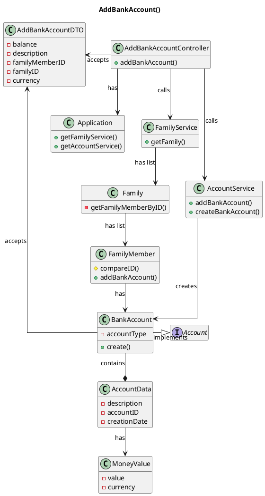

# US171 Add Bank Account to Family Member
=======================================


# 1. Requirements

### 1.1 Client's Sheet

- As a family member, I want to add a Bank Account I have.

We interpreted this requirement as the function of a FamilyMember to add a Bank Account to his application account.

- A BankAccount needs to have:
    - Account Type;
    - Account Data:
      - Description;
      - Account ID;
      - Date of Creation;
      - Current Balance;
  
The same Bank Account can be added to more than one Family Member;
The account balance can be negative;


### 1.2 System Sequence Diagram

```` puml

    autonumber
    title US171 - Add Bank Account SSD
    actor "Family Member" as familyMember
    participant "System" as system

    activate familyMember
    familyMember -> system: add Bank Account
    activate system
    system -> familyMember: ask for designation, balance and currency
    familyMember -> system: input desgination, balance and currency
    system -> familyMember : inform Success
    deactivate system
    deactivate familyMember

@endpuml
````


### 1.3 Dependencies

This user story has a dependency with these **2** user stories:

- **US101_AddFamily.md** *(As a system manager, I want to create a family.)*
  - In order to have a Family Administrator and Family Member, the system needs to have that Family.

- **US101_AddFamilyMember.md** *(As a family Administrator, I want to add a familyMember to a family)*
  - In order to add a bank account, the system needs to have a Family Member.
  
# 2. Analysis

In order to fulfill this requirement, we need five main data pieces:
- Family Member ID;
- Family ID;
- Balance;
- Currency;
- Bank Account Description;

The account will be stored inside the Family Member.
The Family and Family Member IDs will be used to identify the correct user where to add the account. 
The basic information required for the account creation is the description, the current balance and the currency of the account.

At a later iteration, the family member's ID would be acquired through the Log In information. For this sprint, the ID will have to be inputted along with the Bank Account information.

##2.1. Domain Model Diagram

```puml
hide empty members
hide circle
title Domain Model Diagram US171

class Family {
- FamilyID
}

class FamilyMember {
- FamilyMemberID
}

class BankAccount {
- Balance
- Description
- Currency
- AccountID 
}

Family "1" -down- "0..*" FamilyMember : has 
FamilyMember "1" -down- "0..*" BankAccount  : has 
```


# 3. Design

````puml
@startuml
autonumber
title US171 - AddBankAccout Sequece Diagram

actor "FamilyMember" as actor
participant ": UI" as UI
participant ": addBankAccountController" as controller
participant ": FFM Application" as app
participant "accServ : AccountService" as accServ
participant "famServ : FamilyService" as famService
participant "aFamily : Family" as family
participant "aFamilyMember : FamilyMember" as person

activate actor
actor -> UI: addBankAccount(addBankAccountDTO)
activate UI
UI -> actor: ask data
deactivate UI
actor -> UI: inputs required data
activate UI
UI -> controller: addBankAccount(addBankAccountDTO)
activate controller
controller -> app: getFamilyMember(addBankAccountDTO)
activate app
app -> famService: getFamilyMember(addBankAccountDTO)
activate famService
famService -> family: getFamilyMember(addBankAccountDTO)
activate family
family -> family : getFamilyMember(FamilyMemberID)
family -> famService: ok
deactivate family
famService -> app: ok
deactivate famService
app -> controller: ok
deactivate app

controller -> app: addBankAccount(addBankAccountDTO)
activate app
app -> accServ: addBankAccount(addBankAccountDTO)
activate accServ
accServ -> accServ : generateID(FamilyMember)
ref over accServ

AddBankBankAccount 2

end ref

accServ -> person: addAccount(aBankAccount)
activate person

person -> person: addAccount(aBankAccount)

person -> accServ: ok
deactivate person
accServ -> app: ok
deactivate accServ
app -> controller: ok
deactivate app
controller -> UI: ok
deactivate controller
UI -> actor: informs success
deactivate UI
deactivate actor

@enduml
````

````puml
@startuml
autonumber
title US171 - AddBankBankAccount 2 

participant "accServ : AccountService" as accServ
participant "aBankAccount : BankAccount" as bankAcc
participant "anAccountData : \nAccountData" as data
participant "aMoneyValue : MoneyValue" as moneyV

activate accServ
accServ -> bankAcc **: create(addBankAccountDTO, targetMember)
activate bankAcc
bankAcc -> data **: create(balance, description, bankAccountID, addBankAccountDTO.getCurrency())
activate data
data -> moneyV **: create(balance,currency)
activate moneyV
moneyV -> data: aMoneyValue
deactivate moneyV
data -> bankAcc: anAccountData
deactivate data
bankAcc -> accServ: aBankAccount
deactivate bankAcc
deactivate accServ

@enduml
````

## 3.1. Functionality Use

The AddBankAccountController will invoke the Application object, which stores AccountService and FamilyService objects. The Application will return both Services. The FamilyService will be used to retrieve the FamilyMember object of the actor, using the FamilyID and FamilyMemberCC. The FamilyMember object will then be passed, along with the AccountName and InitialBalance to the AccountService, which will prompt the FamilyMember to create the BankAccount after having generated the accountID. The BankAccount will validate its name and balance upon creation. Finally, the BankAccount object will be added to the FamilyMember's Account List and a success response will be returned.


## 3.2. Class Diagram
The main Classes involved are:
- AddBankAccountController
- Application
- FamilyService
- Family
- FamilyMember
- AccountService
- Bank Account
- AccountData
- MoneyValue



## 3.3. Applied Patterns

- GRASP:
    - Information expert:
        - This pattern was used in classes that implemented the Account interface, like in this case BankAccount class. The BankAccount concentrates the responsibility of managing all procedures about itself;

    - Controller:
        - To deal with the responsibility of receiving input from outside the system (first layer after the UI) we use a case controller.

    - Pure Fabrication:
        - In this user story the Application, FamilyService and AccountService class was used, which does not represent a business domain concept. It was created to be responsible for all operations regarding Account type Classes.

    - High cohesion and Low Coupling:
        - The creation of the AccountService class provided low Coupling and high Cohesion, keeping one Class as the Information Expert.

    - Protected Variation:
        - An Account interface applies the polymorphism concept by being implemented in several classes, each representing an Account type.

- SOLID:
    - Single-responsibility principle:
        - this pattern was used in the AccountService class, in which the only responsibility is managing account operations.


## 3.4. Domain Tests 

###Test 1: BankAccount tests

####Test 1.1: Verify description 

- **1.1.1** - If the description is **null**, the BankAccount is created with a standard name **"BankAccount + ID"** 
```
@Test
void CreateBankAccount_NullDescription() {
    AddBankAccountDTO addBankAccountDTO = new AddBankAccountDTO(balance, null, selfCC, 1, CurrencyEnum.EURO);
    BankAccount account = new BankAccount(addBankAccountDTO, 1);
    String desc = "BankAccount 1";
    assertEquals(account.getDescription(), desc);
}
```


- **1.1.2** - If the description is **empty**, the BankAccount is created with a standard name **"BankAccount + ID"**

- **1.1.3** - If the description is **blank**, the BankAccount is created with a standard name **"BankAccount + ID"**

- **1.1.4** - If the description is compliant with the criteria, the BankAccount is created with the inserted data

####Test 1.2: Verify balance

- **1.2.1** - If the balance is **null**, the BankAccount is created with **0.00 (zero)** value by default
```
@Test
void CreateBankAccount_NullBalance() {
    AddBankAccountDTO addBankAccountDTO = new AddBankAccountDTO(null, description, selfCC, 1, CurrencyEnum.EURO);
    BankAccount account = new BankAccount(addBankAccountDTO, 1);
    Double expected = 0.00;
    assertEquals(expected, account.getMoneyBalance().getValue());
}
```

- **1.2.2** - If the balance is **empty**, the BankAccount is created with **0.00 (zero)** value by default

- **1.2.3** - If the balance is **blank**, the BankAccount is created with **0.00 (zero)** value by default

- **1.2.4** - If the balance is a **negative value**, the BankAccount is created with the inserted data

```
@Test
void CreateBankAccount_NegativeBalance() {
    AddBankAccountDTO addBankAccountDTO = new AddBankAccountDTO(-10.0, description, selfCC, 1, CurrencyEnum.EURO);
    BankAccount account = new BankAccount(addBankAccountDTO, 1);
    Double expected = -10.00;
    assertEquals(expected, account.getMoneyBalance().getValue());
}
```

- **1.2.5** - If the balance is a **positive value**, the BankAccount is created with the inserted data


####Test 1.3: Account Type

- **1.3.1** - The account Type **BANKACCOUNT** is automatically attributed and the account created


####Test 1.4: Verify MoneyValue 

- **1.4.1** - If the currency is **null**, the account currency is automatically assigned to **EURO** and creates the account

- **1.4.2** - If the currency is correctly inserted, the account assigns that currency and creates the account


###Test 2: AccountService tests

- **2.1** - The accountService adds the account to the FamilyMember accountList and returns **true**

###Test 3: Controller tests

- **3.1** - If the **Family doesn't exist**, the controller catches the exception and returns **false**

```
@Test
void addBankAccountTest_Fail_NoFamily() {
    AddBankAccountDTO addBankAccountDTO = new AddBankAccountDTO(balance, accountName, cc, 100, CurrencyEnum.EURO);//familyID doesn't exists'
    assertFalse(addBankAccountController.addBankAccount(addBankAccountDTO));
}
```

- **3.2** If the **FamilyMember doesn't exist**, the controller catches the exception and returns **false**

```
@Test
void addBankAccountTest_Fail_NoFamilyMember() {
    AddBankAccountDTO addBankAccountDTO = new AddBankAccountDTO(balance, accountName, cc2, 1, CurrencyEnum.EURO);//familyMemberID doesn't exists'
    assertFalse(addBankAccountController.addBankAccount(addBankAccountDTO));
}
```

- **3.3** If every piece of data is complaint, the controller executes correctly and returns **true**

```
@Test
void addBankAccountTest_Success() {
    AddBankAccountDTO addBankAccountDTO = new AddBankAccountDTO(balance, accountName, cc, 1, CurrencyEnum.EURO);
    assertTrue(addBankAccountController.addBankAccount(addBankAccountDTO));
}
```


# 4. Implementation

This Account type implements data that is also present in all other account types. 
Since this account will have future integration with a Banking System, it needs simple information and validation to be created because most restrictions are assured by the Bank.

As it was referred in other user stories, the UI will give the FamilyID and FamilyMemberID so the controller can execute its function.

During this feature implementation we thought about implementing IBAN class and assign it as a BankAccount attribute.
After talking with Product Owner we realized that it is not necessary at this moment, so we decided to postpone this implementation.

# 5. Integration/Demonstration

As it was said before, this UserStory dependes on both **[US010 - AddFamily]**, **[US011 - AddFamilyAdministrator]** and **[US101 - AddFamilyMember]**.

# 6. Observations

In the future, the two issues we have to deal with are the following:
- The familyID and FamilyMemberID will be solved when the UI and login layer are set up,
- The IBAN will be implemented when the App requires it.


