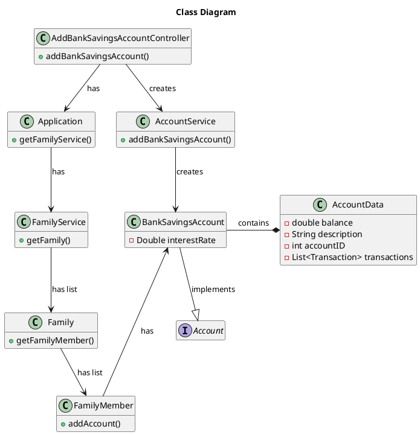

# US172 Add a Bank Savings Account
=======================================


# 1. Requirements

### 1.1 Client Notes 
**Demo1** - As a family member, I want to add a bank savings account I have.

We interpreted this requirement as the function of adding an already existing Bank Savings Account
Data and linking it to a Family Member.

### 1.2 System Sequence Diagram
````puml
autonumber

skinparam sequence {
ArrowColor black
LifeLineBorderColor black
LifeLineBackgroundColor white
ParticipantBorderColor black
ParticipantBackgroundColor white
ParticipantFontColor black
ActorBorderColor black
ActorBackgroundColor white
}

title AddBankSavingsAccount
actor "Family Member" as FamilyMember
participant "System" as System

activate FamilyMember
FamilyMember -> System: addBankSavingsAccount
activate System
System --> FamilyMember: request data
FamilyMember -> System: input data
alt failure
System --> FamilyMember: inform failure
else success
System --> FamilyMember: inform success
deactivate System
end alt
deactivate FamilyMember

````

# 2. Analysis
Our analysis of this US is as follows:

To create a Bank Savings Account we need to have:
 
1. An account name
    > *Question:*  
    *Pegando numa resposta anterior em relação à criação de contas (sejam cash, bank, savings ou credit card), 
    >devemos incluir uma designação (exemplo: "Conta do Banco") para que o utilizador possa personalizar as contas.* 
    >
    > PO:  
    *Claro que tem de ter uma designação compreensível.*

2. An account ID
An unique account ID is going to be necessary in order to differentiate accounts.
Product Owner said specifically to not use the IBAN as an unique identifier:
    > PO:   
    >Para começar, não peçam aos utilizadores para conhecerem/identificarem as contas pelo IBAN ou pelo número do cartão.  
    > Está completamente fora de questão.  
    >A forma como identificam as contas no código é um problema de implementação. Pensem numa solução.
    
3. An Interest rate
We've decided to add this attribute in order to distinguish bewteen account types. In the future it will allow
the user to forecast future earnings, review earnings to-date, etc..

4. A Family Member
The user to whom the account will be added. At the moment there is no business rule, limiting the number of Family Members
linked to the same account. 


It is expected of a Savings Account to have a balance. At the moment, the Product Owner
referred that defining the balance it would be a future feature regarding bank data importation.
Having this in mind we decided to initialize all accounts with 0 as the initial balance. 


# 3. Design


skinparam sequence {
ArrowColor black
LifeLineBorderColor black
LifeLineBackgroundColor white
ParticipantBorderColor black
ParticipantBackgroundColor white
ParticipantFontColor black
ActorBorderColor black
ActorBackgroundColor white
}

````puml
autonumber


title AddBankSavingsAccount
actor "Family Member" as FamilyMember
participant "UI" as UI
participant ": AddSavings\nAccountController" as Controller
participant ": Application" as App
participant ": FamilyService" as FamilyService
participant "aFamily : Family" as Family
participant "aFamilyMember : FamilyMember" as aFamilyMember
participant ": AccountService" as AccountService
participant "aBankSavingsAccount : \nBankSavingsAccount" as BankAccount

activate FamilyMember
FamilyMember -> UI: I want to add a Bank Savings Account
activate UI
UI -> Controller : addBankSavingsAccount(FamilyID, FamilyMemberID, \nBalance, Name, InterestRate)
activate Controller
Controller -> App : getFamilyService()
activate App
App --> Controller : familyService
deactivate App
Controller -> FamilyService : getFamily(FamilyID)
activate FamilyService
FamilyService -> FamilyService : getFamily(FamilyID)
FamilyService --> Controller : Family
deactivate FamilyService
Controller -> Family : getFamilyMember(FamilyMemberID)
Activate Family
Family -> Family : getFamilyMember(FamilyMemberID)
Family --> Controller : aFamilyMember
Deactivate Family
Controller -> AccountService ** : createAccountService()
Controller -> AccountService : addBankSavingsAccount(Balance, \nName, InterestRate, aFamilyMember)
activate AccountService
AccountService -> BankAccount ** : createBankSavingsAccount(Balance, \nName, InterestRate)
AccountService -> aFamilyMember : addAccount(aBankSavingsAccount) 
activate aFamilyMember
aFamilyMember --> AccountService : Success
deactivate aFamilyMember
AccountService --> Controller : Success
deactivate AccountService
Controller --> UI : Success
deactivate Controller
UI --> FamilyMember : Success
deactivate UI
deactivate FamilyMember
````


## 3.1. Functionality Use

## 3.2. Class Diagram


## 3.3. Applied Patterns

## 3.4. Tests

**Test 1:** 

**Test 2:** 

**Test 3:** 

# 4. Implementation

# 5. Integration

#6. Observations
Interest Rate will have to be manually inserted as a percentage in order to perform
the correct calculations. UI will have to deal with this.

Will Interest Rate be a Class in the future? (As it will have behaviour of its own)

In the future we're thinking about implementing a forecast feature to calculate expected earnings on a given date.