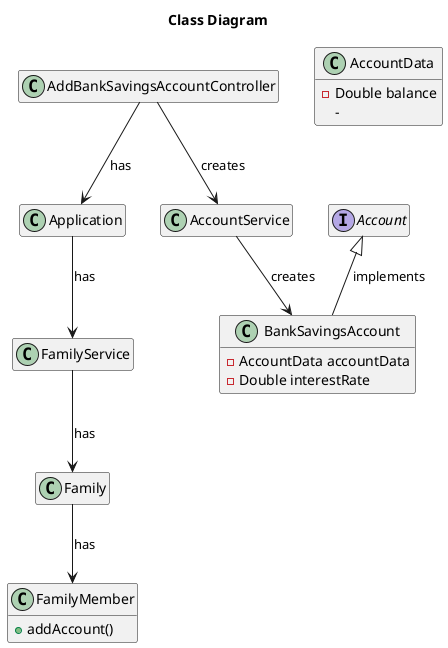

# US010 Add a Family
=======================================


# 1. Requirements

US172 As a family member, I want to add a bank savings account I have.

````puml
autonumber

skinparam sequence {
ArrowColor black
LifeLineBorderColor black
LifeLineBackgroundColor white
ParticipantBorderColor black
ParticipantBackgroundColor white
ParticipantFontColor black
ActorBorderColor black
ActorBackgroundColor white
}

title AddBankSavingsAccount
actor "Family Member" as FamilyMember
participant "System" as System

activate FamilyMember
FamilyMember -> System: addBankSavingsAccount
activate System
System --> FamilyMember: request data
FamilyMember -> System: input data
alt failure
System --> FamilyMember: inform failure
else success
System --> FamilyMember: inform success
deactivate System
end alt
deactivate FamilyMember

````

# 2. Analysis


# 3. Design


skinparam sequence {
ArrowColor black
LifeLineBorderColor black
LifeLineBackgroundColor white
ParticipantBorderColor black
ParticipantBackgroundColor white
ParticipantFontColor black
ActorBorderColor black
ActorBackgroundColor white
}

````puml
autonumber


title AddBankSavingsAccount
actor "Family Member" as FamilyMember
participant "UI" as UI
participant ": AddSavings\nAccountController" as Controller
participant ": Application" as App
participant ": FamilyService" as FamilyService
participant "aFamily : Family" as Family
participant "aFamilyMember : FamilyMember" as aFamilyMember
participant ": AccountService" as AccountService
participant "aBankSavingsAccount : \nBankSavingsAccount" as BankAccount

activate FamilyMember
FamilyMember -> UI: I want to add a Bank Savings Account
activate UI
UI -> Controller : addBankSavingsAccount(FamilyID, FamilyMemberID, \nBalance, Name, InterestRate)
activate Controller
Controller -> App : getFamilyService()
activate App
App --> Controller : familyService
deactivate App
Controller -> FamilyService : getFamily(FamilyID)
activate FamilyService
FamilyService -> FamilyService : getFamily(FamilyID)
FamilyService --> Controller : Family
deactivate FamilyService
Controller -> Family : getFamilyMember(FamilyMemberID)
Activate Family
Family -> Family : getFamilyMember(FamilyMemberID)
Family --> Controller : aFamilyMember
Deactivate Family
Controller -> AccountService ** : createAccountService()
Controller -> AccountService : addBankSavingsAccount(Balance, \nName, InterestRate, aFamilyMember)
activate AccountService
AccountService -> BankAccount ** : createBankSavingsAccount(Balance, \nName, InterestRate)
AccountService -> aFamilyMember : addAccount(aBankSavingsAccount) 
activate aFamilyMember
aFamilyMember --> AccountService : Success
deactivate aFamilyMember
AccountService --> Controller : Success
deactivate AccountService
Controller --> UI : Success
deactivate Controller
UI --> FamilyMember : Success
deactivate UI
deactivate FamilyMember
````


## 3.1. Functionality Use

## 3.2. Class Diagram


## 3.3. Applied Patterns

## 3.4. Tests

**Test 1:** 

**Test 2:** 

**Test 3:** 

# 4. Implementation

# 5. Integration

#6. Observations
Interest Rate will have to be manually inserted as a percentage in order to perform
the correct calculations. UI will have to deal with this.

Will Interest Rate be a Class in the future? (As it will have behaviour of its own)

In the future we're thinking about implementing a forecast feature to calculate expected earnings on a given date.