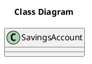

# US010 Add a Family
=======================================


# 1. Requirements

US172 As a family member, I want to add a bank savings account I have.

````puml
autonumber

skinparam sequence {
ArrowColor black
LifeLineBorderColor black
LifeLineBackgroundColor white
ParticipantBorderColor black
ParticipantBackgroundColor white
ParticipantFontColor black
ActorBorderColor black
ActorBackgroundColor white
}

title AddBankSavingsAccount
actor "Family Member" as FamilyMember
participant "System" as System

activate FamilyMember
FamilyMember -> System: addBankSavingsAccount
activate System
System --> FamilyMember: request data
FamilyMember -> System: input data
alt failure
System --> FamilyMember: inform failure
else success
System --> FamilyMember: inform success
deactivate System
end alt
deactivate FamilyMember

````

# 2. Analysis


# 3. Design


skinparam sequence {
ArrowColor black
LifeLineBorderColor black
LifeLineBackgroundColor white
ParticipantBorderColor black
ParticipantBackgroundColor white
ParticipantFontColor black
ActorBorderColor black
ActorBackgroundColor white
}

````puml
autonumber


title AddBankSavingsAccount
actor "Family Member" as FamilyMember
participant "UI" as UI
participant ": AddSavings\nAccountController" as Controller
participant ": Application" as App
participant ": FamilyService" as FamilyService
participant ": AccountService" as AccountService
participant ": Family" as Family

activate FamilyMember
FamilyMember -> UI: I want to add a Bank Savings Account
activate UI
UI -> Controller : addBankSavingsAccount(FamilyID, FamilyMemberID, \nIBAN, Balance, Name, InterestRate)
activate Controller
Controller -> App : getFamilyService()
activate App
App --> Controller : familyService
deactivate App
Controller -> FamilyService : getFamily(FamilyID)
activate FamilyService
FamilyService -> Family : getFamily(FamilyID)
activate Family
Family --> FamilyService : Family
FamilyService --> Controller : Family
Controller -> FamilyService : getFamilyMember(FamilyMemberID)
FamilyService -> Family : getFamilyMember(FamilyMemberID)
Family -> Family : getFamilyMember(FamilyMemberID)
Family --> FamilyService : aFamilyMember
FamilyService --> Controller : aFamilyMember
Controller -> App : getAccountService()
activate App
App --> Controller : accountService
deactivate App
Controller -> AccountService : addBankSavingsAccount(IBAN, Balance, \nName, InterestRate)
activate AccountService
 
alt failure
UI --> FamilyMember: inform failure
else success
UI --> FamilyMember: inform success
deactivate UI
end alt
deactivate FamilyMember

````

## 3.1. Functionality Use

## 3.2. Class Diagram


## 3.3. Applied Patterns

## 3.4. Tests

**Test 1:** 

**Test 2:** 

**Test 3:** 

# 4. Implementation

# 5. Integration

#6. Observations
