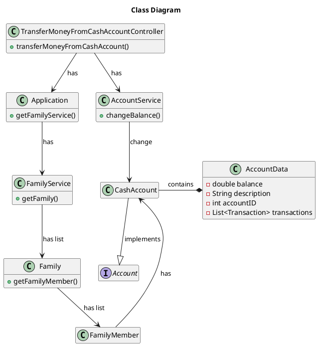

# US180 transfer money from my cash account to another family member’s cash account

# 1. Requirements

## 1.1. Client Notes

As a family member, I want to add to transfer money from my cash account to another family member’s cash account:

**Demonstration 1** As a family member, I want to...

- 1.1. transfer money from my cash account to another family member’s cash account:
 
**Extracted from communications with the Product Owner**

- >*"lorem ipsum"*;
- >*" "*;

We interpreted this requirement as the function of a family member to transfer money from his cash account to another family member’s cash account.

## 1.2. System Sequence Diagram

```puml
autonumber
title System Sequence Diagram - US180

actor "Family Member" as familyMember
participant ": System" as system

activate familyMember
familyMember-> system : transfer money
activate system
familyMember -> system : inputs required data

alt failure
system -> familyMember : Inform Failure

else sucess
system -> familyMember : Inform Sucess

end

deactivate system

deactivate familyMember
```

## 1.3. Dependencies from other User Stories

This user story is dependent on the following:

- US010_Add Family: to create a family;
- US011_Add Family Administrator: to add an Administrator, that he is allowed to add a Family Member;
- US101_Add Family Members: to add a Personal Cash Account
- US170_Create Family Member Cash Account: to create a cash account from where money will be transferred or received.  
- US120_Create Family Cash Account: to create a cash account to transfer money to family members in the first time. Only family cash account can transfer money to the family members after the creation of the family member´s personal cash account.

# 2. Analysis

For the fulfillment of the raised requirements, we analyze that for the accomplishment of the US we need, at this moment, the input of the family administrator of the following data:

- Other ID (User who will receive the money to his cash account);
- Family ID (User's Family);
- Card description (Card Description);
- Withdrawal limit (Card usage limit).

##2.1. Domain Model Diagram



# 3. Design

The process to fulfill the requirement we need the input of data from a UI to create a CreditCardAccount object and add it to a specific FamilyMember(familyMemberID) in a given Family(familyID).
To create a valid CreditCardAccount object the constructor must acept an id, that is generated in AccountService.
A default Card Description is generated if has been inputed a invalid Card Description (null, empty or blank).

The controller will return:
- True, if a CreditCardAccount as been successfull created and assign.
- False, if catches on of the following throws ("Family don't exist", "Family Member don't exist")

## 3.1. Functionality Use

``` puml
autonumber 1
title transferMoneyCashAccountCardAccount
actor "Actor" as actor
participant ": UI" as UI
participant ": TransferMoneyFromCashAccount\n Controller" as controller
participant ": Application" as app
'participant "aAccountService \n : AccountService" as aserv
participant "aTransactionService \n : TransactionService" as tserv
participant "aFamilyService \n : FamilyService" as fserv
participant "aFamily : Family" as family
participant "aCreditCardAccount : CreditCard Account" as credit
participant "aFamilyMember : FamilyMember" as familyMember

activate actor
activate UI
deactivate UI
actor -> UI : inputs required data
UI -> controller : transferMoneyFromFamilyMemberCashAccount \n ToAnotherFamilyCashAccount \n (originFamilyMemberID,  destinationFamilyMemberID, ammount)
activate controller
controller -> app : getFamilyService()
activate app
app -> controller : aFamilyService
deactivate app
controller -> fserv : getFamily(familyID)
activate fserv
fserv -> controller : aFamily
deactivate fserv

controller -> family : getFamilyMember(familyMemberID)
activate family
activate familyMember
family -> familyMember : hasAccount(AccountID)
deactivate family

/'app -> controller : getAccountService()
activate app
controller -> app : aAccountService
deactivate app '/

aserv -> aserv : id = generateID()

aserv -> credit** : createCreditCardAccount(id, cardDescription, withdrawLimit)

aserv -> familyMember : addAccountToList(aCreditCardAccount)
activate familyMember 
familyMember -> aserv : inform sucess
deactivate familyMember
aserv -> controller : inform sucess
deactivate aserv

controller -> UI : inform sucess
deactivate controller

UI -> actor : inform sucess
deactivate UI
deactivate actor
```

## 3.2. Class Diagram

```puml

title Class Diagram - US173

class AddCreditCardAcccountController {
}

class Application {
}

class AccountService {
+ addCreditCardAccount()
}

class FamilyService {
   }
   
class FamilyMember {
    + addAccount()
}

class Account {
}

class CreditCardAccount {
}

AddCreditCardAcccountController  -> Application
AddCreditCardAcccountController  -down-> AccountService
(AccountService, FamilyMember) -> CreditCardAccount : add credit card account to member
Application --> FamilyService : has
FamilyService --> FamilyMember : has
FamilyMember --> Account : has List<Account>
Account  <-- CreditCardAccount : Is a
```

## 3.3. Applied Patterns


## 3.4. Tests


## 4. Implementation


# 5. Integration/Demonstration


# 6. Observations

