# US180 transfer money from my cash account to another family member’s cash account

# 1. Requirements

## 1.1. Client Notes

As a family member, I want to add to transfer money from my cash account to another family member’s cash account:

**Demonstration 1** As a family member, I want to...

- 1.1. transfer money from my cash account to another family member’s cash account:
 

We interpreted this requirement as the function of a family member to transfer money from his cash account to another family member’s cash account.

## 1.2. System Sequence Diagram

```puml
autonumber
title System Sequence Diagram - US180

actor "Family Member" as familyMember
participant ": System" as system

activate familyMember
familyMember-> system : transfer money
activate system
system -> familyMember: requests required data
familyMember-> system : send required data
alt failure
system -> familyMember: Inform Failure
else sucess
system -> familyMember : Inform Sucess

end

deactivate system

deactivate familyMember
```

## 1.3. Dependencies from other User Stories

This user story is dependent on the following:

- US010_Add Family: to create a family;
- US011_Add Family Administrator: to add an Administrator, that he is allowed to add a Family Member;
- US101_Add Family Members: to add a Personal Cash Account
- US170_Create Family Member Cash Account: to create a cash account from where money will be transferred or received.

# 2. Analysis

To  meet the requirements of this particular US we need at this stage the input of the following necessary data:

- Family ID (User's Family);
- Origin FamilyMember ID (User who will send the money from his cash account);
- Destination Family Member ID (User who will receive the money to his cash account);
- Amount transferred;
- Category

##2.1. Domain Model Diagram

```puml
hide empty members
hide circles
left to right direction
title Domain Model Diagram - US180

class Family {
UniqueID
Name
RegistrationDate
}

class FamilyMember {
Name
BirthDate
Address
Vat number
Email
Telephone
CCnumber
}

class CashAccount {
UniqueID
Balance
Transactions
Description
}

class Category {
UniqueID
Name
ParentCategory
}

class Transaction {
targetAccount
Date
Amount
Category
Designation
Credit/Debit
}

Family "*" -- "*" Category : has standard >
Family "1" -- "0..*" Category : has custom >
Family "1" -- "0..1" CashAccount : has >
Family "1" -- "0..1" FamilyMember : has administrator >
Family "1" -- "1..*" FamilyMember : has members >
Category "1" -- "0..1" Category : has parent
FamilyMember "1" -- "0..*" CashAccount : has >
CashAccount "1" -- "0..*" Transaction : has >
````
# 3. Design

The process to fulfill the requirement we need the input of data from a UI to determine origin and destination accounts inside family members, and the amount to be transferred.
To execute the transfer the controller will first invoke the FamilyService to get the respective Family

The controller will return:
- True, 
- False, 

## 3.1. Functionality Use

### Sequence diagram

````puml
@startuml
title US180 - Transfer Money from One Family Member Cash Account To a Personal Cash Account - SequenceDiagram
autonumber

Actor "FamilyMember" as Actor
Participant "UI" as UI
Participant ": TransferCashBetweenFamilyMembers\nCashAccountsController" as controller
Participant ": Application" as App
Participant ": FamilyService" as FamilyService
Participant "aFamily\n : Family" as Family
Participant ": CategoryService" as CategoryService
Participant ": AccountService" as AccountService
Participant ": aFamilyMember\n : FamilyMember" as FamilyMember

Actor -> UI : Transfer Money \nto Family Member
activate UI
UI --> Actor : ask for required data
deactivate UI

Actor -> UI : input required data
activate UI
UI -> controller : TransferCash\nBetweenFamilyMembers\nCashAccounts(CashTransferDTO)
activate controller
controller -> App : getFamilyService()
activate App
App --> controller : FamilyService
deactivate App

controller -> FamilyService : getFamily(familyID)
activate FamilyService
FamilyService --> controller : aFamily
deactivate FamilyService

controller -> Family : getOriginFamilyMember(familyMemberCC)
activate Family
Family --> controller : aFamilyMember
controller -> Family : getDestinationFamilyMember(familyMemberCC)
Family --> controller : aFamilyMember
deactivate Family

alt StandardCategory
controller -> App : getCategoryService()
activate App
App --> controller : CategoryService
deactivate App
controller -> CategoryService : getStandardCategoryByID(categoryID)
activate CategoryService
CategoryService --> controller : aCategory
deactivate CategoryService

else CustomCategory

controller -> Family : getCustomCategoryByID(categoryID)
activate Family
Family --> controller : aCategory
deactivate Family

end

controller -> App : getAccountService()
activate App
App --> controller : AccountService
deactivate App

controller -> AccountService : transferCashBetweenFamilyMembers\nCashAccounts(originFamilyMember,destinationFamilyMember,cashTransferDTO)
activate AccountService

ref over AccountService

Transfer Cash From One Family Member
 To Family Member

end ref

AccountService --> controller : success
deactivate AccountService

controller -> AccountService : getOriginAccount(originFamilyMember,originAccountID)
activate AccountService
AccountService --> controller : originCashAccount
controller -> AccountService : getDestinationAccount(destinationFamilyMember,destinationAccountID)
AccountService --> controller : destinationCashAccount
deactivate AccountService

controller -> App : getTransactionService()
activate App
App --> controller : TransactionService
deactivate App

controller -> TransactionService : registerCashTransferOther\n(originCashAccount, destinationCashAccount, cashTransferDTO)
activate TransactionService

ref over TransactionService

Register Cash Transfer

end ref

TransactionService --> controller : success
deactivate TransactionService

controller --> UI : success
deactivate controller

UI --> Actor : inform success
deactivate UI

@enduml

````

````puml
title Transfer Cash From One Family Member To Family Member
autonumber

Participant ": AccountService" as AccountService
Participant "aFamily\n : Family" as Family
Participant "transferAmount\n : MoneyValue" as transferMoneyValue
Participant "aFamilyMember\n : FamilyMember" as FamilyMember
Participant "aFamilyMemberCashAccount\n : CashAccount" as familyMemberCashAccount

-> AccountService : transferCashBetweenFamily\nMembersCashAccounts\n(aFamilyMember, aFamilyMember, \n cashTransferDTO)
activate AccountService

AccountService -> Family : getOriginFamilyMemberCashAccount()
activate Family
Family --> AccountService : originFamilyMemberCashAccount
AccountService -> Family : getDestinationFamilyMemberCashAccount()
Family --> AccountService : destinationFamilyMemberCashAccount
deactivate Family

AccountService -> transferMoneyValue ** : create(transferValue, currency)

AccountService -> familyMemberCashAccount : hasEnoughMoneyForTransaction(transferAmount)
activate familyMemberCashAccount

opt true
familyMemberCashAccountt --> AccountService : false
<-- AccountService : failure

else false
familyMemberCashAccount --> AccountService : true
deactivate familyMemberCashAccount
end

AccountService -> familyMemberCashAccount : checkCurrency(currency)
activate familyMemberCashAccount

opt different currency
familyMemberCashAccount --> AccountService : false
<-- AccountService : failure

else same currency
familyMemberCashAccount --> AccountService : true
deactivate familyMemberCashAccount
end opt

AccountService -> FamilyMember : getOriginAccount(originFamilyAccountID)
activate FamilyMember
FamilyMember --> AccountService : originCashAccount
AccountService -> FamilyMember : getOriginAccount(originFamilyAccountID)
FamilyMember --> AccountService : originCashAccount
deactivate FamilyMember


AccountService -> familyMemberCashAccount : debit(transferAmount)
activate familyMemberCashAccount
AccountService -> familyMemberCashAccount : credit(transferAmount)
deactivate familyMemberCashAccount
<-- AccountService : success
deactivate AccountService

````

````puml
autonumber
title Register Cash Transfer

Participant ": TransactionService" as TransactionService
Participant "originCashAccount\n : CashAccount" as originCashAccount
Participant "destinationCashAccount\n : CashAccount" as destinationCashAccount

-> TransactionService : registerCashTransferOther\n(originCashAccount, destinationCashAccount, cashTransferDTO)
activate TransactionService

TransactionService -> originCashAccount : getMoneyBalance()
activate originCashAccount
originCashAccount --> TransactionService : remainingBalanceOrigin
deactivate originCashAccount

TransactionService -> originCashAccount : registerTransaction(originCashAccount, category,\n isCredit, remainingBalanceOrigin, cashTransferDTO)
activate originCashAccount
originCashAccount --> TransactionService : true
deactivate originCashAccount

TransactionService -> destinationCashAccount : getMoneyBalance()
activate destinationCashAccount
destinationCashAccount --> TransactionService : remainingBalanceDestination
deactivate destinationCashAccount

TransactionService -> destinationCashAccount : registerTransaction(destinationCashAccount, category, isCredit,\n remainingBalanceDestination, cashTransferDTO)
activate destinationCashAccount
destinationCashAccount --> TransactionService : true
deactivate destinationCashAccount

<-- TransactionService : success
deactivate TransactionService

````

## 3.2. Class Diagram

```puml
left to right direction
title Class Diagram - US180
skinparam linetype ortho

hide empty members

class TransferCashBetweenFamily\nMembersCashAccountsController {
+transferCashBetweenFamilyMembersCashAccountsController
}

class Application {
+getFamilyService()
+getCategoryService()
+getAccountService()
}

class CategoryService {
+getStandardCategoryByID()
}
interface Category{
}

class StandardCategory {
}

class CustomCategory {
}

class FamilyService {
+getFamily()
}

class Family {
+getFamilyMember()
+getFamilyMemberCashAccount()
+getCustomCategoryById()
}

class FamilyMember {
+hasCashAccount()
+getAccount()
}

class AccountService {
+verifyAccountType()
+transferCashBetweenFamilyMembers()
}

class TransactionService {
+registerCashTransfer()
}

class CashAccount implements Account {
+debit()
+credit()
+hasEnoughMoneyForTransaction()
+checkCurrency()
+registerTransactionOther()
}

class Account {
}

class MoneyValue {
+debit()
+credit()
}

class CashTransaction {
}

class TransactionData {

}

interface Account {
}

TransferCashBetweenFamily\nMembersCashAccountsController --> Application : has
TransferCashBetweenFamily\nMembersCashAccountsController--> FamilyService : calls
TransferCashBetweenFamily\nMembersCashAccountsController --> CategoryService : calls
TransferCashBetweenFamily\nMembersCashAccountsController --> AccountService : calls
TransferCashBetweenFamily\nMembersCashAccountsController --> TransactionService : calls
CategoryService --> StandardCategory
'CategoryService -left-> CategoryTreeDTO : creates
'FamilyService -right-> FamilyWithoutAdministratorDTO : creates
FamilyService --> Family : has list
Family --> CashAccount : has
Family --> CustomCategory : \n\n has
Family --> FamilyMember : has list
Category <|-- StandardCategory : implements
Category <|-right- CustomCategory : implements
FamilyMember --> Account : has list
'Account <|-- CashAccount : implements
CashAccount - AccountData : contains
AccountService --> Account: handles

TransactionService --> CashTransaction: handles
Account --> Transaction: has list

AccountData o- MoneyValue : contains

CashTransaction  o- TransactionData : contains

```


## 3.3. Applied Patterns

###We applied the following principles:

- **GRASP**:
    - Information expert:
        - This pattern was used in classes that implemented the Account interface, as well as the CashTransactions;

    - **Controller**:
        - To deal with the responsibility of receiving input from outside the system (first layer after the UI) we implemented a use-case controller.

    - **Pure Fabrication**:
        - The creation of classes like AccountService and TransactionService which don't have domain model equivalents allowed to reduce the responsibilities of the other classes (Family and FamilyMember for example)

    - **High cohesion and Low Coupling**:
        - The creation of the Service classes provided low Coupling and high Cohesion, keeping one Class as the Information Expert.

- **SOLID**:
    - Single-responsibility principle:
        - this pattern was used in the AccountService class, in which the only responsibility is to manage account operations while all the transaction registration responsibilities were delegated to the TransactionService.


## 3.4. Tests

**Tests :** Controller:

#### Success cases:

**Test 1** : Both Family Members are valid, Family is known and valid and all transfer details are valid

    @Test
    void transferCashBetweenFamilyMembersCashAccountsTrueWithSufficientFunds() {
    transferenceDTO = new CashTransferDTO(familyID, originFamilyMemberCC, originAccountID, destinationFamilyMemberCC, destinationAccountID, transferedValue, currency,categoryID, transactionDesignation, transactionDate);
    transferCashBetweenFamilyMembersCashAccountsController controller = new TransferCashBetweenFamilyMembersCashAccountsController(ffmApplication);
    boolean result = controller.transferCashBetweenFamilyMembersCashAccounts(transferenceDTO);
    Assertions.assertTrue(result);
    
#### Failure cases:

**Test 2** : **Unknown** Family will not execute the transfer and returns **false**

    @Test
    void transferCashBetweenFamilyMembersCashAccountsFromFamilyMembersOfUnknownFamily() {
    transferenceDTO = new CashTransferDTO(2, originFamilyMemberCC, originAccountID, "000",  1, 2, currency, 1,"Beer", date1);
    TransferCashBetweenFamilyMembersCashAccountsController controller = new TransferCashBetweenFamilyMembersCashAccountsController(ffmApplication);
    boolean result = controller.transferCashBetweenFamilyMembersCashAccounts(transferenceDTO);
    assertFalse(result);
    }

**Test 3** : **Unknown** Category will not execute the transfer and returns **false**  

    @Test
    void transferCashBetweenFamilyMembersCashAccountsFromFamilyMembersWithUnknowCategory() {
    transferenceDTO = new CashTransferDTO(2, originFamilyMemberCC, originAccountID, "000",  1, 2, currency,1 ,"Beer", date1);
    TransferCashBetweenFamilyMembersCashAccountsController controller = new TransferCashBetweenFamilyMembersCashAccountsController(ffmApplication);
    boolean result = controller.transferCashBetweenFamilyMembersCashAccounts(transferenceDTO);
    assertFalse(result);
    }

**Test 3** : **Unknown** Category will not execute the transfer and throws an exception 

    @Test
    void transferCashBetweenFamilyMembersCashAccountsFromFamilyMembersWithUnknowCategory2() {
    transferenceDTO = new CashTransferDTO(familyID, originFamilyMemberCC, originAccountID, "000",  1, 2, currency,1, "Beer", date1);
    TransferCashBetweenFamilyMembersCashAccountsController controller = new TransferCashBetweenFamilyMembersCashAccountsController(ffmApplication);
    assertThrows(NullPointerException.class, ()-> controller.transferCashBetweenFamilyMembersCashAccounts(transferenceDTO));
    }

## 4. Implementation

### 4.1.Transfer money from one family member to other family member both of the same family

- The method in the AccountService will make the transference of money
  between the origin and destination accounts respective ID that are given in new CashTransferDTO object
  and then changes the balance in the originAccount (debit) and in the destinationAccount (credit).
  
This method has three important verifications that are simple attributes validations, the first two refer
to validate the amount transferred , the second and third validations are relative to the currency type of both 
the origin account, and the destination account.

        public boolean transferCashBetweenFamilyMembersCashAccounts(FamilyMember originFamilyMember, FamilyMember destinationFamilyMember, CashTransferDTO cashTransferDTO) {
        int originFamilyMemberAccountID = cashTransferDTO.getOriginAccountID();
        int destinationFamilyMemberAccountID = cashTransferDTO.getDestinationAccountID();
        Account originFamilyMemberAccount = originFamilyMember.getAccount(originFamilyMemberAccountID);
        Account destinationFamilyMemberAccount = destinationFamilyMember.getAccount(destinationFamilyMemberAccountID);
        CurrencyEnum currency = cashTransferDTO.getCurrency();
        double transferredValue = cashTransferDTO.getTransferAmount();
        MoneyValue transferAmmount = new MoneyValue(transferredValue, currency);
        if(!originFamilyMemberAccount.hasEnoughMoneyForTransaction(transferAmmount)) return false;
        if(!originFamilyMemberAccount.checkCurrency(currency)) throw new IllegalArgumentException("Invalid currency");
        if(!destinationFamilyMemberAccount.checkCurrency(currency)) throw new IllegalArgumentException("Invalid currency");
        originFamilyMemberAccount.debit(transferAmmount);
        destinationFamilyMemberAccount.credit(transferAmmount);
        return true;
        }

 # 5. Integration/Demonstration

-  This User Story depends on the [US185] - GetAccountBalance because it uses methods created in that US.

# 6. Observations

In the future I think the problems are only going to be about establishing daily limits or amount limits per cash transfer. 

