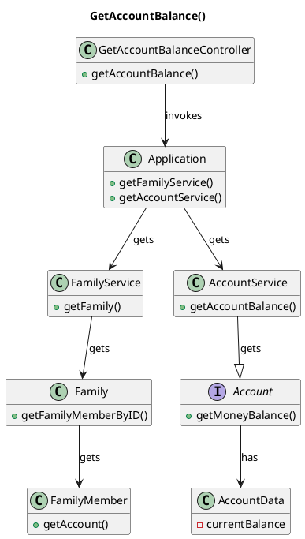

# US181 Get Account Balance
=======================================


# 1. Requirements

### 1.1 Client's Sheet

- As a family member, I want to check the balance of one of my accounts.

We interpreted this requirement as the function of a FamilyMember to retrieve the balance from one of its accounts.

The balance is an attribute of all account types and is returned in a MoneyValue object, accounting for both value and currency.
  

### 1.2 System Sequence Diagram

```` puml

    autonumber
    title US185 - Get Account Balance
    actor "Family Member" as fm
    participant "System" as system

    activate fm
    fm -> system: Get Profile Information
    activate system
    fm -> system: input required data
    system --> fm: return Balance
    deactivate fm
    deactivate system

@endpuml
````


### 1.3 Dependencies

This user story has a dependency with these **1** user stories:

- **[US010](US010_AddFamily.md)** *(As a system manager, I want to create a family)*
  - In order to be added a family member, the system needs to have a family;

- **[US011](US010_AddFamilyAdministrator.md)** *(As a system manager, I want to add a family administrator)*
  - In order to be added a family member, the family needs to have a family administrator;
  
- **[US101](US101_AddFamilyMember.md)** *(As a family Administrator, I want to add a familyMember to a family)*
  - In order to add a bank account, the system needs to have that Family Member.

- **[US171](US170_CreatePersonalCashAccount.md)** *(As a family member, I want to create a personal cash account.)*
  - In order to be get cash account balance, there needs to be a cash account in the family member.
  
- **[US171](US171_AddBankAccount.md)** *(As a family member, I want to add a bank account I have.)*
  - In order to be get bank account balance, there needs to be a bank account.

- **[US172](US172_AddBankSavingsAccount.md)** *(As a family member, I want to add a bank savings account I have.)*
  - In order to be get savings account balance, there needs to be a savings account.

- **[US173](US173_AddCreditCardAccount.md)** *(As a family member, I want to add a credit card account I have.)*
  - In order to be get credit card account balance, there needs to be a credit card account.
  
# 2. Analysis

In order to fulfill this requirement, we need three main data pieces:
- Family ID;
- Family Member ID;
- Bank Account ID;

Since the accounts will be stored inside the Family Members, we need to be able to identify the family member in question. For this we need both the familyID and the familyMemberID.
To identify the account we need the account ID, which is unique in each family member, this approach removes the need to check if the account belongs to the user requesting the balance.

At a later iteration, the family's and family member's IDs would be acquired through the Log In information. For this sprint, the IDs will have to be inputted along with the Bank Account information.

# 3. Design

````puml
@startuml
autonumber
title US171 - GetAccountBalance Sequece Diagram

actor "FamilyMember" as actor
participant ": UI" as UI
participant ": GetAccountBalanceController" as controller
participant ": FFM Application" as app
participant "famServ : FamilyService" as famService
participant "aFamily : Family" as family
participant "accServ : AccountService" as accServ
participant "aFamilyMember : FamilyMember" as person
participant "anAccount: Account" as account

activate actor
actor -> UI: get account balance
activate UI
UI -> actor: ask data
deactivate UI
actor -> UI: inputs required data
activate UI
UI -> controller: getAccountBalance(familyID,familyMemberID, accountID)

activate controller
controller -> app: getFamilyService()
activate app
app -> controller: aFamilyService
deactivate app

controller -> famService: getFamily(familyID)
activate famService
famService -> famService: getFamily(familyID)
famService -> controller: aFamily
deactivate famService
controller -> family: getFamilyMember(familyMemberID)
activate family
family -> family: getFamilyMember(familyMemberID)
family -> controller: aFamilyMember
deactivate family

controller -> app: getAccountService()
activate app
app -> controller: anAccountService
deactivate app
controller -> accServ: getAccountBalance(FamilyMember, accountID)
activate accServ
accServ -> person: getAccount(familyMember, accountID)
activate person
person -> accServ: anAccount
deactivate person
accServ -> account: getBalance()
activate account
account -> accServ: balance
deactivate account
accServ -> controller: balance
deactivate accServ
controller -> UI: balance
deactivate controller
UI -> actor: Display balance
deactivate UI
deactivate actor

@enduml
````


## 3.1. Functionality Use
The getAccountBalanceController will invoke the application object, the Family Service object, the Family object and finally the Family Member object.
In each of these steps it will find the corresponding instance, using either the familyId, familyMemberID or accountID.
The Account Service is then invoked and both the Family Member ID and the Account ID are forwarded to it. Once the correct account is reached, it will get and return the balance of the account back to the controller.


## 3.2. Class Diagram
The main Classes involved are:
- GetAccountBalanceController
- Application
- FamilyService
- Family
- FamilyMember
- AccountService
- Account
- BankAccount
- CreditCardAccount
- SavingsAccount
- CashAccount

**AddBankAccount()**


## 3.3. Applied Patterns
We applied the principles of Controller, Information Expert, Creator e PureFabrication from the GRASP pattern.
We also used the SOLID SRP principle.

## 3.4. Domain Tests 

###Test 1: Verify that CashAccount returns balance

  - **1.1.** Controller is used for a CashAccount and **balance** is returned with expected MoneyValue object.
        @Test
        void getBankAccountBalanceTest1_Success() {
        MoneyValue expected = new MoneyValue(0.6, CurrencyEnum.EURO);

        MoneyValue result = getAccountBalanceController.getAccountBalance(1, cc, 1);

        Assertions.assertEquals(expected, result);
        Assertions.assertNotSame(expected, result);
        }
  - **1.2.** Controller is used for a CashAccount and **balance** is returned with a different MoneyValue object than the one created for the test.
    
        @Test
        void getBankAccountBalanceTest2_NotEquals() {
        MoneyValue expected = new MoneyValue(0.9, CurrencyEnum.EURO);
    
        MoneyValue result = getAccountBalanceController.getAccountBalance(1, cc, 1);

        Assertions.assertNotEquals(expected, result);
        }
###Test 2: Verify that SavingsAccount returns balance

  - **2.1.** Controller is used for a SavingsAccount and **balance** is returned with expected MoneyValue object.

        @Test
        void getSavingsAccountBalanceTest1_Success() {
        MoneyValue expected = new MoneyValue(15.0, CurrencyEnum.EURO);

        MoneyValue result = getAccountBalanceController.getAccountBalance(1, cc, 2);

        Assertions.assertEquals(expected, result);
        Assertions.assertNotSame(expected, result);
        }
  - **2.2.** Controller is used for a SavingsAccount and **balance** is returned with a different MoneyValue object than the one created for the test.
    
        @Test
        void getSavingsAccountBalanceTest2_NotEquals() {
        MoneyValue expected = new MoneyValue(0.9, CurrencyEnum.EURO);

        MoneyValue result = getAccountBalanceController.getAccountBalance(1, cc, 2);

        Assertions.assertNotEquals(expected, result);
        }
###Test 3: Verify that CreditCardAccount returns balance

  - **3.1.** Controller is used for a CreditCardAccount and **balance** is returned with expected MoneyValue object.

        @Test
        void getCreditCardAccountBalanceTest1_Success() {
        MoneyValue expected = new MoneyValue(100.0, CurrencyEnum.EURO);

        MoneyValue result = getAccountBalanceController.getAccountBalance(1, cc, 3);

        Assertions.assertEquals(expected, result);
        Assertions.assertNotSame(expected, result);
        }
  - **3.2.** Controller is used for a CreditCardAccount and **balance** is returned with a different MoneyValue object than the one created for the test.
    
        @Test
        void getCreditCardAccountBalanceTest2_NotEquals() {
        MoneyValue expected = new MoneyValue(0.9, CurrencyEnum.EURO);

        MoneyValue result = getAccountBalanceController.getAccountBalance(1, cc, 3);

        Assertions.assertNotEquals(expected, result);
        }
###Test 4: Verify that CashAccount returns balance

- **4.1.** Controller is used for a CashAccount and **balance** is returned with expected MoneyValue object.
    
        @Test
        void getCashAccountBalanceTest1_Success() {
        MoneyValue expected = new MoneyValue(5.0, CurrencyEnum.EURO);

        MoneyValue result = getAccountBalanceController.getAccountBalance(1, cc, 4);

        Assertions.assertEquals(expected, result);
        Assertions.assertNotSame(expected, result);
    }
  
  - **4.2.** Controller is used for a CashAccount and **balance** is returned with a different MoneyValue object than the one created for the test.
        
        @Test
        void getCashAccountBalanceTest2_NotEquals() {
        MoneyValue expected = new MoneyValue(0.9, CurrencyEnum.EURO);

        MoneyValue result = getAccountBalanceController.getAccountBalance(1, cc, 4);

        Assertions.assertNotEquals(expected, result);
    }
  
# 4. Implementation

**Get Account Balance**

    public MoneyValue getAccountBalance(FamilyMember familyMember, int accountID) {
        Account account = getAccount(familyMember, accountID);
        return account.getMoneyBalance();
    }


# 5. Integration/Demonstration

This UserStory build upon the user stories **[US010 - Add Family]**, **[US011 - Add Family Administrator]**, **[US101 - Add Family Member]**, **[US170 - Create Personal Cash Account]**, **[US171 - Create Bank Account]**, **[US172 - Create Bank Savings Account]** and **[US173 - Create Credit Card Account]**.

# 6. Observations

In the future, both family ID and family member ID will be provided with the user login.
With the login layer, the user ID will be already available before the UserStory gets executed, avoiding the method *getFamily(familyID)* and *getFamilyMember(familyMemberID)* execution.


