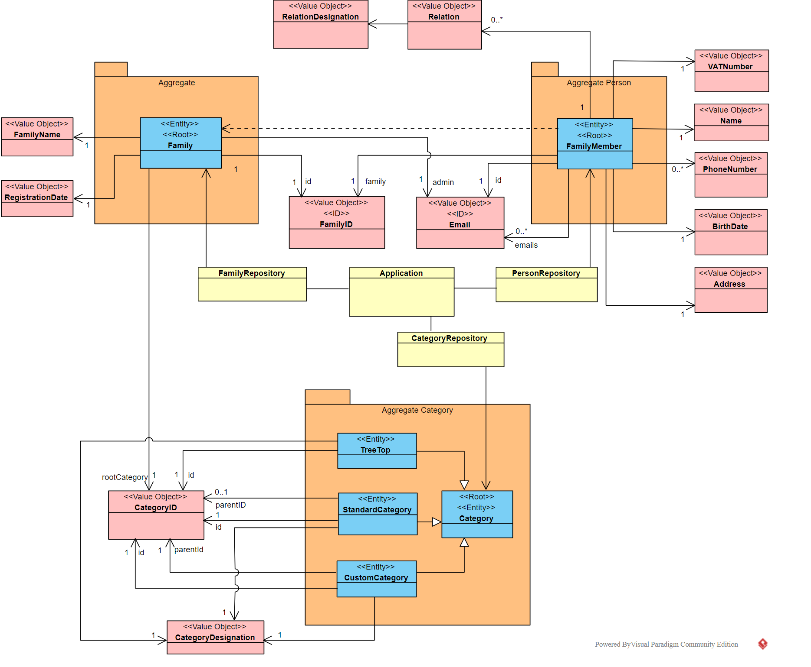

# This document keeps track of the different Class Diagrams throughout the sprint

    22 março 2021

    Log:
    
## 1. Retirada 2ª hipótese representação de agregado Category.  
   
## 2. Hipóteses de ligação da Family às Categories:  
   
### a. TreeTop ligado ao FamilyID (Uma treetop tem um familyID)  

### b. Agregado Category tem uma Categoria Raíz.
   
   Existe apenas Interface Category no Agregado Category (remover o TreeTop) implementada por Standard e Custom Category.  
   Family tem ligação de 1 para 1 com um CategoryID (Value object) que corresponde a uma Standard Category.  
   Esta Standard Category implementa a Interface Category (Root).
       
   ### PERGUNTA: Uma Root Entity de um agregado pode ser uma Interface?
   
### c. Três subtipos de Category que implementam a Interface Category.
A TreeTop será uma Category que não tem ParentID e possivelmente a Designação envolverá o nome da família. 
NOTA: Pode-se eventualmente definir o parentID da TreeTop como um número "default" (exemplo -1)  
Este número quereria dizer que não há Categoria pai e o ciclo parava de iterar em busca de um parent.  
##### Boa prática? Número mágico
   

## 3. Representação de ligação entre pessoas e famílias  
  
   
   ### Versão 1
Family Members conhecem a sua família.  
Family não conhece os seus family Members  
FamilyMember tem um atributo ID (Email) e tem um outro atributo familyID (email do admin)
     
  
  ### Versão 2  
   Family conhece os seus members.   
    Members não conhecem a família a que pertencem
    Family tem uma lista de Family Members (emails)
    Family Member tem um ID (email)
    
   
Hipotése C das Categories + Versão inicial de Family e Family Members (Antes da aula de LABPROJ II)

---

Hipótese B das Categories + versão 1 Family e Family Members

---  

Hipótese B das Categories + Versão 2 Family e Family Members

    