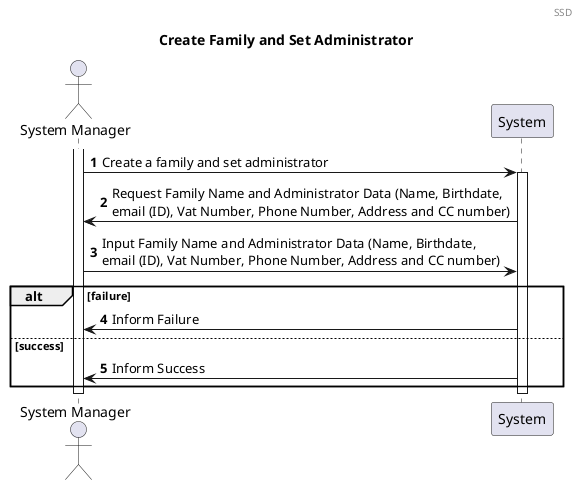
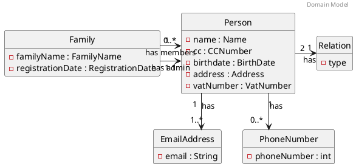
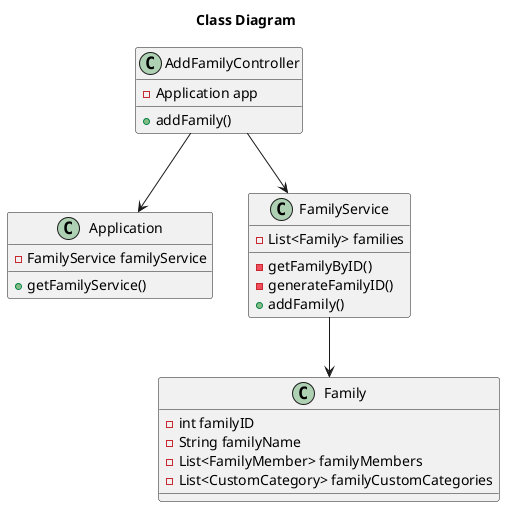

# US010 Create a Family and set the Family administrator
=======================================

# 1. Requirements

*As a system administrator, I want to create a family and set a family administrator*



# 2. Analysis

## 2.1 Summary


## 2.2. Domain Model Excerpt




# 3. Design

The process to fulfill this requirement requires the actor to select they want to create a new family, 
which would prompt the input of the designation or name for that family.
Given the current absence of an UI layer the String *familyName* will be passed directly into the AddFamilyController. 

````puml
@startuml
autonumber
title createFamily
actor "System Manager" as systemManager
participant ": FamilyAndAdminService" as FamAdminService
participant "FamilyRepository" as frepository
participant "newFamily : Family" as family
participant "newFamilyName" as familyName
participant "newRegistrationDate" as registrationDate
participant "PersonRepository" as prepository
participant "Admin" as admin
activate systemManager
systemManager -> FamAdminService: getFamilyService()
activate FamAdminService
FamAdminService --> frepository: createFamily()
activate frepository
frepository -> frepository : generateFamilyID()
frepository -> family** : create(familyID, adminEMail, familyName, localDate)
activate family
family ->  familyName** : create
family -> registrationDate** : create
family -> frepository : familyID
deactivate family
frepository -> frepository : addToRepository

frepository -> FamAdminService : familyID
deactivate frepository
FamAdminService -> prepository : createPerson()
activate prepository
prepository -> admin** : create
activate admin
admin -> prepository : email
deactivate admin
alt Success
prepository -> prepository : verifyEmail
prepository -> prepository : addToRepository
prepository --> FamAdminService : adminEMail
else Fail

FamAdminService -> frepository : removeFamily(FamilyID)
activate frepository
frepository --> FamAdminService : ok
deactivate frepository
deactivate FamAdminService
end
deactivate systemManager
@enduml
````

## 3.1. Functionality Use
The AddFamilyController will invoke the Application object, which stores a FamilyService object.
The Application will return the FamilyService, which contains a list of all Families.
The FamilyService then creates a new Family Object and adds it to the existing list.


## 3.2. Class Diagram


## 3.3. Applied Patterns
We applied the principles of Controller, Information Expert, Creator and PureFabrication from the GRASP pattern.
We also used the SOLID Single Responsibility Principle.

## 3.4. Tests 
    
Several cases where analyzed in order to test the creation of a new Family    

**Test 1:** Test that it is possible to create a new instance of Family with a valid Admin

**Test 2:** Test that it is not possible to create a new instance of Family if admin email is already registered

**Test 3:** Test that it is not possible to create a new instance of Family receiving a **familyName** that is null

**Test 4:** Test that it is not possible to create a new instance of Family receiving a **familyName** that is empty

**Test 5:** Test that it is not possible to create a new instance of Family receiving a **familyName** that is blank

**Additional Tests** Test that its not possible to create a new instance of Family if any attribure is empty, blank or null
The whole user story was tested for the case of success and for failure

**Test 5:** Success
```` 
@DisplayName("Test if a family can be successfully created)  
@Test
 void shouldBeTrueCreateFamily() {
        Application application = new Application();
        Create Family Controller controller = new Create Family Controller(application);
        CreateFamilyDTO createFamilyDTO = new CreateFamilyDTO("tonyze@hotmail.com", "Silva", "Tony", "12/12/1990", 999999999, 919999999, "Rua das Flores", "Porto", 69, "4400-000", "139861572ZW2");
        
        assertTrue(controller.createFamilyAndAdmin(createFamilyDTO));    
    }
````
  
**Test 6:** Failure
````
@DisplayName ("Test if a family isnt created if the admin email is already registered in the app)  
@Test
    void shouldBeFalseCreateFamilyEmailAlreadyregistered() {
        Application application = new Application();
        Create Family Controller controller = new Create Family Controller(application);
        CreateFamilyDTO createFamilyDTO1 = new CreateFamilyDTO("tonyze@hotmail.com", "Silva", "Tony", "12/12/1990", 999999999, 919999999, "Rua das Flores", "Porto", 69, "4400-000", "139861572ZW2");
        CreateFamilyDTO createFamilyDTO2 = new CreateFamilyDTO("tonyze@hotmail.com", "Pereira", "Rita", "12/12/1990", 999999999, 919999999, "Rua das Flores", "Porto", 69, "4400-000", "139861572ZW2");
        controller.createFamilyAndAdmin(createFamilyDTO1);
        assertFalse(controller.createFamilyAndAdmin(createFamilyDTO2));    
    }
    }
````

# 4. Implementation

After providing a family name the FamilyService class creates a new Family object.

# 5. Integration
 
The development of this user story was the basis for the family structure where the FamilyMembers are stored and was thus crucial for the development of the other User Stories

#6. Observations

As with the Standard Category the family ID will probably need to be reworked in a future sprint to allow for more complex ID information if needed (probably using a UUID)