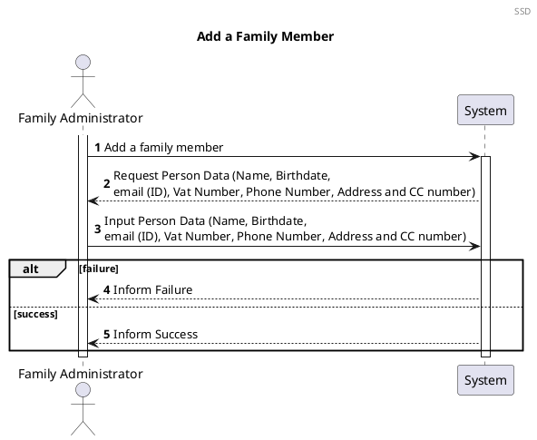
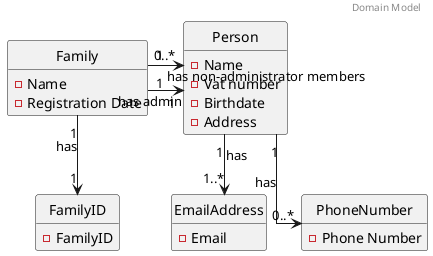
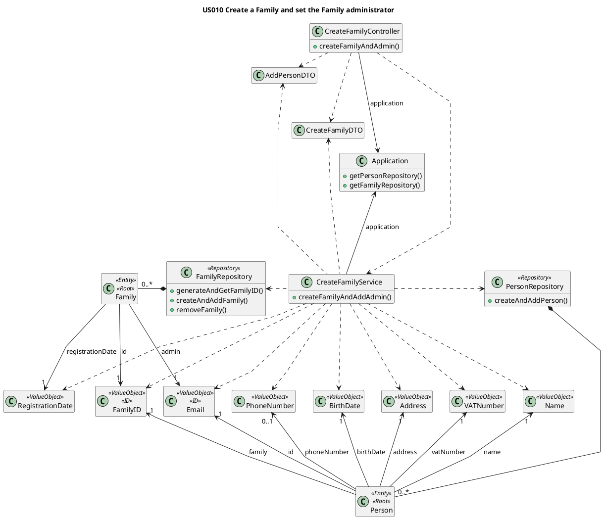

# US101 Add Family Members
=======================================

# 1. Requirements

### 1.1 Client Notes
*As a family administrator, I want to add family members*

We interpreted this requirement as the function of a family administrator adding a new Person to their family. 

This Person's email account must not exist in the Application since it is used as a unique ID.  

- A Person needs to have:
    - ID (email)
    - Name
    - Vat number
    - Address
    - Birthdate
    - Phone (none or one)
    - Family ID


### 1.2 Dependencies 

### 1.3 SSD



# 2. Analysis

## 2.1 Summary

At the moment a person can have one or no phone numbers when it is created.
Two options:

- Two Person constructors (One with phone number, one without)  
- One constructor with a validation for phone number that accepts a null Phone Number.

[COMMENT]: # (The first one seems better practice than the second one. Validate both)


The following Domain Model is only referring to this user story. The complete model can be found in the diagrams folder.


Each Person will have two types of attributes. The attributes *name*, *CCNumber*, *birthDate*, *address* and *vatNumber*
will have a **single value** but *EmailAddress* and *PhoneNumber* will behave differently. Both *EmailAddress* and *
PhoneNumber* are attributes that a Person can have more than one. A *Person* **must have at least one email**, but it's
possible that has **none or multiple** *PhoneNumbers*.

The **Person** must have the following characteristics with the following rules:

| **_Value Objects_**         | **_Business Rules_**                                                                   |
| :-------------------------- | :------------------------------------------------------------------------------------- |
| **CCNumber**                | Required, CCNumber must have 8 numeric digits and 4 alphanumeric.              |
| **Name**                    | Required, string                                                                       |
| **BirthDate**               | Required, date(year-month-day)                                                         |
| **Address**                 | Required, string                                                                       |
| **VatNumber**               | Required, unique, Vat must have 9 numeric digits                                       |
| **EmailAddress**            | Required, unique, Email must follow a pattern                                          |
| **PhoneNumber**             | Non-Required, PhoneNumber must have 9 digits                                           |


## 2.2. Domain Model Excerpt



# 3. Design

The process to fulfill this requirement requires the actor to select they want to add a new person to their family, which would
prompt the input of the person's data.

## 3.1 Class Diagram




# 3.2 Sequence Diagram

The main user's FamilyID will be automatically retrieved by checking who is logged into the application. It will also verify if the main user is the admin of their own family.

Given the current absence of a UI layer the required data will be passed directly into the AddPersonController.

We chose to verify the uniqueness of the Email Address after instancing the email. This way we could minimize the possibility of duplicate emails being added since the verification would occur at the moment of addition to the family repository.


````puml
@startuml

autonumber
header Sequence Diagram
title US101 Add a Family Member

actor "Family Administrator" as familyAdmin
participant "UI" as UI
participant ": AddFamilyMemberController" as controller
participant ": AddFamilyMemberService" as FamAdminService
participant "anApplication\n : Application" as app
participant "aFamilyRepository\n : FamilyRepository" as frepository
participant "aPersonRepository\n: PersonRepository" as prepository
participant "newFamilyMember\n : Person" as admin

activate familyAdmin
familyAdmin -> UI: I want to add a Family Member
activate UI
return request data
familyAdmin -> UI : input Family Member data
activate UI

UI -> controller : addFamilyMember(addPersonDTO)
activate controller

controller -> FamAdminService** : create(application)
controller -> FamAdminService : addFamilyMember(addPersonDTO)
activate FamAdminService

FamAdminService -> app : getFamilyRepository()
activate app
return aFamilyRepository

FamAdminService -> app : getLoggedPersonID()
activate app
return loggedUserID

FamAdminService -> frepository: verifyAdmin(loggedUserID)
activate frepository
return

FamAdminService -> app : getPersonRepository()
activate app
return aPersonRepository

FamAdminService -> app : getLoggedPersonFamilyID()
activate app
return familyID

FamAdminService -> prepository : createAndAddPerson(name, birthdate, \nemail, vat, phone, address, cc, familyID)
activate prepository

prepository -> prepository : isEmailAlreadyRegistered(email)

alt false

prepository -> admin** : create
activate admin

prepository -> prepository : addToRepository (newFamilyMember)
prepository --> FamAdminService
deactivate admin

FamAdminService --> controller : success

controller --> UI : success

UI --> familyAdmin : inform success

else true

prepository --> FamAdminService
deactivate prepository

FamAdminService --> controller : fail
deactivate FamAdminService

controller --> UI : fail
deactivate controller

UI --> familyAdmin : inform failure
deactivate UI

end
@enduml
````

## 3.3. Functionality Use

The AddPersonController creates a new AddPersonService object using an addPersonDTO and an application instance.
The AddPersonService will create all the necessary value objects, after unpacking the addPersonDTO and validating the data, in order to create the Family Member.
The AddPersonService will invoke the Application to retrieve the PersonRepository and FamilyRepository.
The AddPersonService will invoke the FamilyRepository to check if the logged user is a Family Administrator and retrieve the FamilyID.
The AddPersonService will invoke the PersonRepository to create the Person object for the Family Member, after checking if the email is unique. If it isn't, the process will fail. If it is, the Person will be created and added to the PersonRepository.
The AddPersonController will then return a true or false response depending on the success or insuccess of creating the Family Member.


## 3.3. Applied Patterns

We applied the principles of Controller, Information Expert, Creator and PureFabrication from the GRASP pattern. We also
used the SOLID Single Responsibility Principle.

## 3.4. Tests

Several cases where analyzed in order to test the creation of a new Family

**Test 1:** Test that it is possible to add a new Family Member succesfully

```java
 @DisplayName("Successfully add a person")
    @Test
    void mustReturnTrueAddPerson() {
        application.logInAsAdmin();

        assertTrue(addPersonController.addPerson(addPersonDTO));
    }

```

**Test 2:** Test that it is not possible to add a new Family Member if logged user is not the admin

```java
@DisplayName("Unsuccessfully add a person - not the admin")
    @Test
    void mustReturnFalseAddPersonNotAdmin() {
        application.logInAsNotAdmin();

        assertFalse(addPersonController.addPerson(addPersonDTO));
    }


```

**Test 3:** Test that it is not possible to create a new Family Member if the email is already registered in the application.

```java
@DisplayName("Unsuccessfully add a person - email already registered")
    @Test
    void mustReturnFalseAddPersonEmailRegistred() {
        application.logInAsAdmin();
        
        assertFalse(addPersonController.addPerson(addAdminPersonDTO));
    }
```

# 4. Implementation

1. All the Value Objects are initially instanced (instantiated), with respective validations.

```java
 public void addPerson(AddPersonDTO addPersonDTO) {
        FamilyRepository familyRepository = application.getFamilyRepository();
        EmailAddress loggedUserID = application.getLoggedPersonID();
        familyRepository.verifyAdmin(loggedUserID);

        Name name = new Name(addPersonDTO.unpackName());
        BirthDate birthDate = new BirthDate(addPersonDTO.unpackBirthDate());
        EmailAddress email = new EmailAddress(addPersonDTO.unpackEmail());
        VATNumber vat = new VATNumber(addPersonDTO.unpackVAT());
        PhoneNumber phone = new PhoneNumber(addPersonDTO.unpackPhone());
        Address address = new Address(addPersonDTO.unpackStreet(), addPersonDTO.unpackCity(), addPersonDTO.unpackZipCode(), addPersonDTO.unpackHouseNumber());
        CCnumber cc = new CCnumber(addPersonDTO.unpackCCNumber());
        FamilyID familyID = application.getLoggedPersonFamilyID();

        PersonRepository personRepository = application.getPersonRepository();
        personRepository.createAndAddPerson(name, birthDate, email, vat, phone, address, cc, familyID);
    }
```

2. Logged User ID is automatically retrieved  from the Logged User and checked to see if they are an admin

    ```java
   public void verifyAdmin(EmailAddress loggedUserID) {
        boolean result = false;
        for (Family family : this.families) {
            if(family.isPersonTheAdmin(loggedUserID)){
                result = true;
            }
        }
        if(!result){
            throw new UserIsNotAdminException();
        }
    } 
   ```


3. Before creating the Person, the email is validated in the Person Repository in order to guarantee that it is
   Unique

   ```java
      private boolean isEmailAlreadyRegistered(EmailAddress email) {
      boolean emailIsRegistered = false;
      for (Person person : people) {
      if (person.isSameEmail(email)) {
      emailIsRegistered = true;
      }
      }
      return emailIsRegistered;
      }
   ```
   


# 5. Integration

 This functionality uses the same method to add the Person to the PersonRepository as the US010. 

# 6. Observations

The Person's unique ID is considered to be the 0 index EmailAddress on the Person's EmailAddress List.