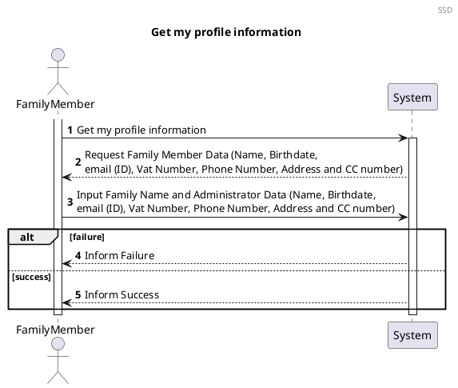
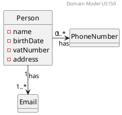
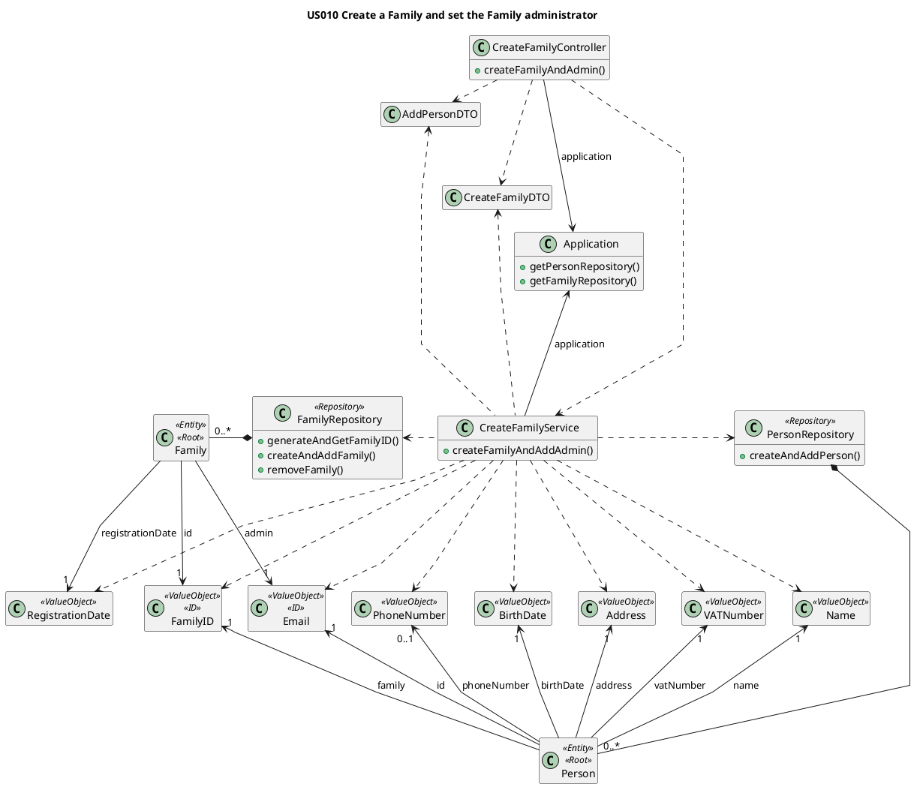

# US150 Get Profile Informatio

# 1. Requirements

## 1.1. Client Notes

### SUBSTITUIR CONTEUDO 
```
**Demo1** As a family member, I want to get...

- 1.1. My family member profile information

We interpreted this requirement as the function of a user to receive their personal profile information.

- A MemberProfile needs to have the following information:
   - Name;
   - Birth Date;
   - Phone Number(none or multiple);
   - Email (none or multiple);
   - VAT Number;
   - Address;
   - Relation with Administrator(none or one);
   - If member is administrator.
```

## 1.2. Dependencies

### 1.2.1. Pre-conditions

### 1.2.2. Other User Stories

## 1.3. Acceptance Criteria

### 1.3.1. Success Cases

### 1.3.2. Failure Cases


## 1.4. System Sequence Diagram

*As a Family Member, I want to get my profile´s information*




# 2. Analysis

## 2.1 Summary

The following Domain Model is only referring to this user story. The complete model can be found in the diagrams folder.

What is relevant for this US is the relation between *Family* and *Person*. The Family will be composed by **1
administrator** and **0, 1 or multiple non-administrators**. Both administrator and non-administrator are Persons.

Each Person will have two types of attributes. The attributes *name*, *CCNumber*, *birthDate*, *address* and *vatNumber*
will have a **single value** but *EmailAddress* and *PhoneNumber* will behave differently. Both *EmailAddress* and *
PhoneNumber* are attributes that a Person can have more than one. A *Person* **must have at least one email**, but it's
possible that has **none or multiple** *PhoneNumbers*.

The **Person** must have the following characteristics with the following rules:

| **_Value Objects_**         | **_Business Rules_**                                                                   |
| :-------------------------- | :------------------------------------------------------------------------------------- |
| **CCNumber**                | Required, unique, CCNumber must have 8 numeric digits and 4 alphanumeric.              |
| **Name**                    | Required, string                                                                       |
| **BirthDate**               | Required, date(year-month-day)                                                         |
| **Address**                 | Required, string                                                                       |
| **VatNumber**               | Required, unique, Vat must have 9 numeric digits                                       |
| **EmailAddress**            | Required, unique, Email must follow a pattern                                          |
| **PhoneNumber**             | Non-Required, PhoneNumber must have 9 digits                                           |

The **Family** must have the following characteristics with the following rules:

| **_Value Objects_**         | **_Business Rules_**                                                                   |
| :-------------------------- | :------------------------------------------------------------------------------------- |
| **Name**                | Required, string                                                                           |
| **RegistrationDate**    | Required, date(year-month-day)                                                             |


## 2.2. Domain Model Excerpt



# 3. Design

## 3.1. Design decisions

The process to fulfill this requirement requires the actor to select they want to add a new person to their family, which would
prompt the input of the person's data.

The main user's FamilyID will be automatically retrieved by checking who is logged into the application. It will also verify if the main user is the admin of their own family.

Given the current absence of an UI layer the required data will be passed directly into the AddPersonController.

We chose to verify the uniqueness of the Email Address after instancing the email. This way we could minimize the possibility of duplicate emails being added since the verification would occur at the moment of addition to the family repository.

## 3.2. Class Diagram




## 3.3. Functionality Use

The CreateFamilyController creates a new CreateFamilyService object using a createFamilyDTO, a addPersonDTO and the
application.
The CreateFamilyService will create all the necessary value objects to create the family and administrator.
The CreateFamilyService will invoke the Application to retrieve the PersonRepository and FamilyRepository.
The CreateFamilyService will invoke the FamilyRepository to create a familyID and then a Family.
The CreateFamilyService will invoke the PersonRepository to create the Person object for the administrator,
providing the email from the admin is unique. If it isn't, the previously created Family will be deleted.
The CreateFamilyController will then return a true or false response depending on the sucess or insuccess
of creating the Family and administrator.


## 3.4. Sequence Diagram

The process to fulfill this requirement requires the actor to select they want to create a new family, which would
prompt the input of the name for that family as well as the administrator email, and the other necessary data stated in
2.1.  
Given the current absence of an UI layer the required data will be passed directly into the CreateFamilyController.
ation would occur at the moment of addition to the repository.

````puml
@startuml

autonumber
header Sequence Diagram - part 1
title US150 Get my profile information

actor "Family Member" as actor
participant "UI" as UI
participant ": GetMyProfile\nInfoController" as controller
participant ": GetProfile\nInfoService" as service
participant "Application" as app
participant "PersonRepository" as repository
participant "aPerson \n: Person" as person
activate actor
actor -> UI: Get my profile\n information
activate UI
UI -> actor : request data
actor -> UI : input Family Member data
UI -> controller : getProfileInfo()
activate controller
controller -> service : getProfileInfo()
activate service
service -> app : getPersonRepository()
activate app
return repositoryservice
service -> repository : getProfileInfo(LoggedEmail)
activate repository
repository -> repository : getPersonByID(email)
repository -> person** : getProfileInfo(email)
ref over person

part 2:
getProfileDTO
end

autonumber 35
activate person
person --> repository : aProfileDTO
deactivate person
repository --> service : aProfileDTO
deactivate repository
service --> controller : aProfileDTO
deactivate service
controller --> UI : aProfileDTO
deactivate controller
UI -> actor : show Profile
deactivate UI
deactivate actor

@enduml
````

````puml
@startuml

autonumber 11
header Sequence Diagram - part 2
title US150 Get my profile information

participant "aPerson \n: Person" as person
participant "aProfileDTO \n: ProfileDTO" as profiledto
participant "aName \n: Name" as name
participant "aEmail \n: Email" as email
participant "aBirthDate \n: BirthDate" as birthdate
participant "aOtherEmails \n: OtherEmails" as otheremails
participant "aVat \n: Vat" as vat
participant "aPhoneNumber \n: PhoneNumber" as phonenumber
participant "aAdress \n: Adress" as adress
activate person
[o-> person : getProfileDTO
activate profiledto
person -> profiledto** : create()

deactivate profiledto
person -> name : getStringName()
activate name
return stringName
person -> profiledto: setName(stringName)
activate profiledto
deactivate profiledto
person -> email : getStringEmail()
activate email
return stringEmail
person -> profiledto: setEmail(stringEmail)
activate profiledto
deactivate profiledto
person -> birthdate : getStringBirthDate()
activate birthdate
return stringbirthDate
person -> profiledto: setBirthate(stringBirthDate)
activate profiledto
deactivate profiledto
person -> otheremails : getStringOtherEmails()
activate otheremails
return stringOtherEmails
person -> profiledto: setOtherEmails(stringOtherEmails)
activate profiledto
deactivate profiledto
person -> vat : getIntVat()
activate vat
return intVat
person -> profiledto: setVat(intVat)
activate profiledto
deactivate profiledto
person -> phonenumber : getStringPhoneNumber()
activate phonenumber
return stringPhoneNumber
person -> profiledto: setPhoneNumber(stringPhoneNumber)
activate profiledto
deactivate profiledto
person -> adress : getStringAdress()
activate adress
return stringAdress
person -> profiledto: setAdress(stringAdress)
activate profiledto
deactivate profiledto

[<-o person : aProfileDTO
deactivate profiledto
deactivate person
@enduml
````

## 3.5. Applied Patterns

We applied the principles of Controller, Information Expert, Creator and PureFabrication from the GRASP pattern. We also
used the SOLID Single Responsibility Principle.

We applied the following principles:

- GRASP:
   - Information expert:
      - This pattern is represented in Person object because it stores all the Person attributes associated with it. PersonRepository just stores all the Person´s objects.
      
   - Controller:
      - To deal with the responsibility of receiving input from outside the system (first layer after the UI) we use a case controller.

   - Pure Fabrication:
      - In this user story the Application and GetProfileInfoService class were used, which does not represent business domain concepts. They were created to be responsible for obtaining profile information.

   - High cohesion and Low Coupling:
      - The creation of the GetProfileInfoService class provided low Coupling and high Cohesion, keeping one Class as the Information Expert.

   - Protected Variation:
      - An XXXXXXXX was used in which the polymorphism was used to be implemented in several classes, each representative of a type of Account.

- SOLID:
   - Single-responsibility principle:
      - this pattern was used in the GetPersonInfoService class, in which is the only responsibility is manage person profile operations.


## 3.6. Tests

### 3.6.1. XXXX

#### 3.6.1.1. Success

#### 3.6.1.2 Failure


### 3.6.2. YYYY

#### 3.6.2.1. Success

#### 3.6.2.2 Failure


### 3.6.3. ZZZZ

#### 3.6.3.1. Success

#### 3.6.3.2. Failure

Several cases where analyzed in order to test the creation of a new Family

**Test 1:** Test that it is possible to create a new instance of Family with a valid Admin

**Test 2:** Test that it is not possible to create a new instance of Family if admin email is already registered

**Test 3:** Test that it is not possible to create a new instance of Family receiving a **familyName** that is null

**Test 4:** Test that it is not possible to create a new instance of Family receiving a **familyName** that is empty

**Test 5:** Test that it is not possible to create a new instance of Family receiving a **familyName** that is blank

**Additional Tests** Test that its not possible to create a new instance of Family if any attribure is empty, blank or
null The whole user story was tested for the case of success and for failure

**Test 5:** Success

```` 
@DisplayName("Test if a family can be successfully created")  
@Test
 void shouldBeTrueCreateFamily() {
        Application application = new Application();
        Create Family Controller controller = new Create Family Controller(application);
        CreateFamilyDTO createFamilyDTO = new CreateFamilyDTO("tonyze@hotmail.com", "Silva", "Tony", "12/12/1990", 999999999, 919999999, "Rua das Flores", "Porto", 69, "4400-000", "139861572ZW2");
        
        assertTrue(controller.createFamilyAndAdmin(createFamilyDTO));    
    }
````

**Test 6:** Failure

````
@DisplayName ("Test if a family isnt created if the admin email is already registered in the app")  
@Test
    void shouldBeFalseCreateFamilyEmailAlreadyregistered() {
        Application application = new Application();
        Create Family Controller controller = new Create Family Controller(application);
        CreateFamilyDTO createFamilyDTO1 = new CreateFamilyDTO("tonyze@hotmail.com", "Silva", "Tony", "12/12/1990", 999999999, 919999999, "Rua das Flores", "Porto", 69, "4400-000", "139861572ZW2");
        CreateFamilyDTO createFamilyDTO2 = new CreateFamilyDTO("tonyze@hotmail.com", "Pereira", "Rita", "12/12/1990", 999999999, 919999999, "Rua das Flores", "Porto", 69, "4400-000", "139861572ZW2");
        controller.createFamilyAndAdmin(createFamilyDTO1);
        assertFalse(controller.createFamilyAndAdmin(createFamilyDTO2));    
    }
    }
````

# 4. Implementation

1. All the Value Objects are initially instanced (instantiated), with respective validations.


      public boolean createFamilyAndAddAdmin() {
      boolean result;
      EmailAddress adminEmail = new EmailAddress(addPersonDTO.unpackEmail());
      FamilyName familyName = new FamilyName(createFamilyDTO.unpackFamilyName());
      Name name = new Name(addPersonDTO.unpackName());
      BirthDate birthdate = new BirthDate(addPersonDTO.unpackBirthDate());
      VATNumber vat = new VATNumber(addPersonDTO.unpackVAT());
      PhoneNumber phone = new PhoneNumber(addPersonDTO.unpackPhone());
      Address address = new Address(addPersonDTO.unpackStreet(), addPersonDTO.unpackCity(), addPersonDTO.unpackZipCode(), addPersonDTO.unpackHouseNumber());
      CCnumber cc = new CCnumber(addPersonDTO.unpackCCNumber());
      RegistrationDate registrationDate = new RegistrationDate(createFamilyDTO.unpackLocalDate());

2. Family ID is automatically generated by the Family Repository (Information Expert)


      public FamilyID generateAndGetFamilyID() {
      FamilyID familyID = new FamilyID(UUID.randomUUID());
      if (checkIfFamilyIDExists(familyID)) {
      familyID = generateAndGetFamilyID();
      }
      return familyID;
      }

3. AdminEmail is added to the Family upon its instantiation. The Family is immediately added to the FamilyRepository (
   The administrator email validation will come later.)


      public void createAndAddFamily(FamilyName familyName, FamilyID familyID, RegistrationDate registrationDate, EmailAddress adminEmail) {
      Family family = new Family(familyID, familyName, registrationDate, adminEmail);
      this.families.add(family);
      }

4. Before creating the Administrator, the email is validated in the Person Repository in order to guarantee that it is
   Unique


      private boolean isEmailAlreadyRegistered(EmailAddress email) {
      boolean emailIsRegistered = false;
      for (Person person : people) {
      if (person.isSameEmail(email)) {
      emailIsRegistered = true;
      }
      }
      return emailIsRegistered;
      }

5. If the Email fails verification, the Family is removed from the FamilyRepository and the process fails.

   
      try {
      personRepository.createAndAddPerson(name, birthdate, adminEmail, vat, phone, address, cc, familyID);
      result = true;
      } catch (EmailAlreadyRegisteredException e) {
      familyRepository.removeFamily(familyID);
      result = false;
      }
      return result;


# 5. Integration

[comment]: # (All other US's/features that this one will be added on !!!!!!)

The development of this user story was the basis for the family structure where the FamilyMembers are stored and was
thus crucial for the development of the other User Stories


# 6. Observations

[comment]: # (Tudo o que nao encaixe em lado nenhum vai para aqui AKA LIXOOOOOOO !!!!!!!)

As with the Standard Category the family ID will probably need to be reworked in a future sprint to allow for more
complex ID information if needed (probably using a UUID)