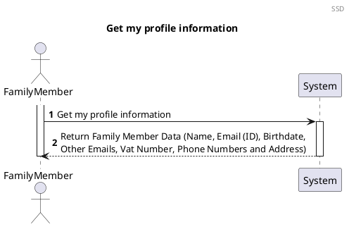
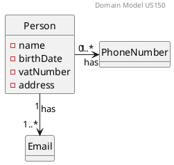
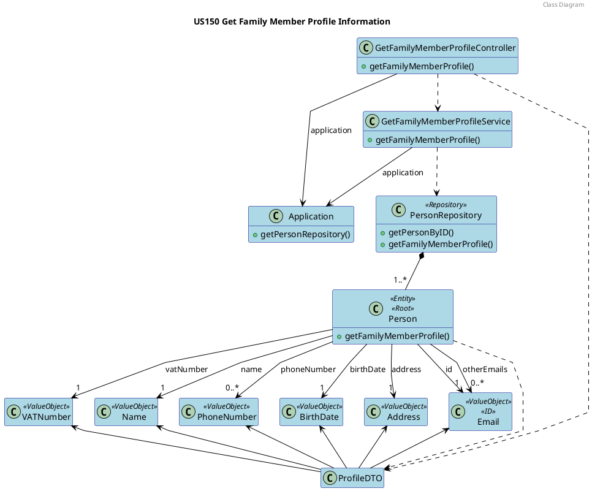

# US150 Get Profile Informatio

# 1. Requirements

## 1.1. Client Notes

**As a family member, I want to get my profile’s information.**

We interpreted this requirement as the function of a user to receive their personal profile information.

- A MemberProfile needs to have the following information:
   - Name;
   - Email (ID)
   - Birth Date;
   - Email (other emails);
   - VAT Number;
   - Phone Number(none or more);
   - Address;


## 1.2. Dependencies

### 1.2.1. Pre-conditions

To be able to **get family member's profile information**, some user stories need to be implemented in first place. 
Before everything else, the *Application* needs to have a family with family members. So, **the system manager needs to create a family and assign a family administrator** because the administrator will have the responsibility of adding family members to his family.
After the **family administrator adds the family members** it will be possible to execute this US by each member. 

### 1.2.2. Other User Stories

The following users stories need to be executed before US150:

- US010 As system manager, I want to create a family and set the family administrator

- US101 As a family administrator, I want to add family members;

## 1.3. Acceptance Criteria

### 1.3.1. Success Cases

This user story is always executed correctly since it doesn't need any data entry neither validation.
It just gets family member stored information and shows it in the UI.

### 1.3.2. Failure Cases

In this US there aren't any direct failure scenarios because it just retrives already validated information that belongs to a family member.
The possible failure cases are related with wrong execution of the dependent user stories from the section **1.2.2.**.

## 1.4. System Sequence Diagram

*As a Family Member, I want to get my profile´s information*




# 2. Analysis

## 2.1 Summary

The profile information we need to obtain in this user story contains the personal information of the user.
This includes _Name_, _BirthDate_, _Address_, _VATNumber_ and _PrimaryEmail_, as well as a list of any other _Emails_ and a list of any _PhoneNumbers_ registered in the application.


## 2.2. Domain Model Excerpt



# 3. Design

## 3.1. Design decisions

To fulfill this requirement it is required for the actor to select they want to get their profile information.

The user's primary email (it's identification) will be automatically retrieved by checking who is logged into the application.

To allow the output of all the data required we opted to create a ProfileDTO gathering all the relevant profile information.

[COMMENT]: # (A criação do DTO de saida será feita na classe person. O DTO é criado com um builder que lhe passa os dados.
Esses dados são passados a primitivos directamente ou convertidos quando desempacotados?)

## 3.2. Class Diagram




## 3.3. Functionality Use

The GetFamilyMemberProfileController creates a new GetFamilyMemberProfileService using the Application.
The GetFamilyMemberProfileService will invoke the Application to retrieve the PersonRepository.
The PersonRepository will use the GetPersonByID method to find the person whose profile we want to return.
The Person will then create a ProfileDTO containing all the data required for the user story (Name, Address,
BirthDate, VATNumber, PrimaryEmail and any other Emails or PhoneNumbers)
It will then return the ProfileDTO all the way back to the  GetFamilyMemberProfileController.

## 3.4. Sequence Diagram

The process to fulfill this requirement requires the actor to select they want to create a new family, which would
prompt the input of the name for that family as well as the administrator email, and the other necessary data stated in
2.1.  
Given the current absence of an UI layer the required data will be passed directly into the CreateFamilyController.
ation would occur at the moment of addition to the repository.

````puml
@startuml

autonumber
header Sequence Diagram - part 1
title US150 Get my profile information

actor "Family Member" as actor
participant "UI" as UI
participant ": GetMyProfile\nInfoController" as controller
participant ": GetProfile\nInfoService" as service
participant "Application" as app
participant "PersonRepository" as repository
participant "aPerson \n: Person" as person
activate actor
actor -> UI: Get my profile\n information
activate UI
UI -> actor : request data
actor -> UI : input Family Member data
UI -> controller : getProfileInfo()
activate controller
controller -> service : getProfileInfo()
activate service
service -> app : getPersonRepository()
activate app
return repositoryservice
service -> repository : getProfileInfo(LoggedEmail)
activate repository
repository -> repository : getPersonByID(email)
repository -> person** : getProfileInfo(email)
ref over person

part 2:
getProfileDTO
end

autonumber 35
activate person
person --> repository : aProfileDTO
deactivate person
repository --> service : aProfileDTO
deactivate repository
service --> controller : aProfileDTO
deactivate service
controller --> UI : aProfileDTO
deactivate controller
UI -> actor : show Profile
deactivate UI
deactivate actor

@enduml
````

````puml
@startuml

autonumber 11
header Sequence Diagram - part 2
title US150 Get my profile information

participant "aPerson \n: Person" as person
participant "aProfileDTO \n: ProfileDTO" as profiledto
participant "aName \n: Name" as name
participant "aEmail \n: Email" as email
participant "aBirthDate \n: BirthDate" as birthdate
participant "aOtherEmails \n: OtherEmails" as otheremails
participant "aVat \n: Vat" as vat
participant "aPhoneNumber \n: PhoneNumber" as phonenumber
participant "aAdress \n: Adress" as adress
activate person
[o-> person : getProfileDTO
activate profiledto
person -> profiledto** : create()

deactivate profiledto
person -> name : getStringName()
activate name
return stringName
person -> profiledto: setName(stringName)
activate profiledto
deactivate profiledto
person -> email : getStringEmail()
activate email
return stringEmail
person -> profiledto: setEmail(stringEmail)
activate profiledto
deactivate profiledto
person -> birthdate : getStringBirthDate()
activate birthdate
return stringbirthDate
person -> profiledto: setBirthate(stringBirthDate)
activate profiledto
deactivate profiledto
person -> otheremails : getStringOtherEmails()
activate otheremails
return stringOtherEmails
person -> profiledto: setOtherEmails(stringOtherEmails)
activate profiledto
deactivate profiledto
person -> vat : getIntVat()
activate vat
return intVat
person -> profiledto: setVat(intVat)
activate profiledto
deactivate profiledto
person -> phonenumber : getStringPhoneNumber()
activate phonenumber
return stringPhoneNumber
person -> profiledto: setPhoneNumber(stringPhoneNumber)
activate profiledto
deactivate profiledto
person -> adress : getStringAdress()
activate adress
return stringAdress
person -> profiledto: setAdress(stringAdress)
activate profiledto
deactivate profiledto

[<-o person : aProfileDTO
deactivate profiledto
deactivate person
@enduml
````


## 3.5. Applied Patterns

We applied the principles of Controller, Information Expert, Creator and PureFabrication from the GRASP pattern. We also
used the SOLID Single Responsibility Principle.

We applied the following principles:

- GRASP:
   - Information expert:
      - This pattern was used in classes that implemented the Account interface, like in this case CashAccount class, for returning a DTO with the account id and description without removing information outside the class;

   - Controller:
      - To deal with the responsibility of receiving input from outside the system (first layer after the UI) we use a case controller.

   - Pure Fabrication:
      - In this user story the Application and AccountService class was used, which does not represent a business domain concept. It was created to be responsible for all operations regarding Account type Classes.

   - High cohesion and Low Coupling:
      - The creation of the AccountService class provided low Coupling and high Cohesion, keeping one Class as the Information Expert.

   - Protected Variation:
      - An Account interface was used in which the polymorphism was used to be implemented in several classes, each representative of a type of Account.

- SOLID:
   - Single-responsibility principle:
      - this pattern was used in the AccountService class, in which it the only responsibility is manage account operations.


## 3.6. Tests

### 3.6.1. Person

#### 3.6.1.1. Success

**Test 1:** Test ProfileDTO creation

#### 3.6.1.2 Failure

No failure tests 

_____

### 3.6.2. PersonRepository

#### 3.6.2.1. Success

**Test 2:** Test if the PersonRepository gets the Person by his email (ID)

**Test 3:** Test if the PersonRepository gets the ProfileDTO from Person using his email (ID)

#### 3.6.2.2 Failure

No failure tests

_____

### 3.6.3. GetProfileInfoService

#### 3.6.3.1. Success

**Test 4:** Test if the Service gets the ProfileDTO from it the PersonRepository

#### 3.6.3.2. Failure

No failure tests

_____

### 3.6.4. GetProfileInfoController

#### 3.6.4.1. Success

**Test 5:** Test if the Controller gets the ProfileDTO from the GetProfileInfoService

#### 3.6.4.2. Failure

No failure tests

_____


# 4. Implementation

1. All the Value Objects are initially instanced (instantiated), with respective validations.


      public boolean createFamilyAndAddAdmin() {
      boolean result;
      EmailAddress adminEmail = new EmailAddress(addPersonDTO.unpackEmail());
      FamilyName familyName = new FamilyName(createFamilyDTO.unpackFamilyName());
      Name name = new Name(addPersonDTO.unpackName());
      BirthDate birthdate = new BirthDate(addPersonDTO.unpackBirthDate());
      VATNumber vat = new VATNumber(addPersonDTO.unpackVAT());
      PhoneNumber phone = new PhoneNumber(addPersonDTO.unpackPhone());
      Address address = new Address(addPersonDTO.unpackStreet(), addPersonDTO.unpackCity(), addPersonDTO.unpackZipCode(), addPersonDTO.unpackHouseNumber());
      CCnumber cc = new CCnumber(addPersonDTO.unpackCCNumber());
      RegistrationDate registrationDate = new RegistrationDate(createFamilyDTO.unpackLocalDate());

2. Family ID is automatically generated by the Family Repository (Information Expert)


      public FamilyID generateAndGetFamilyID() {
      FamilyID familyID = new FamilyID(UUID.randomUUID());
      if (checkIfFamilyIDExists(familyID)) {
      familyID = generateAndGetFamilyID();
      }
      return familyID;
      }

3. AdminEmail is added to the Family upon its instantiation. The Family is immediately added to the FamilyRepository (
   The administrator email validation will come later.)


      public void createAndAddFamily(FamilyName familyName, FamilyID familyID, RegistrationDate registrationDate, EmailAddress adminEmail) {
      Family family = new Family(familyID, familyName, registrationDate, adminEmail);
      this.families.add(family);
      }

4. Before creating the Administrator, the email is validated in the Person Repository in order to guarantee that it is
   Unique


      private boolean isEmailAlreadyRegistered(EmailAddress email) {
      boolean emailIsRegistered = false;
      for (Person person : people) {
      if (person.isSameEmail(email)) {
      emailIsRegistered = true;
      }
      }
      return emailIsRegistered;
      }

5. If the Email fails verification, the Family is removed from the FamilyRepository and the process fails.

   
      try {
      personRepository.createAndAddPerson(name, birthdate, adminEmail, vat, phone, address, cc, familyID);
      result = true;
      } catch (EmailAlreadyRegisteredException e) {
      familyRepository.removeFamily(familyID);
      result = false;
      }
      return result;


# 5. Integration

[comment]: # (All other US's/features that this one will be added on !!!!!!)

The development of this user story was the basis for the family structure where the FamilyMembers are stored and was
thus crucial for the development of the other User Stories


# 6. Observations

[comment]: # (Tudo o que nao encaixe em lado nenhum vai para aqui AKA LIXOOOOOOO !!!!!!!)

As with the Standard Category the family ID will probably need to be reworked in a future sprint to allow for more
complex ID information if needed (probably using a UUID)