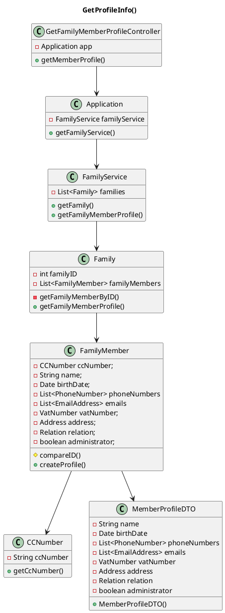

# US150 Get Family Member Profile Information
=======================================


# 1. Requirements

## 1.1. Client Notes

*As a family member, I want to get my profile’s information*

**Demo1** As a family member, I want to get...

- 1.1. My family member profile information

We interpreted this requirement as the function of a user to receive their personal profile information.

- A MemberProfile needs to have the following information:
    - Name;
    - Birth Date;
    - Phone Number(none or multiple);
    - Email (none or multiple);
    - VAT Number;
    - Address;
    - Relation with Administrator(none or one);
    - If member is administrator.

## 1.2 System Sequence Diagram

```` puml

    autonumber
    title getFamilyMemberProfile SSD
    actor "Family Member" as fm
    participant "System" as system

    activate fm
    fm -> system: Get Profile Information
    activate system
    fm -> system: input required data
    system --> fm: return Profile
    deactivate fm
    deactivate system

@endpuml
````

## 1.3. Dependencies from other User Stories

This user story is dependent on the following:

- US010_Add Family: to create a family;
- US101_Add Family Member: to create and add family member to created family.

# 2. Analysis

In order to fulfill this requirement, we need two main data pieces:
- Family ID of the actor's family
- Family Member ID of the actor's profile

At a later iteration, both the family ID and the family member's ID would be acquired through the Log In information. For this sprint, the IDs will have to be inputted.

This User Story is highly reliant on both the Family and FamilyMember classes, particularly the last one. A DTO approach was chosen to encapsulate the required information, as well as to provide more control over which member information is transmitted.


# 3. Design

The main process to fulfill this requirement would require the actor to select they want to add an email in the UI, which would then prompt the retrieval of their familyMemberID and familyID. In lieu of not having an UI, the Int *familyMemberID* and *familyID* will be directly inputed into the GetFamilyMemberProfileController. 
````puml
@startuml

autonumber
title Get Profile Info
actor "Family Member" as familyMember
participant ": UI" as ui
participant ": GetFamilyMemberInfoController" as controller
participant ": Application" as app
participant "famServ : FamilyService" as familyservice
participant "aFamily : Family" as family
participant "aFamilyMember : FamilyMember" as fm
participant "aProfile : MemberProfile" as profile

activate familyMember
familyMember -> ui: Request Profile Information
activate ui
ui -> familyMember: Request familyID and ccNumber
deactivate ui
familyMember -> ui: input familyID and ccNumber
activate ui
ui -> controller: getMemberProfile(familyId, ccNumber)
activate controller
controller -> app: getFamilyService()
activate app
app -> controller: famServ
deactivate app
controller -> familyservice: getMemberProfile(familyId, ccNumber)
activate familyservice
loop find family
    familyservice -> familyservice: getFamily(familyID)
    end
familyservice -> family: getFamilyMemberProfile(ccNumber)

activate family
loop find family member
    family -> family: findFamilyMember(ccNumber)
    end
family -> fm: getFamilyMemberProfile()
activate fm
fm -> profile**: createProfile()

fm -> family: aProfile
deactivate fm
family -> familyservice: aProfile
deactivate family
familyservice -> controller: aProfile
deactivate familyservice
controller -> ui: aProfile
deactivate controller
ui -> familyMember: aProfile

@enduml
````

## 3.1. Functionality Use
This User Story's purpose is to allow the retrieval of a member's profile, by the member. The GetFamilyMemberProfileController will invoke the Application object, which stores the FamilyService object. The Application will return the FamilyService to the Controller, and the getMemberProfile method is called to retrieve the Profile as a MemberProfileDTO object, using the familyID and familyMemberID. The Family is retrieve in the FamilyService instantiation and Family Member is then retrieved from the corresponding family.
The Family Member the uses the method createProfile to generate a new object of the type MemberProfileDTO, which is then returned to the FamilyService and then to the Controller.


## 3.2. Class Diagram
The main Classes involved are:
- GetFamilyMemberProfileController
- Application
- FamilyService
- Family
- FamilyMember
- MemberProfileDTO
- CCNumber

**GetProfileInfo()**


## 3.3. Applied Patterns
We applied the principles of Controller, Information Expert, Creator and PureFabrication from the GRASP pattern.
We also used the SOLID SRP principle.

## 3.4. Tests 

The tests were conducted on FamilyMemberTest, FamilyServiceTest and GetFamilyMemberProfileControllerTest. 
The following preparation was made for the execution of the tests:

    //Family Member Diogo
    String cc = "000000000ZZ4";
    String name = "Diogo";
    Date date = new Date(1990,8,26);
    Integer numero = 919999999;
    String email = "josediogoccbr@gmail.com";
    int nif = 212122233;
    String rua = "Rua Nossa";
    String codPostal = "4444-555";
    String local = "Zinde";
    String city = "Porto";
    String relacao = "filho";
    Relation relation = new Relation(relacao);
    boolean admin = false;

    Address address = new Address(rua, codPostal, local, city);
    EmailAddress emailAddress = new EmailAddress(email);
    List<EmailAddress> emails = new ArrayList<>();
    PhoneNumber phoneNumber = new PhoneNumber(numero);
    List<PhoneNumber> phoneNumbers = new ArrayList<>();
    VatNumber vatNumber = new VatNumber(nif);

    //Family Member Tony
    String id2 = "166699209ZY8";
    String name2 = "Tony";
    Date date2 = new Date(1954,8,26);
    int numero2 = 919999998;
    String email2 = "tony@gmail.com";
    int nif2 = 212122000;
    String rua2 = "Rua";
    String codPostal2 = "4444-556";
    String local2 = "Gaia";
    String city2 = "Porto";
    String relacao2 = "primo";
    Relation relation2 = new Relation(relacao2);
    boolean admin2 = false;

    FamilyMember diogo = new FamilyMember(cc, name, date,numero,email,nif,rua,codPostal,local, city, admin);
    FamilyMember jorge = new FamilyMember(id2, name2, date2, numero2, email2, nif2, rua2, codPostal2, local2, city2, admin2);
    FamilyMember diogoNoAdmin = new FamilyMember(cc, name, date,numero,email,nif,rua,codPostal,local, city);
    Family family = new Family(familyOneName, familyOneID);
    Family familyTwo = new Family(familyTwoName, familyTwoID);

**Test 1:** Verify that createProfile() creates the MemberProfileDTO correctly

    @Test
    void getMemberProfileTest1_objectsAreEqual() {
        emails.add(emailAddress);
        phoneNumbers.add(phoneNumber);
        MemberProfileDTO expected = new MemberProfileDTO(name, date, phoneNumbers, emails, vatNumber, address, admin);

        MemberProfileDTO result = diogoNoAdmin.createProfile();

        assertEquals(expected, result);
        assertNotSame(expected, result);
    }
    @Test
    void getMemberProfileTest2_objectsAreNotEqual() {
        emails.add(emailAddress);
        phoneNumbers.add(phoneNumber);
        MemberProfileDTO expected = new MemberProfileDTO(name, date, phoneNumbers, emails, vatNumber, address, admin);

        MemberProfileDTO result = jorge.createProfile();

        assertNotEquals(expected, result);
    }

**Test 2:** Verify that MemberProfileDTO is created if admin attribute is true

      @Test
      void getMemberProfileTest3_AdministratorObjectsAreEqual() {
  
          emails.add(emailAddress);
          phoneNumbers.add(phoneNumber);
          FamilyMember admin = new FamilyMember(cc, name, date,numero,email,nif,rua,codPostal,local, city, true);
          MemberProfileDTO expected = new MemberProfileDTO(name, date, phoneNumbers, emails, vatNumber, address, true);
  
          MemberProfileDTO result = admin.createProfile();
          //Assert
          assertEquals(expected, result);
          assertNotSame(expected, result);
      }
    @Test
    void getMemberProfileTest4_AdministratorTrueObjectsAreNotEqual() {
        emails.add(emailAddress);
        phoneNumbers.add(phoneNumber);
        MemberProfileDTO expected = new MemberProfileDTO(name, date, phoneNumbers, emails, vatNumber, address, true);

        MemberProfileDTO result = jorge.createProfile();

        assertNotEquals(expected, result);
    }

**Test 3:** Verify that MemberProfileDTO is created if an invalid email is provided

    @Test
    void getMemberProfileTest5_objectsAreEqualNullEmail() {
        phoneNumbers.add(phoneNumber);
        FamilyMember joaquim = new FamilyMember(cc, name, date,numero,null,nif,rua,codPostal,local, city);
        MemberProfileDTO expected = new MemberProfileDTO(name, date, phoneNumbers, emails, vatNumber, address, admin);

        MemberProfileDTO result = joaquim.createProfile();

        assertEquals(expected, result);
        assertNotSame(expected, result);
    }
    @Test
    void getMemberProfileTest6_objectsAreNotEqualInvalidEmail() {
        phoneNumbers.add(phoneNumber);
        MemberProfileDTO expected = new MemberProfileDTO(name, date, phoneNumbers, emails, vatNumber, address, admin);

        MemberProfileDTO result = diogo.createProfile();

        assertNotEquals(expected, result);
    }

**Test 4:** Verify that MemberProfileDTO is created if an invalid phoneNumber is provided

    @Test
    void getMemberProfileTest7_objectsAreEqualInvalidPhoneNumber() {
        emails.add(emailAddress);
        FamilyMember joaquim = new FamilyMember(cc, name, date,null,email,nif,rua,codPostal,local, city);
        MemberProfileDTO expected = new MemberProfileDTO(name, date, phoneNumbers, emails, vatNumber, address, admin);

        MemberProfileDTO result = joaquim.createProfile();

        assertEquals(expected, result);
        assertNotSame(expected, result);
    }
    @Test
    void getMemberProfileTest8_objectsAreNotEqualInvalidPhoneNumbers() {
        emails.add(emailAddress);
        MemberProfileDTO expected = new MemberProfileDTO(name, date, phoneNumbers, emails, vatNumber, address, admin);

        MemberProfileDTO result = diogo.createProfile();

        assertNotEquals(expected, result);
    }
**Test 5:** Verify that MemberProfileDTO can be created with relation

    @Test
    void getMemberProfileTest9_WithRelationObjectsAreEqual() {
        emails.add(emailAddress);
        phoneNumbers.add(phoneNumber);
        diogoNoAdmin.addRelation(relation);
        MemberProfileDTO expected = new MemberProfileDTO(name, date, phoneNumbers, emails, vatNumber, address, relation, admin);

        MemberProfileDTO result = diogoNoAdmin.createProfile();

        assertEquals(expected, result);
        assertNotSame(expected, result);
    }
    @Test
    void getMemberProfileTest10_WithRelationObjectsAreNotEqual() {
        emails.add(emailAddress);
        phoneNumbers.add(phoneNumber);
        diogoNoAdmin.addRelation(relacao);
        jorge.addRelation(relacao2);
        MemberProfileDTO expected = new MemberProfileDTO(name, date, phoneNumbers, emails, vatNumber, address, relation, admin);

        MemberProfileDTO result = jorge.createProfile();

        assertNotEquals(expected, result);
    }
**Test 6:** Verify that getMemberProfile(ccNumber) in Family creates MemberProfileDTO

    @Test
    void getFamilyMemberProfileUsingIDsTest1_MemberProfileDTOIsEquals() {
        emails.add(emailAddress);
        phoneNumbers.add(phoneNumber);
        familyService.addFamily(family);
        family.addFamilyMember(diogo);
        MemberProfileDTO expected = new MemberProfileDTO(name, date, phoneNumbers, emails, vatNumber, address, admin);

        MemberProfileDTO result = family.getFamilyMemberProfile(diogo.getID());

        assertEquals(expected, result);
        assertNotSame(expected, result);
    }
    @Test
    void getFamilyMemberProfileUsingIDsTest2_MemberProfileDTOIsNotEquals() {
        emails.add(emailAddress);
        phoneNumbers.add(phoneNumber);
        family.addFamilyMember(diogo);
        family.addFamilyMember(jorge);
        MemberProfileDTO expected = new MemberProfileDTO(name, date, phoneNumbers, emails, vatNumber, address, admin);

        MemberProfileDTO result = family.getFamilyMemberProfile(jorge.getID());

        assertNotEquals(expected, result);
    }

**Test 7:** Verify that getMemberProfile(familyID, ccNumber) in FamilyService creates MemberProfileDTO

    @Test
    void getFamilyMemberProfileUsingIDsTest1_MemberProfileDTOIsEquals() {
        emails.add(emailAddress);
        phoneNumbers.add(phoneNumber);
        familyService.addFamily(family);
        family.addFamilyMember(diogo);
        MemberProfileDTO expected = new MemberProfileDTO(name, date, phoneNumbers, emails, vatNumber, address, admin);

        MemberProfileDTO result = familyService.getFamilyMemberProfile(familyOneID, diogo.getID());

        assertEquals(expected, result);
        assertNotSame(expected, result);
    }

    @Test
    void getFamilyMemberProfileUsingIDsTest2_MemberProfileDTOIsNotEquals() {
        emails.add(emailAddress);
        phoneNumbers.add(phoneNumber);
        familyService.addFamily(family);
        family.addFamilyMember(diogo);
        family.addFamilyMember(jorge);
        MemberProfileDTO expected = new MemberProfileDTO(name, date, phoneNumbers, emails, vatNumber, address, admin);

        MemberProfileDTO result = familyService.getFamilyMemberProfile(familyOneID, jorge.getID());

        assertNotEquals(expected, result);
    }


**Test 8:** Verify that controller can create MemberProfileDTO, testing the whole flow

    @Test
    void instantiationOfGetFamilyMemberProfileControllerTest() {
        Application app = new Application();
        GetFamilyMemberProfileController controller = new GetFamilyMemberProfileController(app);
        assertNotNull(controller);
    }
    @Test
    void getFamilyMemberProfileUsingIDsTest1_MemberProfileDTOIsEqual() {
        emails.add(emailAddress);
        phoneNumbers.add(phoneNumber);
        app.getFamilyService().addFamily(family);
        app.getFamilyService().getFamily(familyOneID).addFamilyMember(diogo);
        MemberProfileDTO expected = new MemberProfileDTO(name, date, phoneNumbers, emails, vatNumber, address, admin);
        
        MemberProfileDTO result = controller.getMemberProfile(familyOneID, diogo.getID());

        assertEquals(expected, result);
        assertNotSame(expected, result);
    }
    @Test
    void getFamilyMemberProfileUsingIDsTest2_MemberProfileDTOIsNotEqual() {
        emails.add(emailAddress);
        phoneNumbers.add(phoneNumber);
        app.getFamilyService().addFamily(family);
        app.getFamilyService().getFamily(familyOneID).addFamilyMember(diogo);
        app.getFamilyService().getFamily(familyOneID).addFamilyMember(jorge);

        MemberProfileDTO expected = new MemberProfileDTO(name, date, phoneNumbers, emails, vatNumber, address, admin);

        MemberProfileDTO result = controller.getMemberProfile(familyOneID, jorge.getID());

        assertNotEquals(expected, result);
    }


# 4. Implementation

**Finding the correct FamilyMember**

In order to find the relevant Family by its ID, a method was constructed to retrieve the family object

    public Family getFamily(int familyID) {
        if (checkIfFamilyExists(familyID)) {
            for (Family family : families) {
                if (family.getFamilyID() == familyID)
                    return family;
            }
        } else {
            throw new IllegalArgumentException("No family with such ID");
        }
        return null;
    }

Following that, we can use it to retrieve the correct FamilyMember object:

    private FamilyMember getFamilyMemberByID(String ccNumber) {
        for (FamilyMember familyMember : familyMembers) {
            if (familyMember.compareID(ccNumber))
                return familyMember;
        }
        // If given ID is not present, a exception is thrown
        throw new IllegalArgumentException("No family member with such ID");
    }

    protected boolean compareID(String ccNumber) {
        return ccNumber.equals(this.ccNumber.getCcNumber());
    }


**Creating the Family Member Profile**

The Family Member Class triggers the creation of the Family Member Profile with two possible variations based on if the family member has a relation attribute or not:

    public MemberProfileDTO createProfile() {
        if (this.relation == null) {
            return new MemberProfileDTO(name, birthDate, phoneNumbers, emails, vatNumber, address, administrator);
        }
        return new MemberProfileDTO(name, birthDate, phoneNumbers, emails, vatNumber, address, relation, administrator);
    }


# 5. Integration/Demonstration

As of this sprint, this function has no integration with other functions.

# 6. Observations

In the future, the ccNumber would ideally have to be retrieved by a method that checks the log in info of the current user, instead of the ID being manually inputted. The same applies to the FamilyID.
An approach to have the controller as a boolean while accounting for the possible exceptions, e.g. not finding the Family or Family Member, but was discarded de to issues regarding having 2 exceptions.


