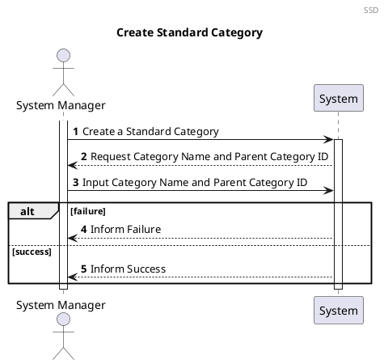
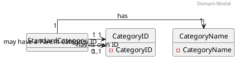
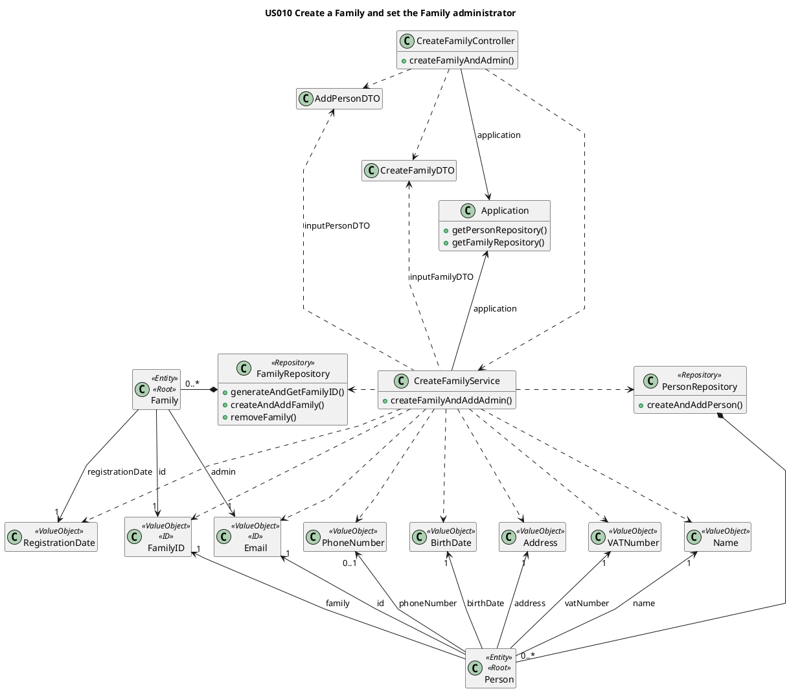

# US001 Create a Standard Category
=======================================

# 1. Requirements

*As a system manager, I want to create a standard category.*



# 2. Analysis

## 2.1 Summary

The following Domain Model is only referring to this user story. The complete model can be found in the diagrams folder.

What is relevant for this US is the validity of the Parent Category ID (PCID). If the actor inputs a not-null PCID that doesn't match any existing Standard Category, then the process must fail.


Each StandardCategory will have two or three attributes. They must have a non-null, non-empty, non-blank Category Name, and a auto-generated Category ID. Optionally, they may have another Category ID which will be the PCID.

The **Standard Category** must have the following characteristics with the following rules:

| **_Value Objects_**         | **_Business Rules_**                                                                   |
| :-------------------------- | :------------------------------------------------------------------------------------- |
| **CategoryName**                | Required, string.               |
| **CategoryID**                    | Required and optional, unique. A Category will have its own (required) and one for its parent (optional)                                                                        |

 |

## 2.2. Domain Model Excerpt



# 3. Design

The process to fulfill this requirement requires the actor to select they want to create a new Standard Category
prompt the input of the name for that category as well as the Parent Category ID

2.1.  
Given the current absence of an UI layer the required data will be passed directly into the CreateStandardCategoryController.

If the user does not input a PCID (will be null) then the Standard Category will be considered to be at root level.
Alternatively, if the PCID does not match any existing Standard Categories, the creation will fail.

In order to be possible to input a PCID, the generated CategoryID should not be random.
In the future, if it's possible to retrieve the existing Categories for the actor to select the parent, then the CategoryID could be made random. 

This decision occurred after discussing the possibility of testing the input of a PCID. If it's random, there's not a way to input it in the tests.


````puml
@startuml
autonumber
header Sequence Diagram
title US001 Create a Standard Category
actor "System Manager" as systemManager
participant "UI" as UI
participant ": Create\nStandardCategoryController" as controller
participant ": CreateStandardCategoryService" as service
participant " anApplication : \nApplication" as app
participant "aCategoryRepository \n: CategoryRepository" as repository
participant "newStandardCategory \n: StandardCategory" as scategory

activate systemManager
systemManager -> UI: I want to create a Standard Category
activate UI
return request data
systemManager -> UI : input Category name, Parent ID.
activate UI
UI -> controller : createStandardCategory(createCategoryDTO)
activate controller
controller -> service** : create(application)
controller -> service : createStandardCategory(createCategoryDTO)
activate service

service -> app : getCategoryRepository()
activate app
return aCategoryRepository

service -> service: unpack DTO and create value objects
service -> repository: checkIfParentCategoryIDisValid()
activate repository

alt Success - Parent Category Exists

repository -> service: true
service -> repository: create StandardCategory(CategoryName, ParentCategoryID)
activate repository
repository -> repository: generate categoryID()
repository -> scategory**: create (CategoryName, CategoryID, ParentCategoryID)
activate scategory
return category created
repository -> repository : add(aStandardcategory)
return success
service -> controller: success
controller -> UI: success
UI -> systemManager: inform success

else Fail - No Such Parent Category

return false
return fail
return fail
return inform failure

end

@enduml
````

## 3.1. Functionality Use

The CreateFamilyController creates a new CreateFamilyService object using a inputFamilyDTO, a inputPersonDTO and the
application. 
The CreateFamilyService will create all the necessary value objects to create the family and administrator.
The CreateFamilyService will invoke the Application to retrieve the PersonRepository and FamilyRepository. 
The CreateFamilyService will invoke the FamilyRepository to create a familyID and then a Family. 
The CreateFamilyService will invoke the PersonRepository to create the Person object for the administrator, 
providing the email from the admin is unique. If it isn't, the previously created Family will be deleted.
The CreateFamilyController will then return a true or false response depending on the sucess or insuccess
of creating the Family and administrator.


## 3.2. Class Diagram



## 3.3. Applied Patterns

We applied the principles of Controller, Information Expert, Creator and PureFabrication from the GRASP pattern. We also
used the SOLID Single Responsibility Principle.

## 3.4. Tests

Several cases where analyzed in order to test the creation of a new Family

**Test 1:** Test that it is possible to create a new instance of Family with a valid Admin

**Test 2:** Test that it is not possible to create a new instance of Family if admin email is already registered

**Test 3:** Test that it is not possible to create a new instance of Family receiving a **familyName** that is null

**Test 4:** Test that it is not possible to create a new instance of Family receiving a **familyName** that is empty

**Test 5:** Test that it is not possible to create a new instance of Family receiving a **familyName** that is blank

**Additional Tests** Test that its not possible to create a new instance of Family if any attribure is empty, blank or
null The whole user story was tested for the case of success and for failure

**Test 5:** Success

```` 
@DisplayName("Test if a family can be successfully created")  
@Test
 void shouldBeTrueCreateFamily() {
        Application application = new Application();
        Create Family Controller controller = new Create Family Controller(application);
        CreateFamilyDTO inputFamilyDTO = new CreateFamilyDTO("tonyze@hotmail.com", "Silva", "Tony", "12/12/1990", 999999999, 919999999, "Rua das Flores", "Porto", 69, "4400-000", "139861572ZW2");
        
        assertTrue(controller.createFamilyAndAdmin(inputFamilyDTO));    
    }
````

**Test 6:** Failure

````
@DisplayName ("Test if a family isnt created if the admin email is already registered in the app")  
@Test
    void shouldBeFalseCreateFamilyEmailAlreadyregistered() {
        Application application = new Application();
        Create Family Controller controller = new Create Family Controller(application);
        CreateFamilyDTO createFamilyDTO1 = new CreateFamilyDTO("tonyze@hotmail.com", "Silva", "Tony", "12/12/1990", 999999999, 919999999, "Rua das Flores", "Porto", 69, "4400-000", "139861572ZW2");
        CreateFamilyDTO inputFamilyDTO2 = new CreateFamilyDTO("tonyze@hotmail.com", "Pereira", "Rita", "12/12/1990", 999999999, 919999999, "Rua das Flores", "Porto", 69, "4400-000", "139861572ZW2");
        controller.createFamilyAndAdmin(createFamilyDTO1);
        assertFalse(controller.createFamilyAndAdmin(inputFamilyDTO2));    
    }
    }
````

# 4. Implementation

1. All the Value Objects are initially instanced (instantiated), with respective validations.


      public boolean createFamilyAndAddAdmin() {
      boolean result;
      EmailAddress adminEmail = new EmailAddress(inputPersonDTO.unpackEmail());
      FamilyName familyName = new FamilyName(inputFamilyDTO.unpackFamilyName());
      Name name = new Name(inputPersonDTO.unpackName());
      BirthDate birthdate = new BirthDate(inputPersonDTO.unpackBirthDate());
      VATNumber vat = new VATNumber(inputPersonDTO.unpackVAT());
      PhoneNumber phone = new PhoneNumber(inputPersonDTO.unpackPhone());
      Address address = new Address(inputPersonDTO.unpackStreet(), inputPersonDTO.unpackCity(), inputPersonDTO.unpackZipCode(), inputPersonDTO.unpackHouseNumber());
      CCnumber cc = new CCnumber(inputPersonDTO.unpackCCNumber());
      RegistrationDate registrationDate = new RegistrationDate(inputFamilyDTO.unpackLocalDate());

2. Family ID is automatically generated by the Family Repository (Information Expert)


      public FamilyID generateAndGetFamilyID() {
      FamilyID familyID = new FamilyID(UUID.randomUUID());
      if (checkIfFamilyIDExists(familyID)) {
      familyID = generateAndGetFamilyID();
      }
      return familyID;
      }

3. AdminEmail is added to the Family upon its instantiation. The Family is immediately added to the FamilyRepository (
   The administrator email validation will come later.)


      public void createAndAddFamily(FamilyName familyName, FamilyID familyID, RegistrationDate registrationDate, EmailAddress adminEmail) {
      Family family = new Family(familyID, familyName, registrationDate, adminEmail);
      this.families.add(family);
      }

4. Before creating the Administrator, the email is validated in the Person Repository in order to guarantee that it is
   Unique


      private boolean isEmailAlreadyRegistered(EmailAddress email) {
      boolean emailIsRegistered = false;
      for (Person person : people) {
      if (person.isSameEmail(email)) {
      emailIsRegistered = true;
      }
      }
      return emailIsRegistered;
      }

5. If the Email fails verification, the Family is removed from the FamilyRepository and the process fails.

   
      try {
      personRepository.createAndAddPerson(name, birthdate, adminEmail, vat, phone, address, cc, familyID);
      result = true;
      } catch (EmailAlreadyRegisteredException e) {
      familyRepository.removeFamily(familyID);
      result = false;
      }
      return result;


# 5. Integration

The development of this user story was the basis for the family structure where the FamilyMembers are stored and was
thus crucial for the development of the other User Stories

# 6. Observations

As with the Standard Category the family ID will probably need to be reworked in a future sprint to allow for more
complex ID information if needed (probably using a UUID)