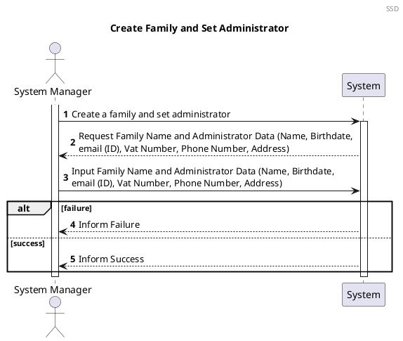
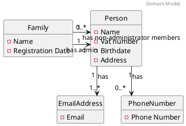
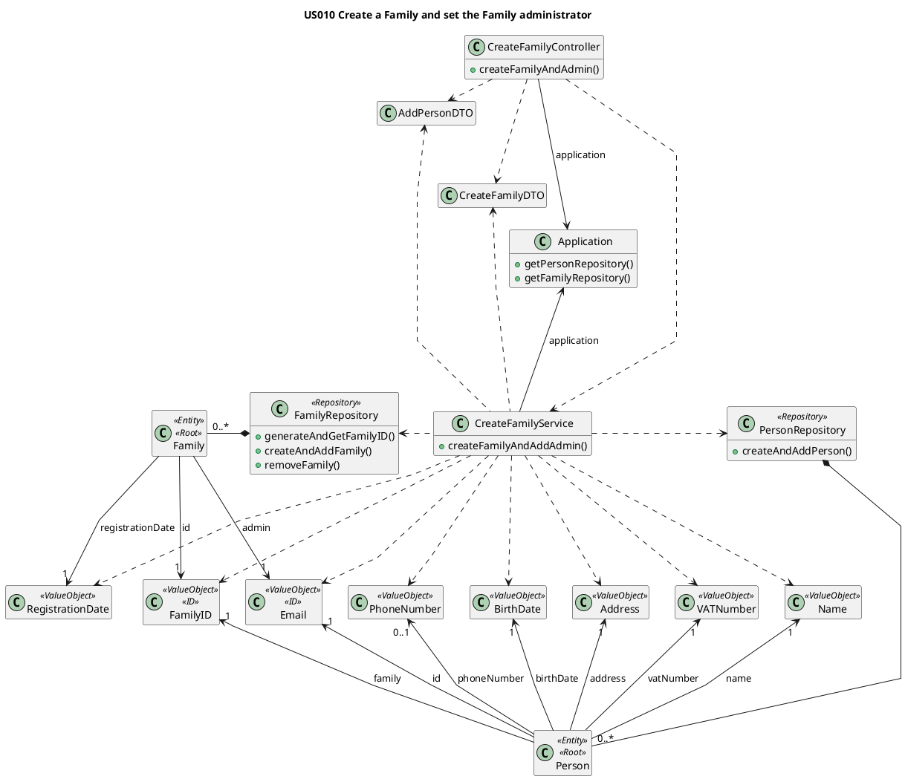
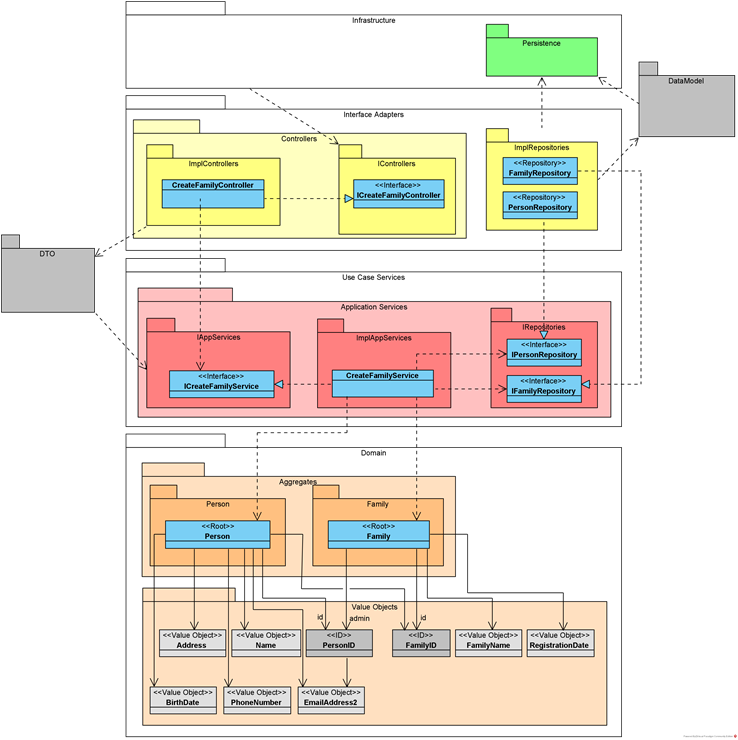

# US010 Create a Family and set the Family administrator
=======================================

# 1. Requirements

*As a system manager, I want to create a family and set a family administrator*



# 2. Analysis

## 2.1 Summary

What is relevant for this US is the relation between *Family* and *Person*. The Family will be composed by **1
administrator** and **0, 1 or multiple non-administrators**. Both administrator and non-administrator are Persons.

Each Person will have two types of attributes. The attributes *name*, *CCNumber*, *birthDate*, *address* and *vatNumber*
will have a **single value** but *EmailAddress* and *PhoneNumber* will behave differently. Both *EmailAddress* and *
PhoneNumber* are attributes that a Person can have more than one. A *Person* **must have at least one email**, but it's
possible that has **none or multiple** *PhoneNumbers*.

The **Person** must have the following characteristics with the following rules:

| **_Value Objects_**         | **_Business Rules_**                                                                   |
| :-------------------------- | :------------------------------------------------------------------------------------- |
| **Name**                    | Required, string                                                                       |
| **BirthDate**               | Required, date(year-month-day)                                                         |
| **Address**                 | Required, string                                                                       |
| **VatNumber**               | Required, unique, Vat must have 9 numeric digits                                       |
| **EmailAddress**            | Required, unique, Email must follow a pattern                                          |
| **PhoneNumber**             | Non-Required, PhoneNumber must have 9 digits                                           |

The **Family** must have the following characteristics with the following rules:

| **_Value Objects_**         | **_Business Rules_**                                                                   |
| :-------------------------- | :------------------------------------------------------------------------------------- |
| **Name**                | Required, string                                                                           |
| **RegistrationDate**    | Required, date(year-month-day)                                                             |

## 2.2. Domain Model Excerpt

The following Domain Model is only referring to this user story. The complete model can be found in the diagrams folder.



# 3. Design

The process to fulfill this requirement requires the actor to select the option to create a new family, which would
prompt the input of the name for that family as well as the administrator email, and the other necessary data stated in
2.1.  
Given the current absence of a UI layer the required data will be passed directly into the CreateFamilyController.


## 3.1. Class Diagram

### 3.1.1. Previous Iterations



### 3.1.2. Onion Layer Class Diagram




## 3.2. Functionality Use

The CreateFamilyController creates a new CreateFamilyService object using a inputFamilyDTO, a inputPersonDTO and the
application.
The CreateFamilyService will create all the necessary value objects to create the family and administrator.
The CreateFamilyService will invoke the Application to retrieve the PersonRepository and FamilyRepository.
The CreateFamilyService will invoke the FamilyRepository to create a familyID and then a Family.
The CreateFamilyService will invoke the PersonRepository to create the Person object for the administrator,
providing the email from the admin is unique. If it isn't, the previously created Family will be deleted.
The CreateFamilyController will then return a true or false response depending on the sucess or insuccess
of creating the Family and administrator.


````puml
@startuml

autonumber
header Sequence Diagram
title US010 Create a Family and Set Administrator

participant ": IFamilyController" as familyController <<Interface>>
participant ": ICreateFamilyService" as FamAdminService <<Interface>>
participant "adminID\n : PersonID" as adminID
participant "familyID\n : FamilyID" as familyID
participant "anAdmin\n : Person" as person
participant "aFamily\n : Family" as family
participant ": IFamilyRepository" as familyRepository <<Interface>>
participant ": IPersonRepository" as personRepository <<Interface>>
participant ": IPersonRepositoryJPA" as personRepositoryJPA <<Interface>>
participant ": IFamilyRepositoryJPA" as familyRepositoryJPA <<Interface>>

note left: especificar nome da instância no participant?


-> familyController : createFamilyAndSetAdmin(\n addFamilyAndSetAdminDTO)
activate familyController

ref over familyController
   InputPersonDTO = personAssembler.toInputPersonDTO(addFamilyAndSetAdminDTO)
end

ref over familyController
   InputFamilyDTO = familyAssembler.toInputFamilyDTO(addFamilyAndSetAdminDTO)
end

familyController -> FamAdminService : createFamilyAndAddAdmin\n(inputFamilyDTO, inputPersonDTO)
activate FamAdminService

FamAdminService -> adminID ** : create\n(inputPersonDTO.unpackEmail())

FamAdminService -> familyID ** : create\n(inputPersonDTO.unpackEmail()

ref over FamAdminService
   Value Objects 
   personDTODomainAssembler.toDomain(inputPersonDTO,familyID)
end ref

ref over FamAdminService
   Value Objects 
   familyDTODomainAssembler.toDomain(inputFamilyDTO,familyID,adminID)
end ref

FamAdminService -> person** : create(name, birthDate, adminID, vat, phone, address, familyID)

FamAdminService -> family** : create(familyID, familyName, registrationDate, adminID)

FamAdminService -> personRepository: add(admin)
activate personRepository

ref over personRepository
personJPA = personAssembler.toData(admin)
end ref

personRepository -> personRepositoryJPA: save(personJPA)
activate personRepositoryJPA
return

return

FamAdminService -> familyRepository: add(newFamily)
activate familyRepository

ref over familyRepository
familyJPA = familyAssembler.toData(newFamily)
end ref

familyRepository -> familyRepositoryJPA : save(familyJPA)
activate familyRepositoryJPA
familyRepositoryJPA -> familyRepository : savedFamilyJPA
deactivate familyRepositoryJPA

familyRepository -> FamAdminService : savedFamily
deactivate familyRepository

ref over FamAdminService
   OutputFamilyDTO = familyDTODomainAssembler.toOutputFamilyDTO(savedFamily)
end

FamAdminService -> familyController : anOutputFamilyDTO

ref over familyController
   addSelfLink to anOutputFamilyDTO
end

deactivate FamAdminService

<- familyController: responseEntity(OutputFamilyDTO, Httpstatus.OK)
deactivate familyController

@enduml
````

````puml
@startuml
title US010 admin = personDTODomainAssembler.toDomain

participant ": iCreateFamilyService" as createFamilyService <<Interface>>
participant ": PersonDTODomainAssembler" as dtoToDomainAssembler
participant "inputPersonDTO : inputPersonDTO" as inputPersonDTO
participant "personID : PersonID" as personID
participant "name : Name" as name
participant "birthDate : BirthDate" as birthDate
participant "vat : VATNumber" as vat
participant "phone : PhoneNumber" as phoneNumber
participant "address : Address" as address
participant "admin : Person" as admin

activate createFamilyService
createFamilyService -> dtoToDomainAssembler : toDomain(inputPersonDTO, familyID)
activate dtoToDomainAssembler
dtoToDomainAssembler -> personID** : create(inputPersonDTO.unpackEmail())
dtoToDomainAssembler -> name** : create(inputPersonDTO.unpackName())
dtoToDomainAssembler -> birthDate** : create(inputPersonDTO.unpackBirthDate())
dtoToDomainAssembler -> vat** : create(inputPersonDTO.unpackVAT())
dtoToDomainAssembler -> phoneNumber** : create(inputPersonDTO.unpackPhone())
dtoToDomainAssembler -> address** : create(inputPersonDTO.unpackStreet(), inputPersonDTO.unpackCity(), inputPersonDTO.unpackZipCode(), inputPersonDTO.unpackHouseNumber())
dtoToDomainAssembler -> admin** : create(name, birthDate, personID, vat, phone, address, familyID)
dtoToDomainAssembler -> createFamilyService : admin
deactivate dtoToDomainAssembler
deactivate createFamilyService

@enduml
````

````puml
@startuml

autonumber
header Sequence Diagram
title US010 family = familyDTODomainAssembler.toDomain 

participant ": ICreateFamilyService" as CreateFamService <<Interface>>
participant ": FamilyDTODomainAssembler" as assembler
participant "aFamilyName : FamilyName" as familyName
participant "aRegistrationDate : RegistrationDate" as regDate
participant "aFamily : Family" as family

activate CreateFamService
CreateFamService -> assembler : toDomain(inputFamilyDTO, familyID, adminID)
activate assembler
assembler -> familyName** : create(inputFamilyDTO.unpackFamilyName())
assembler -> regDate** : create(inputFamilyDTO.unpackLocalDate())
assembler -> family** : create(familyID, familyName, regDate, adminID)
assembler -> CreateFamService : aFamily
deactivate assembler
deactivate CreateFamService

@enduml
````

````puml
@startuml

autonumber
header Sequence Diagram
title US010 personJPA = personAssembler.toData(admin)

participant ": IPersonRepository" as personRepository <<interface>>
participant "personAssembler : PersonDataDomainAssembler" as assembler
participant "admin\n : Person" as admin
participant "personIDJPA : PersonIDJPA" as personIDJPA
participant "familyIDJPA : FamilyIDJPA" as familyIDJPA
participant "adminJPA : PersonJPA" as adminJPA
participant "addressJPA : AdressJPA" as addressJPA
participant "emailsJPA : List<EmailAddressJPA>" as emailsJPA
participant "phoneNumbersJPA : List <PhoneNumberJPA>" as phoneNumbersJPA


-> personRepository : add(admin)
activate personRepository
personRepository -> personRepository : isPersonIDAlreadyRegistered(admin.id())

personRepository -> assembler : toData(admin)
activate assembler

assembler -> admin : id()
activate admin
admin --> assembler : adminID
deactivate admin
assembler -> personIDJPA** :  create(adminID.toString())

assembler -> admin : getName().toString()
activate admin
admin --> assembler : name
deactivate admin

assembler -> admin : getBirthDate().toString()
activate admin
admin --> assembler : birthDate
deactivate admin

assembler -> admin : getVat().toInt()
activate admin
admin --> assembler : vat
deactivate admin

assembler -> admin : getPhoneNumbers()
activate admin
admin --> assembler : phoneNumbers
deactivate admin


assembler -> admin : getAddress()
activate admin
admin --> assembler : address
deactivate admin

assembler -> admin : getFamilyID()
activate admin
admin --> assembler : familyID
deactivate admin

assembler -> familyIDJPA** :  create(familyID.getFamilyID().toString())

assembler -> adminJPA** : create(personIDJPA, name, birthdate, vat, familyIDJPA)

assembler -> addressJPA** : create(address.getStreet(), address.getCity(), address.getZipCode(), address.getDoorNumber(), personJPA)

assembler -> emailsJPA** : generateEmailAddressJPAList(person.getEmails(), personJPA)
activate emailsJPA
return emailsJPA

assembler -> phoneNumbersJPA** : generetePhoneNumberJPAList(phoneNumbers, personJPA)
activate phoneNumbersJPA
return phoneNumbersJPA

assembler -> adminJPA : setAddress(addressJPA)
activate adminJPA
adminJPA --> assembler
deactivate adminJPA
assembler -> adminJPA : setPhones(phoneNumbersJPA)
activate adminJPA
adminJPA --> assembler
deactivate adminJPA
assembler -> adminJPA : setEmails(emailsJPA)
activate adminJPA
adminJPA --> assembler
deactivate adminJPA
assembler -> personRepository : aPersonJPA
deactivate assembler
<- personRepository

@enduml
````

````puml
@startuml

autonumber
header Sequence Diagram
title US010 familyJPA = familyAssembler.toData(newFamily) 

participant ": IPersonRepository" as personRepo <<interface>>
participant ": familyDataDomainAssembler" as assembler
participant "aFamily : Family" as Family
participant "aFamilyIDJPA : FamilyIDJPA" as FamilyIDJPA
participant "adminIDJPA : PersonIDJPA" as PersonIDJPA
participant "aFamilyJPA : FamilyJPA" as FamilyJPA

activate personRepo
personRepo -> assembler : toData(Family)
activate assembler
assembler -> Family : id()
activate Family 
Family -> assembler : familyID
deactivate Family 
assembler -> FamilyIDJPA** : create(familyID)
assembler -> Family : getAdmin()
activate Family 
Family -> assembler : PersonID
deactivate Family 
assembler -> PersonIDJPA** : create(PersonID)
assembler -> Family : getName()
activate Family 
Family -> assembler : name
deactivate Family 
assembler -> Family : getRegistrationDate()
activate Family 
Family -> assembler : registrationDate
deactivate Family 
assembler -> FamilyJPA** : create(familyIDJPA, name, registrationDate, adminIDJPA)
assembler -> personRepo : FamilyJPA
deactivate assembler
deactivate personRepo

@enduml
````


## 3.3. Applied Patterns

We applied the principles of Controller, Information Expert, Creator and PureFabrication from the GRASP pattern. We also
used the SOLID Single Responsibility Principle.

## 3.4. Tests

Several cases where analyzed in order to test the creation of a new Family

**Test 1:** Test that it is possible to create a new instance of Family with a valid Admin

**Test 2:** Test that it is not possible to create a new instance of Family if admin email is already registered

**Test 3:** Test that it is not possible to create a new instance of Family receiving a **familyName** that is null

**Test 4:** Test that it is not possible to create a new instance of Family receiving a **familyName** that is empty

**Test 5:** Test that it is not possible to create a new instance of Family receiving a **familyName** that is blank

**Additional Tests** Test that its not possible to create a new instance of Family if any attribure is empty, blank or
null The whole user story was tested for the case of success and for failure

**Test 5:** Success

```` 
@DisplayName("Test if a family can be successfully created")  
@Test
 void shouldBeTrueCreateFamily() {
        Application application = new Application();
        Create Family Controller controller = new Create Family Controller(application);
        CreateFamilyDTO inputFamilyDTO = new CreateFamilyDTO("tonyze@hotmail.com", "Silva", "Tony", "12/12/1990", 999999999, 919999999, "Rua das Flores", "Porto", 69, "4400-000", "139861572ZW2");
        
        assertTrue(controller.createFamilyAndAdmin(inputFamilyDTO));    
    }
````

**Test 6:** Failure

````
@DisplayName ("Test if a family isnt created if the admin email is already registered in the app")  
@Test
    void shouldBeFalseCreateFamilyEmailAlreadyregistered() {
        Application application = new Application();
        Create Family Controller controller = new Create Family Controller(application);
        CreateFamilyDTO createFamilyDTO1 = new CreateFamilyDTO("tonyze@hotmail.com", "Silva", "Tony", "12/12/1990", 999999999, 919999999, "Rua das Flores", "Porto", 69, "4400-000", "139861572ZW2");
        CreateFamilyDTO inputFamilyDTO2 = new CreateFamilyDTO("tonyze@hotmail.com", "Pereira", "Rita", "12/12/1990", 999999999, 919999999, "Rua das Flores", "Porto", 69, "4400-000", "139861572ZW2");
        controller.createFamilyAndAdmin(createFamilyDTO1);
        assertFalse(controller.createFamilyAndAdmin(inputFamilyDTO2));    
    }
    }
````

# 4. Implementation

1. All the Value Objects are initially instanced (instantiated), with respective validations.


      public boolean createFamilyAndAddAdmin() {
      boolean result;
      EmailAddress adminEmail = new EmailAddress(inputPersonDTO.unpackEmail());
      FamilyName familyName = new FamilyName(inputFamilyDTO.unpackFamilyName());
      Name name = new Name(inputPersonDTO.unpackName());
      BirthDate birthdate = new BirthDate(inputPersonDTO.unpackBirthDate());
      VATNumber vat = new VATNumber(inputPersonDTO.unpackVAT());
      PhoneNumber phone = new PhoneNumber(inputPersonDTO.unpackPhone());
      Address address = new Address(inputPersonDTO.unpackStreet(), inputPersonDTO.unpackCity(), inputPersonDTO.unpackZipCode(), inputPersonDTO.unpackHouseNumber());
      CCnumber cc = new CCnumber(inputPersonDTO.unpackCCNumber());
      RegistrationDate registrationDate = new RegistrationDate(inputFamilyDTO.unpackLocalDate());

2. Family ID is automatically generated by the Family Repository (Information Expert)


      public FamilyID generateAndGetFamilyID() {
      FamilyID familyID = new FamilyID(UUID.randomUUID());
      if (checkIfFamilyIDExists(familyID)) {
      familyID = generateAndGetFamilyID();
      }
      return familyID;
      }

3. AdminEmail is added to the Family upon its instantiation. The Family is immediately added to the FamilyRepository (
   The administrator email validation will come later.)


      public void createAndAddFamily(FamilyName familyName, FamilyID familyID, RegistrationDate registrationDate, EmailAddress adminEmail) {
      Family family = new Family(familyID, familyName, registrationDate, adminEmail);
      this.families.add(family);
      }

4. Before creating the Administrator, the email is validated in the Person Repository in order to guarantee that it is
   Unique


      private boolean isEmailAlreadyRegistered(EmailAddress email) {
      boolean emailIsRegistered = false;
      for (Person person : people) {
      if (person.isSameEmail(email)) {
      emailIsRegistered = true;
      }
      }
      return emailIsRegistered;
      }

5. If the Email fails verification, the Family is removed from the FamilyRepository and the process fails.

   
      try {
      personRepository.createAndAddPerson(name, birthdate, adminEmail, vat, phone, address, cc, familyID);
      result = true;
      } catch (EmailAlreadyRegisteredException e) {
      familyRepository.removeFamily(familyID);
      result = false;
      }
      return result;


# 5. Integration

The development of this user story was the basis for the family structure where the FamilyMembers are stored and was
thus crucial for the development of the other User Stories

# 6. Observations

As with the Standard Category the family ID will probably need to be reworked in a future sprint to allow for more
complex ID information if needed (probably using a UUID)