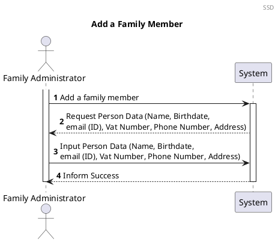
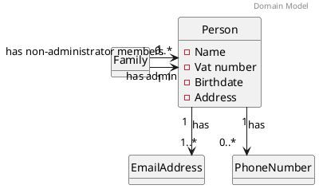
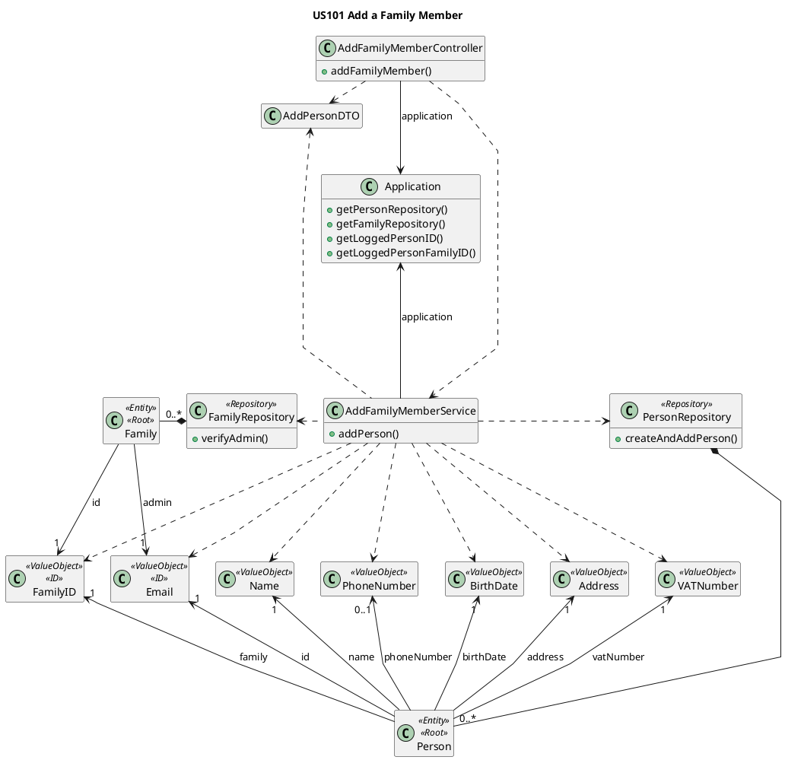
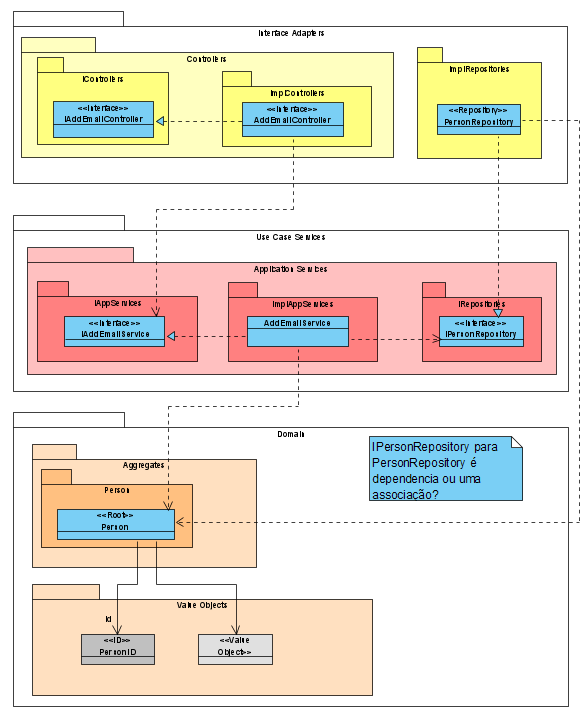
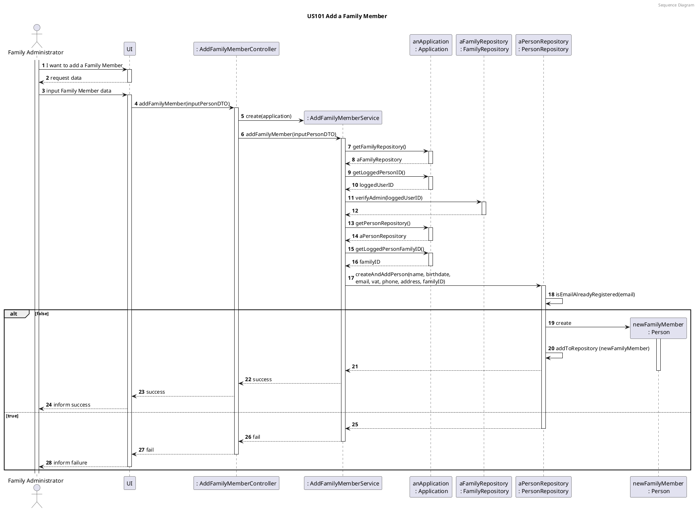

# US101 Add Family Members
=======================================

# 1. Requirements

### 1.1 Client Notes
*As a family administrator, I want to add family members*

We interpreted this requirement as the function of a family administrator adding a new Person to their family.

This Person's email account must not exist in the Application since it is used as a unique ID.

- A Person needs to have:
    - ID (email)
    - Name
    - Vat number
    - Address
    - Birthdate
    - Phone (none or one)
    - Family ID
    

### 1.2 Dependencies

### 1.2.1 Pre-conditions

In order for this US to be possible, a Family and that Family's administrator must already exist in the system.

### 1.2.2 Other User Stories

This US is dependent of US010, as a family and its administrator must be created before a person can be added.

## 1.3 Acceptance Criteria

### 1.3.1 Success Cases

A Person is created without errors and added to the Family. 

### 1.3.2 Failure Cases

- Person's data is incomplete or incorrect.
- User doesn't have Administrator privileges.
- If the Person's email is already registered in the Application.

## 1.4 SSD



# 2. Analysis

## 2.1 Summary

At the moment a person can have one or no phone numbers when it is created.  
As such, the validation of the phone number must accept a null value.


The following Domain Model is only referring to this user story. The complete model can be found in the diagrams folder.


Each Person will have two types of attributes. The attributes *name*, *birthDate*, *address* and *vatNumber*
will have a **single value** but *EmailAddress* and *PhoneNumber* will behave differently. Both *EmailAddress* and 
*PhoneNumber* are attributes that a Person can have more than one. A *Person* **must have at least one email**, but it's
possible that has **none or multiple** *PhoneNumbers*.

The **Person** must have the following characteristics with the following rules:

| **_Value Objects_**         | **_Business Rules_**                                                                   |
| :-------------------------- | :------------------------------------------------------------------------------------- |
| **Name**                    | Required, string                                                                       |
| **BirthDate**               | Required, date(year-month-day)                                                         |
| **Address**                 | Required, string                                                                       |
| **VatNumber**               | Required, Vat must have 9 numeric digits                                       |
| **EmailAddress**            | Required, unique, Email must follow a pattern                                          |
| **PhoneNumber**             | Non-Required, PhoneNumber must have 9 digits                                           |


## 2.2. Domain Model Excerpt



# 3. Design

## 3.1. Design decisions

The process to fulfill this requirement requires the actor to select they want to add a new person to their family, which would
prompt the input of the person's data.

The main user's FamilyID will be automatically retrieved by checking who is logged into the application. It will also verify if the main user is the admin of their own family.

Given the current absence of an UI layer the required data will be passed directly into the AddFamilyMemberController.

We chose to verify the uniqueness of the Email Address after instancing the email. This way we could minimize the possibility of duplicate emails being added since the verification would occur at the moment of addition to the family repository.

Since a Person can be created without a PhoneNumber, in order to not have two different constructors, the AddPersonDTO will accept an Integer object for the phone number, in order to have the possibility of Null values. The PhoneNumber class will also not throw an exception if it receives a null value. The Person will not add the PhoneNumber object to its list if it was built with a null value.

## 3.2 Class Diagram




## 3.3. Functionality Use

The AddFamilyMemberController creates a new AddFamilyMemberService object using an inputPersonDTO and the
application.
The AddFamilyMemberService will create all the necessary value objects to add a Family Member to the Person Repository.
The AddFamilyMemberService will invoke the Application to retrieve the PersonRepository and FamilyRepository.
The AddFamilyMemberService will invoke the Application to retrieve the logged person's email (unique ID) and familyID.
The AddFamilyMemberService will invoke the FamilyRepository to verify Administrator privileges.
The AddFamilyMemberService will invoke the PersonRepository to create the Person object for the Family Member,
providing their email is unique. If it isn't, the process will fail.
The AddFamilyMemberController will then return a true or false response depending on the success or insuccess
of creating the Family Member.

We chose to verify the uniqueness of the Email Address after instancing the email. This way we could minimize the possibility of duplicate emails being added since the verification would occur at the moment of addition to the Person Repository.

# 3.4 Sequence Diagram





#### 3.6.1.2 Failure

**Test 2:** Test that it is not possible to add a new Family Member if logged user is not the admin

```java
@DisplayName("Unsuccessfully add a person - not the admin")
    @Test
    void mustReturnFalseAddPersonNotAdmin() {
        application.logInAsNotAdmin();

        assertFalse(addFamilyMemberController.addPerson(inputPersonDTO));
    }


```

**Test 3:** Test that it is not possible to create a new Family Member if the email is already registered in the application.

```java
@DisplayName("Unsuccessfully add a person - email already registered")
    @Test
    void mustReturnFalseAddPersonEmailRegistred() {
        application.logInAsAdmin();
        
        assertFalse(addFamilyMemberController.addPerson(addAdminPersonDTO));
    }  
    
```

# 4. Implementation

1. All the Value Objects are initially instantiated, with respective validations.

```java
 public void addPerson(AddPersonDTO inputPersonDTO) {
        FamilyRepository familyRepository = application.getFamilyRepository();
        EmailAddress loggedUserID = application.getLoggedPersonID();
        familyRepository.verifyAdmin(loggedUserID);

        Name name = new Name(inputPersonDTO.unpackName());
        BirthDate birthDate = new BirthDate(inputPersonDTO.unpackBirthDate());
        EmailAddress email = new EmailAddress(inputPersonDTO.unpackEmail());
        VATNumber vat = new VATNumber(inputPersonDTO.unpackVAT());
        PhoneNumber phone = new PhoneNumber(inputPersonDTO.unpackPhone());
        Address address = new Address(inputPersonDTO.unpackStreet(), inputPersonDTO.unpackCity(), inputPersonDTO.unpackZipCode(), inputPersonDTO.unpackHouseNumber());
        FamilyID familyID = application.getLoggedPersonFamilyID();

        PersonRepository personRepository = application.getPersonRepository();
        personRepository.createAndAddPerson(name, birthDate, email, vat, phone, address, familyID);
    }
```

2. Logged User ID is automatically retrieved from the Logged User and checked to see if they are an admin

```java
   public void verifyAdmin(EmailAddress loggedUserID) {
        boolean result = false;
        for (Family family : this.families) {
            if(family.isPersonTheAdmin(loggedUserID)){
                result = true;
            }
        }
        if(!result){
            throw new UserIsNotAdminException();
        }
    } 
   ```


3. Before creating the Person, the email is validated in the Person Repository in order to guarantee that it is
   Unique
   
```java
      private boolean isEmailAlreadyRegistered(EmailAddress email) {
      boolean emailIsRegistered = false;
      for (Person person : people) {
      if (person.isSameEmail(email)) {
      emailIsRegistered = true;
      }
      }
      return emailIsRegistered;
      }
   ```


```java
public synchronized void createAndAddPerson(Name name, BirthDate birthDate, EmailAddress email, VATNumber vat, PhoneNumber phone, Address address, FamilyID familyID) {
        if (!isEmailAlreadyRegistered(email)) {
            Person person = new Person(name, birthDate, email, vat, phone, address, familyID);
            this.people.add(person);
        } else {
            throw new EmailAlreadyRegisteredException();
        }
    }
```

# 5. Integration

This functionality uses the same method to add the Person to the PersonRepository as the US010.

In US010 we decided to separate the Person and Family DTO's in order to reuse the Person DTO in this US, avoiding code duplication.

# 6. Observations

The Person's unique ID is not a part of the email adress list.