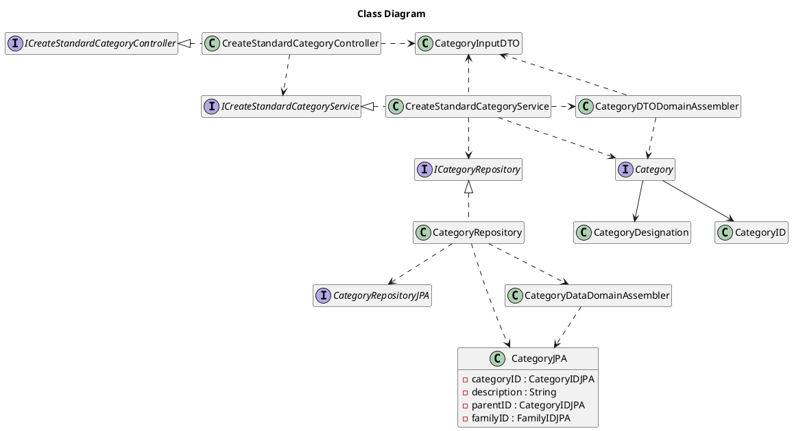

# US001 Create a Standard Category
=======================================


# 1. Requirements

*As a system manager, I want to create a new Standard Category*


**1** As a system manager, I want to create...

- 1.1. The new standard category "Habitação", at the root level;

- 1.2. The already existing category "Habitação";

- 1.3. The new standard category "Renda", as a sub-category of Habitação; 

We interpreted this requirement as the function of a system manager to create a new standard category that can be accessed by all users. 
The name of the category must not be empty, and it can't exist in the current list of standard categories.
A standard category can be a sub-category of an existing standard category.
The name of a standard category must be case-insensitive.

### 1.2 Dependencies

### 1.2.1 Pre-conditions

In order for this US to be possible, a Family and that Family's administrator must already exist in the system.

### System Sequence Diagram

```` puml

    autonumber
    title createStandardCategory SSD
    actor "System Manager" as systemManager
    participant "System" as system

    activate systemManager
    systemManager -> system: create a Standard Category
    activate system
    systemManager -> system: input required data
    system --> systemManager: inform success
    deactivate system

@endpuml
````
# 2. Analysis

In order to fulfill this requirement we need two pieces of data

- 1. Category Name - the designation of the standard category to add
- 2. Parent Category ID - if it is a subcategory the parent category must be indicated

# 3. Design

The process to fulfill this requirement requires the actor to select they want to create a new standard category, 
which would prompt the input of the designation or name for that category and the id of its parent category.
Given the current absence of an UI layer the Int *parentCategoryID* and String *standardCategoryName* will be passed directly into the AddStandardCategoryController. 
 
```` puml

autonumber
title createStandardCategory
participant ": ICreateStandardCategoryController" as controller
participant ": ICreateStandardCategoryService" as catServ
participant ": ICategoryRepository" as repo
participant ": CategoryRepositoryJPA" as jpa
    
-> controller : createStandardCategory(createCategoryDTO)
activate controller

ref over controller 
CreateStandardCategoryDTO to InputCategoryDTO

inputStandardCategoryDTO = categoryInputDTOAssembler.toInputDTO(createCategoryDTO)
end

controller -> catServ : createStandardCategory(inputStandardCategoryDTO)
activate catServ

ref over catServ
category = categoryDTODomainAssembler.toDomain(categoryInputDTO)
end

catServ -> repo : save(category)
activate repo

ref over repo
categoryJPA = categoryDataDomainAssembler.toData(category)
end

repo -> jpa : save(categoryJPA)
activate jpa
return savedCategoryJPA

ref over repo
savedCategory = categoryDataDomainAssembler.toDomain(savedCategoryJPA)
end

return savedCategory

ref over catServ
savedCategoryDTO = categoryDTODomainAssembler.toDTO(savedCategory)
end

return savedCategoryDTO

return savedCategoryDTO

@endpuml
````

## 3.1. Functionality Use
The AddStandardCategoryController will invoke the Application object, which stores a CategoryService object.
The Application will return the CategoryService, which contains a list of all StandardCategories.
The CategoryService then creates a new StandardCategory Object and adds it to the existing list.


## 3.2. Class Diagram


## 3.3. Applied Patterns
We applied the principles of Controller, Information Expert, Creator and PureFabrication from the GRASP pattern.
We also used the SOLID SRP principle.

## 3.4. Tests 
    
Several cases where analyzed in order to test the creation of a new class    

**Test 1:** Test that it is possible to create a new instance of StandardCategory receiving a name, a categoryID and a parent category 

**Test 2:** Test that it is not possible to create a new instance of StandardCategory receiving a **categoryName** that is null

**Test 3:** Test that it is not possible to create a new instance of StandardCategory receiving a **categoryName** that is empty

**Test 4:** Test that it is not possible to create a new instance of StandardCategory receiving a **categoryName** that is blank

We also tested several scenarios regarding the way the information is stored for example

**Test 5:** Test to verify that the category designation is case insensitive
 
````
    @Test
    void isDesignationOfThisCategoryTest2_designationHasDifferentCase() {
        String categoryName = "Habitação";
        int categoryID = 2;
        StandardCategory newStandardCategory = new StandardCategory(categoryName, parentCategory,categoryID);
        String nameToTest = "HABITAÇÃO";

        boolean result = newStandardCategory.isDesignationOfThisCategory(nameToTest);

        assertTrue(result);
    }
````

The whole user story was tested for the case of success and for failure

# 4. Implementation

After providing a category name and, optionally, selecting a parent category (currently this is done by its ID), the CategoryService class creates a new Category object if the information given follows the rules previously discussed in the Requirements section

# 5. Integration
 
The development of this user story was the basis for the financial categories of the application and was thus crucial for the development of other User Stories
Both [US002](US002_GetStandardCategoriesTree.md) and [US110](US110_GetCategoryTree.md) used the implementation of this US

#6. Observations

The way to generate an ID for a Standard Category will probably need to be reworked in a future sprint to allow for more complex ID information if needed

# US101 Add Family Members
=======================================

# 1. Requirements

## 1.1 Client Notes

## 1.2 Dependencies

### 1.2.1 Pre-conditions

### 1.2.2 Other User Stories

## 1.3 Acceptance Criteria

### 1.3.1 Success Cases

### 1.3.2 Failure Cases

## 1.4 SSD


# 2. Analysis

## 2.1 Summary

[COMMENT]: # (The first one seems better practice than the second one. Validate both)


| **_Value Objects_**         | **_Business Rules_**                                                                   |
| :-------------------------- | :--------------------- |
| **Description** | Required, String |
| **ParentID** | Optional, string  |


## 2.2. Domain Model Excerpt


# 3. Design

## 3.1. Design decisions


## 3.2. Class Diagram

```puml
hide empty members
title Class Diagram

interface ICreateStandardCategoryController

class CreateStandardCategoryController

interface ICreateStandardCategoryService

class CreateStandardCategoryService

class CategoryInputDTO

class CategoryDTODomainAssembler

interface Category

class CategoryID

class CategoryDesignation

interface ICategoryRepository

class CategoryRepository

interface CategoryRepositoryJPA

class CategoryJPA {
- categoryID : CategoryIDJPA
- description : String
- parentID : CategoryIDJPA
- familyID : FamilyIDJPA
}

class CategoryDataDomainAssembler


ICreateStandardCategoryController <|. CreateStandardCategoryController

CreateStandardCategoryController -.> ICreateStandardCategoryService

ICreateStandardCategoryService <|. CreateStandardCategoryService

CreateStandardCategoryController -r.> CategoryInputDTO
CreateStandardCategoryService -u.> CategoryInputDTO

CreateStandardCategoryService -r.> CategoryDTODomainAssembler
CategoryDTODomainAssembler -.> CategoryInputDTO

CreateStandardCategoryService -.> Category
CategoryDTODomainAssembler -.> Category

Category --> CategoryID
Category --> CategoryDesignation

CreateStandardCategoryService -.> ICategoryRepository
ICategoryRepository <|.- CategoryRepository

CategoryRepository -.> CategoryDataDomainAssembler

CategoryRepository --.> CategoryJPA

CategoryDataDomainAssembler -.> CategoryJPA

CategoryRepository -.> CategoryRepositoryJPA
```

## 3.3. Functionality Use


## 3.4. Sequence Diagram

````puml
autonumber
title createStandardCategory
participant ": ICreateStandardCategoryController" as controller
participant ": ICreateStandardCategoryService" as catServ
participant ": ICategoryRepository" as repo
participant ": CategoryRepositoryJPA" as jpa
    
-> controller : createStandardCategory(categoryInputDTO)
activate controller

controller -> catServ : createStandardCategory(categoryInputDTO)
activate catServ

ref over catServ

category = categoryDTODomainAssembler.toDomain(categoryInputDTO)
end

catServ -> repo : save(category)
activate repo

ref over repo
categoryJPA = categoryDataDomainAssembler.toData(category)
end

repo -> jpa : save(categoryJPA)
activate jpa
return savedCategoryJPA

ref over repo
savedCategory = categoryDataDomainAssembler.toDomain(savedCategoryJPA)
end

return savedCategory

ref over catServ
savedCategoryDTO = categoryDTODomainAssembler.toDTO(savedCategory)
end

return savedCategoryDTO

return savedCategoryDTO
````


## 3.5. Applied Patterns


## 3.6. Tests

### 3.6.1. XXXX

#### 3.6.1.1. Success

#### 3.6.1.2. Failure


### 3.6.2. YYYY

#### 3.6.2.1. Success

#### 3.6.2.2. Failure


### 3.6.3. ZZZZ

#### 3.6.3.1. Success

#### 3.6.3.2. Failure


# 4. Implementation

[comment]: # (NOTE: Only critical methods for the US implementation)

# 5. Integration


# 6. Observations
