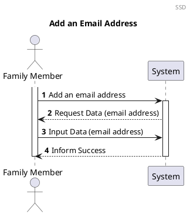
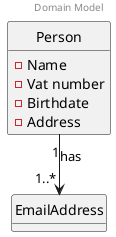
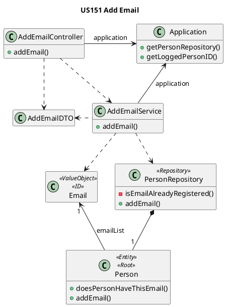
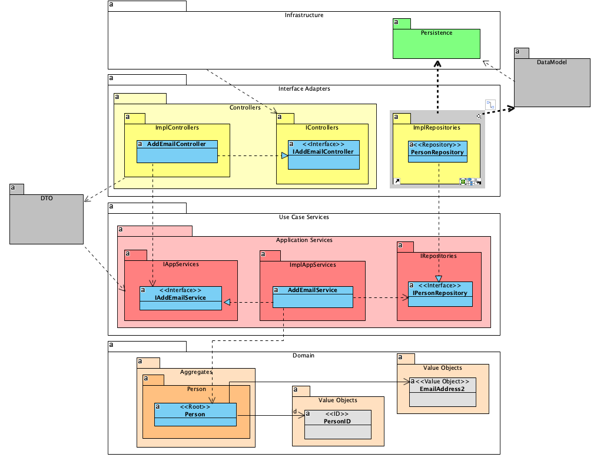

# US151 Add Email
=======================================

# 1. Requirements

### 1.1 Client Notes
*As a family member, I want to add an email account to my profile*

We interpreted this requirement as the function of a user to add an email account to his profile information. 

The email account must not previously exist in the application scope and the email must also be in a valid format.

This Person's email account must not exist in the Application since it is used as a unique ID.

- An Email needs to have:
    - An email address in a valid format (example: tonyze@tvtel.pt)


### 1.2 Dependencies

### 1.2.1 Pre-conditions

In order for this US to be possible, a Family and that Family's administrator must already exist in the system.

The Person to whom the email is going to be added, must already exist in the system and associated to a Family.

### 1.2.2 Other User Stories

This US is dependent of US010, as a family and its administrator must be created before a person can be added,
and US101, as a Family Member must already exist in a Family in order to add an email to that Family Member's profile.

## 1.3 Acceptance Criteria

### 1.3.1 Success Cases

An email address is added successfully to a Family Member's account.

### 1.3.2 Failure Cases

- Email address is on an invalid format
- User already has that email address registered.
- Another user already has that email address registered 

## 1.4 SSD



# 2. Analysis

## 2.1 Summary

At the moment a person can have one or more email address. The required, initial Email Address serves as the person's unique ID.
A valid email address must not be null, empty or blank, and must adhere to the following rules:

- local-part@domain.extension
- Uppercase and lowercase Latin letters A to Z and a to z
- Digits 0 to 9
- Printable characters !#$%&'*+-/=?^_`{|}~
dot ., provided that it is not the first or last character and provided also that it does not appear consecutively (e.g., John..Doe@example.com is not allowed).
  

The following Domain Model is only referring to this user story. The complete model can be found in the diagrams folder.


Each email will have one attribute. The attribute is a String that should comply with the above specifications.


## 2.2. Domain Model Excerpt



# 3. Design

## 3.1. Design decisions

The process to fulfill this requirement requires the actor to select they want to add a new email address to their profile, which would
prompt the input of the new email.

The main user's ID will be automatically retrieved by checking who is logged into the application. 

Given the current absence of an UI layer the required data will be passed directly into the AddEmailController.

We chose to verify the uniqueness of the Email Address after instancing the email. This way we could minimize the possibility of duplicate emails being added since the verification would occur at the moment of addition to the person's profile.

We opted to use an AddEmailDTO in order to account for possible future changes.

## 3.2 Class Diagram



-----------------------------------------------------------------
Onion Architecture 
-----------------------------




## 3.3. Functionality Use

- The AddEmailController creates a new AddEmailService object using an addEmailDTO.
- The AddEmailService will create all the necessary EmailAddress value objects to add to the logged user's profile.
- The AddEmailService will invoke the Application to retrieve the PersonRepository.
- The AddEmailService will invoke the Application to retrieve the logged person's email (unique ID).
- The AddEmailService will invoke the PersonRepository to add the EmailAddress object to the logged user's profile, providing their email is unique. If it isn't, the process will fail.
- The AddEmailController will then return a true or false response depending on the success or insuccess
of creating and adding the EmailAddress object.

We chose to verify the uniqueness of the Email Address after instancing the email. This way we could minimize the possibility of duplicate emails being added since the verification would occur at the moment of addition to the Person's Email List.

# 3.4 Sequence Diagram


````puml
@startuml

autonumber
header Sequence Diagram
title US151 Add Email

participant ":IPersonController" as controller <<interface>>
participant ":EmailExternal\nInternalAssembler" as assembler
participant "anInternalEmailDTO\n:InternalEmailDTO" as internal

participant "IAddEmailService" as service <<interface>>

participant "anOutputEmailDTO\n : OutputEmailDTO" as output
participant "aFailedOutputEmailDTO\n : OutputEmailDTO" as failoutput

participant "aPersonID\n : PersonID" as personid
participant "newEmail\n: EmailAddress" as email
participant "aPerson\n : Person" as person
participant "IPersonRepository" as personRepository <<interface>>
participant "IPersonRepositoryJPA" as repoJPA <<interface>>

-> controller : addEmail(addEmailDTO)
activate controller
controller -> assembler : toInternal(addEmailDTO)
activate assembler
assembler -> internal** : create(addEmailDTO)  
assembler --> controller : anEmailInternalDTO
deactivate assembler

controller -> service : addEmail(anInternalEmailDTO)
activate service

service -> service : loggedUserID = anInternalEmailDTO.unpackUserID()
service -> personid** : create(loggedUserID)

service -> service : emailString = anInternalEmailDTO.unpackEmail()
service -> email** : create(emailString)


service -> personRepository : getByID(aPersonID)
deactivate email
activate personRepository
return aPerson

service -> person: addEmail(newEmail)
activate person
person -> person: isEmailAlreadyRegistered(newEmail)

alt Email already registered

person --> service
controller <-- service
<-- controller : responseEntity(errorMessage, Httpstatus.BADREQUEST)


else Email not registered

person --> service: false
deactivate person

end

service -> personRepository : update(aPerson)
activate personRepository

ref over personRepository
personJPA = personAssembler.toData(admin)
end ref
personRepository -> repoJPA : save(personJPA)
activate repoJPA
repoJPA --> personRepository : savedPersonJPA
ref over personRepository
convert JPA to Domain
person = personAssembler.toDomain(savedPersonJPA)
end
deactivate repoJPA
personRepository --> service : savedPerson
deactivate personRepository

service -> output** : create( savedPerson.getAddedEmail(), savedPerson.getAddedEmailID())
service --> controller : anOutputEmailDTO
deactivate service

ref over controller
add SelfLink to anOutputEmailDTO
end
<-- controller : responseEntity(anOutputEmailDTO, Httpstatus.OK)

deactivate controller

@enduml
````

## 3.5. Applied Patterns


We applied the principles of Controller, Information Expert, Creator and PureFabrication from the GRASP pattern. We also
used the SOLID Single Responsibility Principle.

We applied the following principles:

- GRASP:
    - Information expert:
        - This pattern was used in classes such as the Person Repository, in order to apply the "Tell Don't Ask" Principle.

    - Controller:
        - To deal with the responsibility of receiving input from outside the system (first layer after the UI) we use a case controller.

    - Pure Fabrication:
        - In this user story the Application and AddEmailService class were used, which do not represent a business domain concept. The AddEmailService was created to be responsible for all operations regarding the creation of an Email.

    - High cohesion and Low Coupling:
        - The creation of the Repository Interface will provide low Coupling and high Cohesion.

    - Protected Variation:
        - An Interface will be used in which Polymorphism is going to be applied in order to protect the existing classes from future variations.

- SOLID:
    - Single-responsibility principle:
        - This pattern was used in the AddEmailService, in which the only responsibility is to add an Email to an already existing Family Member.


## 3.6. Tests

### 3.6.1. Creation of a Person/Addition to a Family

#### 3.6.1.1. Success

**Test 1:** Test that it is possible to add a new EmailAddress successfully

```
java
@DisplayName("Successfully add a new email address")
@Test
    void mustReturnTrueAddEmail() {

            AddEmailDTO addEmailDTO = new AddEmailDTO("tonyze@superlatinlover.com");
            assertTrue(addEmailController.addEmail(addEmailDTO));
            }

```

#### 3.6.1.2 Failure

**Test 2:** Test that it is not possible to add a new Email Address if the email is invalid

```
java
@DisplayName("Unsuccessfully add an email - invalid email")
@ParameterizedTest
@ValueSource(strings = {"  ","invalidemail@@gmail.com","tonyze"})
@NullAndEmptySource
    void mustReturnFalseAddInvalidEmail(String value) {
            AddEmailDTO addEmailDTO = new AddEmailDTO(value);


            assertFalse(addEmailController.addEmail(addEmailDTO));
            }


```

**Test 3:** Test that it is not possible to add a new email if the user already has that email

```
java
@DisplayName("Unsuccessfully add an email - email already registered to user")
@Test
    void mustReturnFalseAddEmailEmailRegistred() {

            AddEmailDTO addAdminEmailDTO = new AddEmailDTO(adminEmail);
            assertFalse(addEmailController.addEmail(addAdminEmailDTO));
            }
```
**Test 3:** Test that it is not possible to add a new email if another user already has that email

```
java
@DisplayName("Unsuccessfully add an email - email already registered to another user")
@Test
    void mustReturnFalseAddEmailEmailRegistredAnotherUser() {

            AddEmailDTO addOtherUserEmailDTO = new AddEmailDTO(otherUserEmail);
            assertFalse(addEmailController.addEmail(addOtherUserEmailDTO));
            }
```

# 4. Implementation

1. The EmailAddress is initially instantiated, with respective validations.

```
java
 public void addEmail(AddEmailDTO addEmailDTO) {
        PersonRepository personRepository = application.getPersonRepository();
        EmailAddress loggedUserID = application.getLoggedPersonID();
        
        EmailAddress email = new EmailAddress(addEmailDTO.unpackEmail());
        
        personRepository.addEmailToPerson(email, loggedUserID);
    }
```

2. The Person Repository will check if the email is already registered, and add the email to the target person


```
java
   public void addEmailToPerson(EmailAddress email, EmailAddress personID) {
        if (!isEmailAlreadyRegistered(email)) {
        Person loggedUser = getPersonByEmail(personID);
        loggedUser.addEmail(email);
        } else {
        throw new EmailAlreadyRegisteredException();
        }    
        
    } 
   ```


3. Before adding the email, the email is validated in the Person Repository in order to guarantee that it is Unique

```
java
      private boolean isEmailAlreadyRegistered(EmailAddress email) {
      boolean emailIsRegistered = false;
      for (Person person : people) {
      if (person.isSameEmail(email)) {
      emailIsRegistered = true;
      }
      }
      return emailIsRegistered;
      }
   ```


# 5. Integration

This functionality uses the same method to check the existence of the Email Address as the US010 and US101


# 6. Observations

The Person's unique ID is not a part of the email list.