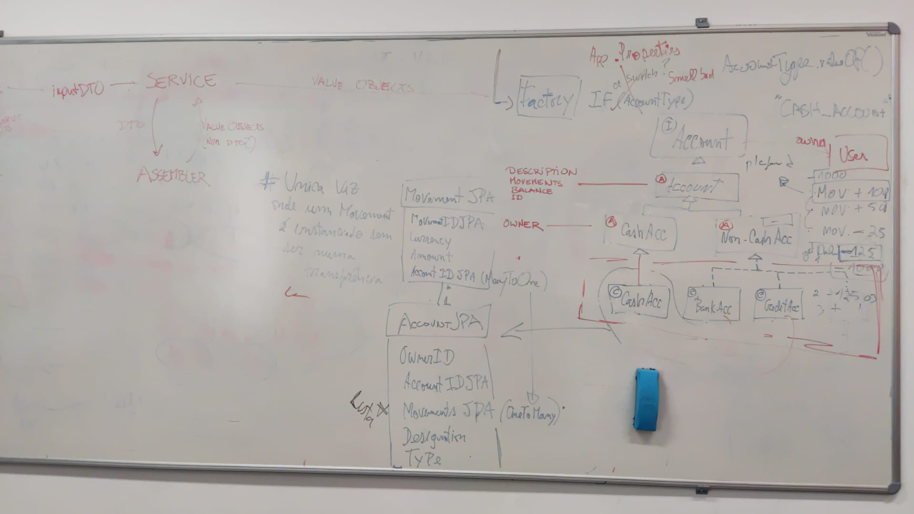

# US170,171,172,173 Create Accounts
=======================================

# 1. Requirements

## 1.1 Client Notes


## 1.2 Dependencies

### 1.2.1 Pre-conditions

### 1.2.2 Other User Stories

## 1.3 Acceptance Criteria

### 1.3.1 Success Cases

### 1.3.2 Failure Cases

## 1.4 SSD

# 2. Analysis

## 2.1 Summary

### Information Needed

| **_Name_**         | **_Business Rules_**                                                                   |
| :-------------------------- | :------------------------------------------------------------------------------------- |
| **Designation**                | Required, string            |
| **InitialAmount**                    | Optional, Integer, default is 0
|**Currency**  | Optional, must be given in ISO 4217 currency code, if absent euro (EURO) is default |
| **OwnerID**               | Required, alphanumeric                                                        |


## 2.2. Domain Model Excerpt


# 3. Design

## 3.1. Design decisions

All accounts will be created using a single entry DTO. This DTO will have an attribute that specifies the type of account to be created. This way, we have a single entry point for all methods regarding account creation. 

- At another point, with more information and user stories regarding accounts, some changes could be made. Another request can come from the client with additional information, for example.

In our service, a DTO to Domain assembler will be used to process received data and create the necessary value objects. 

At this moment all of our accounts share the same attributes except for the owner, who in the case of a CashAccount can be a person or a family. As such, we'll use an Account interface that will hold behaviour common to all accounts and an abstract class Account that will hold attributes such as designation, balance, accountID and list of movements. CashAccount and NonCashAccount abstract classes will extend this Account abstract class and have the ownerID/personID attribute. Finally we have our specific account classes, CashAccount, BankAccount, BankSavingsAccount and CreditCardAccount.

The balance of an account will be calculated through its list of movements, so a balance attribute will not be necessary on account instantiation but can be calculated by a private method in the account class or an interface BalanceCalculator that will have different implementations depending on how balance is to be calculated.

```
// Balance is calculated outside of constructor
   public CashAccount(OwnerID ownerID, Designation designation, AccountID accountID, List<Movement> movements) {
      this.balance = calculateBalance(movements) OR this.balance = balanceCalculator.calculate(movements);
      ...
   }
   
   // Example: private method in account
   private Monetary calculateBalance(List<Movement> movements) {
      Monetary balance = new Monetary()
      // for every movement in movements, balance.sum(movement)
      return balance 
   }
```

To create an account the service will use the AccountFactory class, that will abstract the logic behind account creation.

```
Account account = accountFactory.getAccount(ownerID, initialMovement, designation, accountType)
```

**AccountType**

Account type is a string in the incoming DTO. Through configuration files black magic, the factory will recognize the received String and create the appropriate account. In API documentation, the allowed Strings must be specified.

In the AccountFactory class, the constructor will decide which account class to create depending on the AccountType object it receives.

**AccountID**

AccountID generation will be handled by the database. Upon account first time creation, no ID will be used. When saved in the repository, a savedAccount object will be returned that has a generated AccountID value. Subsequent account creation will use this AccountID. This AccountID can also be used in the ResponseEntity of the request as a self link.

To handle this, AccountFactory will have methods with the same name but different signatures, depending on the arguments it can receive.

Specific account classes will have a builder inner class to instantiate objects. The required data for an Account object are OwnerID and Designation. The builder will allow a withAccountID(), withMovement() and withMovements() methods to be used as well:

```
// first time account creation with unspecified balance
Account account = new CashAccount.Builder(ownerID, designation).build();

// first time account creation with initial movement
Account account = new CashAccount.Builder(ownerID, designation).withMovement(movement).build();

// account data from persistence
Account account = new CashAccount.Builder(ownerID, , designation).withMovements(movements).withAccountID(accountID).build();
```

**Builder**

Each specific Account class should have a builder of its own. This will result in some repeated code, where the only change is the return of the build() method.

```
public class CashAccount {

   // private constructor
   private CashAccount(this.ownerID, this.designation, this.accountID, this.movements) {
   ...
   }
   
   // builder inner class
   public static class Builder {
   
      private OwnerID ownerID
      private Designation designation
      private AccountID accountID
      private List<Movement> movements
      
      // Indispensável para criar uma conta válida
      public Builder(OwnerID ownerID, Designation designation) {
      
      }
      
      public Builder withAccountID(AccountID accountID) {}

      public Builder withMovement(Movement movement) {
         this.movements.add(movement)   
      }

      public Builder withMovementList(List<Movement> movements) {}
      
      public Account build() {
         return new CashAccount(this.ownerID, this.designation, this.accountID, this.movements);
      }
   }
}
```

Another option could be used (mais elegante, mas talvez desnecessário) to avoid this duplication, a [skeletal interface](https://dzone.com/articles/favour-skeletal-interface-in-java).

- In this version, the inner class would extend an abstract class that implements account. This abstract class would contain necessary code except for the build() method, different for every class.

**Monetary**

Regarding handling money in our application, a class that has as attributes monetaryValue value and associated currency is necessary. For currency, we can use the java util class [Currency](https://www.geeksforgeeks.org/java-util-currency-methods-example/). This class allows an instance of currency to be created using a [ISO 4217 currency code](https://en.wikipedia.org/wiki/ISO_4217). The monetaryValue value could be a BigDecimal (recommended) or other options that allow floats.

The request for the creation of an account may have an initialAmount included. In the application, this amount will be converted into a movement. If no amount is specified, the account will be created with a balance of 0.

**Sketch Diagram**




## 3.2. Class Diagram


## 3.3. Functionality Use


## 3.4. Sequence Diagram

```puml
autonumber 1
title Create Account

participant ": IAccountRESTController" as controller
participant ": ICreateAccountService" as service
participant ": IAccountRepository" as repository
participant ": IAccountRepositoryJPA" as repositoryJPA


-> controller : createAccount(createAccountDTO)
activate controller

ref over controller
CreateAccountDTO to InputAccountDTO

inputAccountDTO = accountInputDTOAssembler.toInputDTO(createAccountDTO)
end

controller -> service : createAccount(inputAccountDTO)
activate service

ref over service
InputAccountDTO to Value Objects

designation = accountDTODomainAssembler.designationToDomain(inputAccountDTO)
ownerID = accountDTODomainAssembler.ownerIDToDomain(inputAccountDTO)
...
end

ref over service
Account Factory 1

account = accountFactory.getAccount(ownerID, initialMovement, designation, accountType)
end


service -> repository : add(account)
activate repository

ref over repository
Account to AccountJPA

accountJPA = accountDataDomainAssembler.toData(account)
end

repository -> repositoryJPA : save(accountJPA)
activate repositoryJPA
return savedAccountJPA

ref over repository
AccountJPA to Account

savedAccount = accountDataDomainAssembler.toDomain(savedAccountJPA)
end

return savedAccount

ref over service
Account to OutputAccountDTO

outputAccountDTO = accountDTODomainAssembler.toDTO(savedAccount)
end

return outputAccountDTO

ref over controller
Add Links to OutputAccountDTO
end

return responseEntity

```

```puml
autonumber
title InputAccountDTO to Account

participant ": ICreateAccountService" as service
participant ": AccountDTODomainAssembler" as assembler
participant ": OwnerID" as owner
participant ": Movement" as movement
participant ": Designation" as designation

activate service
service -> assembler : ownerIDToDomain(inputAccountDTO)
activate assembler

assembler -> owner ** : create(inputAccountDTO.unpackOwnerID())
return ownerID

service -> assembler : movementToDomain(inputAccountDTO)
activate assembler 

assembler -> movement ** : create(inputAccountDTO.unpackMovement())
return movement

service -> assembler : designationToDomain(inputAccountDTO)
activate assembler

assembler -> designation ** : create(inputAccountDTO.unpackDesignation())
return designation

service -> assembler : accountTypeToDomain(inputAccountDTO)
activate assembler
assembler -> assembler : accountType = inputAccountDTO.unpackAccountType();

return accountType
```

```puml
autonumber
title Account Factory 1.

participant ": AccountFactory" as factory
participant "cashAccount : Account" as cashAccount
participant "bankAccount : Account" as bankAccount
participant "bankSavingsAccount : Account" as bankSavingsAccount
participant "creditCardAccount : Account" as creditCardAccount

-> factory : getAccount(ownerID, balance, designation, accountType)
activate factory

alt if(accountType = "CASH_ACCOUNT")
factory -> cashAccount ** : create(ownerID, balance, designation)

else if(accountType = "BANK_ACCOUNT")
factory -> bankAccount ** : create(ownerID, balance, designation)

else if(accountType = "BANK_SAVINGS_ACCOUNT")
factory -> bankSavingsAccount ** : create(ownerID, balance, designation)

else if(accountType = "CREDIT_CARD_ACCOUNT")
factory -> creditCardAccount ** : create(ownerID, balance, designation)

end

return account


```

##### FACTORY 1 with APPLICATION PROPERTIES

```puml
autonumber
title Account Factory 1.

participant ": AccountFactory" as factory
participant "cashAccount : Account" as cashAccount
participant "bankAccount : Account" as bankAccount
participant "bankSavingsAccount : Account" as bankSavingsAccount
participant "creditCardAccount : Account" as creditCardAccount

-> factory : getAccount(ownerID, balance, designation, accountType)
activate factory

alt if(accountType = "CASH_ACCOUNT")
factory -> cashAccount ** : create(ownerID, balance, designation)

else if(accountType = "BANK_ACCOUNT")
factory -> bankAccount ** : create(ownerID, balance, designation)

else if(accountType = "BANK_SAVINGS_ACCOUNT")
factory -> bankSavingsAccount ** : create(ownerID, balance, designation)

else if(accountType = "CREDIT_CARD_ACCOUNT")
factory -> creditCardAccount ** : create(ownerID, balance, designation)

end

return account


```


```puml
autonumber
title AccountJPA to Account

participant ": AccountDataDomainAssembler" as assembler
participant "accountID : AccountID" as id
participant "ownerID : OwnerID" as owner
participant "balance : Balance" as balance
participant "designation : Designation" as designation
participant "accountType: AccountType" as type

-> assembler : toDomain(accountJPA)
activate assembler

assembler -> id** : create(accountJPA.getId()) 

assembler -> owner ** : create(accountJPA.getOwner())

assembler -> balance ** : create(accountJPA.getBalance())

assembler -> designation ** : create(accountJPA.getDesignation)

assembler -> type : valueOf(accountJPA.accountType)
activate type
return accountType

ref over assembler
Account Factory 2.

account = accountFactory.getAccout(ownerID, balance, designation, accountType, accountID)
end

return account

```

```puml
autonumber
title Account Factory 2.

participant ": AccountFactory" as factory
participant "cashAccount : Account" as cashAccount
participant "bankAccount : Account" as bankAccount
participant "bankSavingsAccount : Account" as bankSavingsAccount
participant "creditCardAccount : Account" as creditCardAccount

-> factory : getAccount(ownerID, balance, designation, accountType, accountID)
activate factory

alt if(accountType = "CASH_ACCOUNT")
factory -> cashAccount ** : create(ownerID, balance, designation, accountID)

else if(accountType = "BANK_ACCOUNT")
factory -> bankAccount ** : create(ownerID, balance, designation, accountID)

else if(accountType = "BANK_SAVINGS_ACCOUNT")
factory -> bankSavingsAccount ** : create(ownerID, balance, designation, accountID)

else if(accountType = "CREDIT_CARD_ACCOUNT")
factory -> creditCardAccount ** : create(ownerID, balance, designation, accountID)

end

return account

```

```puml
autonumber
title Validating Existence of Family Account

participant ":CreateAccountService" as service
participant ":AccountRepository" as repo
participant ":AccountRepositoryJPA" as repojpa
participant ":Account" as account

service -> repo : createAccount(InputAccountDTO)
repo -> repo : verifyOwnerIDType
alt verifyOwnerIDType == FamilyID
repo -> repoJPA : verifyAccountIDExistence(ownerID)
repoJPA -> repoJPA : for each Account
else verifyOwnerIDType == PersonID
end
```

## 3.5 Tests

### Controller Tests

Testes unitários:
1. Sucesso (mockar o serviço, mockar ou não o assembler+dto)
2. Insucesso (mockar o serviço, mockar ou não o assembler+dto) -> Verificar que HTTP status de erro é suposto retornar

Testes de integração
1. Sucesso (sem mocks)
2. Insucesso (sem mocks)

### Service Tests

Testes unitários:
1. Sucesso (mockar o repositorio, o assembler, classe Account)
2. Insucesso 
   
   - No caso da Family Cash Account, só pode haver uma por familia 
   - Caso o assembler lá dentro falhe a criar um value object (isto aqui é apenas um mock)
    
Teste de integração
O mesmo que no controller, mas a iniciar aqui.

### Assembler Tests
1. Sucesso (mockar a conta criada. DTO pode ser mockado ou não. Lembrar que temos de testar os diferentes tipos de conta que o assembler pode criar)
2. Insucesso 
   - pelo menos um value object a ser invalido.
   - Dados errados para o account type (Por exemplo, bank account mas o owner é uma família, ou credit account sem interest).

Teste de integração
O mesmo que no controller, mas a iniciar aqui.
     
### Repository Tests
1. Sucesso (mockar o RepositoryJPA, DataDomainAssembler)
2. Insucesso 
    - findByID não encontra nenhuma conta com esse ID 
    - Verificar se já existe uma conta com ownerID igual, no caso de FamilyCashAccount.
   
 ### Account Tests
1. Sucesso de criação (sem mocks)
2. Equals + hashCode
3. Coisas especificas de regras de negocio (get balances, etc)


### Testes de Value Objects, JPAs e DTOs
1. (AccountID já tem testes feitos, mas ainda está com UUID. Se for a BD a criar o ID, tem de se mudar estes testes)
  
    