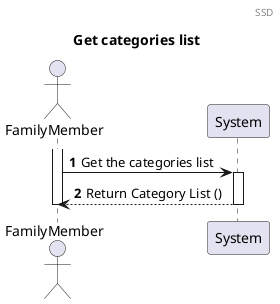
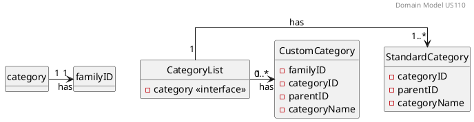
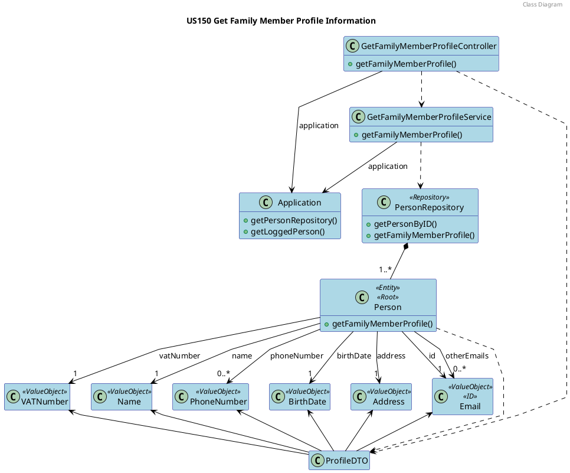

# US110 Get Profile Information

# 1. Requirements

## 1.1. Client Notes

**As a family member, I want to get my profile’s information.**

We interpreted this requirement as the function of a user to receive their personal profile information.

- A MemberProfile needs to have the following information:
   - Name;
   - Email (ID)
   - Birth Date;
   - Email (other emails);
   - VAT Number;
   - Phone Number(none or more);
   - Address;


## 1.2. Dependencies

### 1.2.1. Pre-conditions

To be able to **get family member's profile information**, some user stories need to be implemented in first place. 
Before everything else, the *Application* needs to have a family with family members. So, **the system manager needs to create a family and assign a family administrator** because the administrator will have the responsibility of adding family members to his family.
After the **family administrator adds the family members** it will be possible to execute this US by each member. 

### 1.2.2. Other User Stories

The following users stories need to be executed before US150:

- US010 As system manager, I want to create a family and set the family administrator

- US101 As a family administrator, I want to add family members;

## 1.3. Acceptance Criteria

### 1.3.1. Success Cases

This user story is always executed correctly since it doesn't need any data entry neither validation.
It just gets family member stored information and shows it in the UI.

### 1.3.2. Failure Cases

In this US there aren't any direct failure scenarios because it just retrives already validated information that belongs to a family member.
The possible failure cases are related with wrong execution of the dependent user stories from the section **1.2.2.**.

## 1.4. System Sequence Diagram

*As a Family Member, I want to get my profile´s information*




# 2. Analysis

## 2.1 Summary

The profile information we need to obtain in this user story contains the personal information of the user.
This includes _Name_, _BirthDate_, _Address_, _VATNumber_ and _PrimaryEmail_, as well as a list of any other _Emails_ and a list of any _PhoneNumbers_ registered in the application.


## 2.2. Domain Model Excerpt



# 3. Design

## 3.1. Design decisions

To fulfill this requirement it is required for the actor to select they want to get their profile information.

The user's primary email (it's identification) will be automatically retrieved by checking who is logged into the application.

To allow the output of all the data required we opted to create a ProfileDTO gathering all the relevant profile information.

[COMMENT]: # (A criação do DTO de saida será feita na classe person. O DTO é criado com um builder que lhe passa os dados.
Esses dados são passados a primitivos directamente ou convertidos quando desempacotados?)

## 3.2. Class Diagram




[comment]: # (Ligação de ProfileDTO para PersonRepo e GetCenasService?!)

## 3.3. Functionality Use

The GetFamilyMemberProfileController creates a new GetFamilyMemberProfileService using the Application.
The GetFamilyMemberProfileService will invoke the Application to retrieve the PersonRepository.
The PersonRepository will use the GetPersonByID method to find the person whose profile we want to return.
The Person will then create a ProfileDTO containing all the data required for the user story (Name, Address,
BirthDate, VATNumber, PrimaryEmail and any other Emails or PhoneNumbers)
It will then return the ProfileDTO all the way back to the  GetFamilyMemberProfileController.

## 3.4. Sequence Diagram

The process to fulfill this requirement requires the actor to select they want to create a new family, which would
prompt the input of the name for that family as well as the administrator email, and the other necessary data stated in
2.1.  
Given the current absence of an UI layer the required data will be passed directly into the CreateFamilyController.
ation would occur at the moment of addition to the repository.


//TODO change namings to reflect existent classes and methods

````puml
@startuml

autonumber
header Sequence Diagram - part 1
title US110 Get categories list


participant ": IFamilyController" as controller <<interface>>
participant ": CategoryListDTOAssembler" as assembler
participant "anInternalFamilyCategoriesListDTO:\n InternalFamilyCategoriesListDTO" as internalFamilyCategoriesListDTO
participant ": IGetFamilyCategoriesListService" as service <<interface>>
participant ": ICategoryRepository" as repository <<interface>>
participant ": aFamilyDJPA:\n FamilyIDJPA" as familyIDJPA
participant ": ICategoryRepositoryJPA" as repoJPA <<interface>>
participant "categoriesList: List<Category>" as categoriesList

-> controller : getFamilyCategoriesList\n(getFamilyCategoryListDTO)
activate controller
controller -> assembler : toInternalFamily\nCategoriesListDTO(getFamilyCategoryListDTO)
activate assembler
assembler -> internalFamilyCategoriesListDTO** : create(familyID)
return aninternalFamilyCategoriesListDTO
controller -> service : getFamilyCategoriesList\n(anInternalFamilyCategoriesListDTO)
activate service

ref over service
InternalFamilyCategoriesListDTO to VO
end

service -> repository : getByFamilyID(familyID)

activate repository
repository -> familyIDJPA** : create(famylyID.toString())

repository -> repoJPA : findAllByID(familyIDJPA)

activate repoJPA 
return aCustomCategoryListJPA


repository -> categoriesList** : create()
 
repository -> repoJPA : findAllByFamilyIDIsNull(familyIDJPA)
activate repoJPA
return aStandardCategoryListJPA
repository -> categoriesList : addToCategoriesList()
activate categoriesList
return aFamilyCategoriesList
repository -> service : aFamilyCategoriesList
deactivate repository 
ref over service
Creation of aFamilyCategoriesListOutputDTO
end 
service -> controller : familyCategoriesListOutputDTO
deactivate service
ref over controller
Link creation
end

<-- controller : responseEntity(aFamilyCategoriesListOutputDTO, Httpstatus.OK)
deactivate controller

@enduml
````

```puml
autonumber
title InternalFamilyCategoriesListDTO to VO

participant ": IGetFamilyCategoriesListService" as service
participant ": FamilyCategoriesDTODomainAssembler" as assembler
participant ": FamilyID" as familyID

activate service
service -> assembler : familyIDToDomain(InternalFamilyCategoriesListDTO)
activate assembler

assembler -> familyID ** : create(InternalFamilyCategoriesListDTO.unpackFamilyID())
return familyID

```

````puml
@startuml

autonumber
header Sequence Diagram
title Creation of aCategoriesList :  categoryJPA = categoryAssembler.toDomain(aCategoryJPA)

participant ": ICategoryRepository" as categoryRepository <<interface>>
participant "categoryAssembler : CategoryDataDomainAssembler" as assembler
participant "aCategoryPA : CategoryJPA" as categoryJPA
participant "familyID : FamilyID" as familyID
participant "categoryID : CategoryID" as categoryID
participant "parentID : ParentID" as parentID
participant "categoryName : CategoryName" as categoryName
participant "aCategory\n : Category" as aCategory
participant "aCustomCategory\n : Category" as aCustomCategory
participant "aStandardCategory\n : Category" as aStandardCategory

activate categoryRepository

categoryRepository -> assembler : toDomain(aCategoryJPA)
activate assembler


assembler -> categoryJPA : getCategoryID()
activate categoryJPA
categoryJPA --> assembler : CategoryIDJPA
deactivate categoryJPA
assembler -> categoryID** :  create(categoryIDJPA)

assembler -> categoryJPA : getCategoryName()
activate categoryJPA
categoryJPA --> assembler : categoryName
deactivate categoryJPA
assembler -> categoryName** :  create(categoryName)

assembler -> aCategory : create(categoryID, categoryName)

assembler -> categoryJPA : getFamilyID()
activate categoryJPA
categoryJPA --> assembler : FamilyIDJPA
deactivate categoryJPA
assembler -> familyID** :  create(FamilyIDJPA)

alt  checkIfItHasFamilyID() == true
activate aCategory
assembler -> aCustomCategory** :  create(categoryID, categoryName, FamilyID)

else


end

assembler -> categoryJPA : getParentID()
activate categoryJPA
categoryJPA --> assembler : ParentIDJPA
deactivate categoryJPA
assembler -> parentID** :  create(parentIDJPA)

aCategory --> assembler
deactivate aCategory
assembler -> categoryRepository : aCategory
deactivate assembler
<- categoryRepository

@enduml
````


## 3.5. Applied Patterns

We applied the following principles:

- GRASP:
   - Information expert:
      - This pattern is used in Person class because it stores all the Person attributes associated with it and creates its own DTO. PersonRepository just stores all the Person´s objects.
      
   - Controller:
      - To deal with the responsibility of receiving input from outside the system (first layer after the UI) we use a case controller.

   - Pure Fabrication:
      - In this user story the Application and GetProfileInfoService class were used, which does not represent business domain concepts. They were created to be responsible for obtaining profile information.

[comment]: # (- Protected Variation:
      - O uso do DTO é PV?! Se houver uma alteração nos atributos da classe Person, a sua informação estando encapsulada num DTO só vai sofrer alterações na construção e na "entrega".)

- SOLID:
   - Single-responsibility principle:
      - this pattern was used in the GetPersonInfoService class, in which is the only responsibility is manage person profile operations;
      - also used in ProfileDTO, its only responsibility is to store and deliver Person Data.
   
   - Open-Closed Principle:
      - Any adicional field will not impact the methods. Any change within Person attributes will have impact only on ProfileDTO creation and UI representation.

## 3.6. Tests

### 3.6.1. Person

#### 3.6.1.1. Success

**Test 1:** Test ProfileDTO creation

#### 3.6.1.2 Failure

No failure tests 

_____

### 3.6.2. PersonRepository

#### 3.6.2.1. Success

**Test 2:** Test if the PersonRepository gets the Person by his email (ID)

**Test 3:** Test if the PersonRepository gets the ProfileDTO from Person using his email (ID)

#### 3.6.2.2 Failure

No failure tests

_____

### 3.6.3. GetProfileInfoService

#### 3.6.3.1. Success

**Test 4:** Test if the Service gets the ProfileDTO from it the PersonRepository

#### 3.6.3.2. Failure

No failure tests

_____

### 3.6.4. GetFamilyMemberProfileController

#### 3.6.4.1. Success

**Test 5:** Test if the Controller gets the ProfileDTO from the GetProfileInfoService

#### 3.6.4.2. Failure

No failure tests

_____


# 4. Implementation


# 5. Integration

[comment]: # (All other US's/features that this one will be added on !!!!!!)

The development of this user story was the basis for the family structure where the FamilyMembers are stored and was
thus crucial for the development of the other User Stories


# 6. Observations

[comment]: # (Tudo o que nao encaixe em lado nenhum vai para aqui AKA LIXOOOOOOO !!!!!!!)

As with the Standard Category the family ID will probably need to be reworked in a future sprint to allow for more
complex ID information if needed (probably using a UUID)