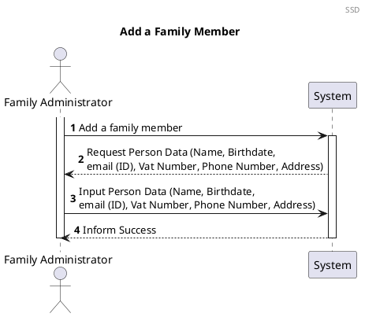
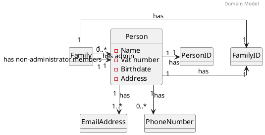

# US101 Add Family Members
=======================================

# 1. Requirements

### 1.1 Client Notes

*As a family administrator, I want to add family members*

We interpreted this requirement as the function of a family administrator adding
a new Person to their family.

This Person's main email address will be used as their unique ID, so it must not
have been used by another Person before as their main email.

- A Person needs to have:
    - ID (email)
    - Name
    - Vat number
    - Address
    - Birthdate
    - Phone (none or one)
    - Family ID

### 1.2 Dependencies

### 1.2.1 Pre-conditions

In order for this US to be possible, a Family and that Family's administrator
must already exist in the system.

### 1.2.2 Other User Stories

This US is dependent of US010, as a family and its administrator must be created
before a person can be added.

## 1.3 Acceptance Criteria

### 1.3.1 Success Cases

A Person is created without errors and added to the Family.

### 1.3.2 Failure Cases

- Person's data is incomplete or incorrect.
- User doesn't have Administrator privileges.
- If the Person's email is already registered in the Application as another
  Person's ID.

## 1.4 SSD



# 2. Analysis

##2.1 Summary

At the moment a person can have one or no phone numbers when it is created.  
As such, the validation of the phone number must accept a null value.

The Domain Model presented in the following section is only referring to this
user story. The complete model can be found in the diagrams folder.

Each Person will have two types of attributes. The attributes *PersonID*, *name*
, *birthDate*, *address* and *vatNumber*
will have a **single value** but *EmailAddress* and *PhoneNumber* will behave
differently. Both *EmailAddress* and
*PhoneNumber* are attributes that a Person can have none or more. A *Person* **
must have at least one main email** (PersonID), but it's possible that has **
none or multiple** *PhoneNumbers* and *EmailAddresses*.

The **Person** must have the following characteristics with the following rules:

| **_Value Objects_**         | **_Business Rules_**
| | :-------------------------- | :
-------------------------------------------------------------------------------------

| |**PersonID**                 |Required, string | **
Name**                    | Required, string | | **
BirthDate**               | Required, date(year-month-day)
| | **
Address**                 | Required, 4 strings (Steet, ZipCode, HouseNumber,
City)                                                                      |
| **
VatNumber**               | Required, Vat must have 9 numeric digits | | **
EmailAddress**            | Required, unique, Email must follow a pattern | | **
PhoneNumber**             | Non-Required, PhoneNumber must have 9 digits |

## 2.2. Domain Model Excerpt



# 3. Design

## 3.1. Design decisions

The process to fulfill this requirement requires the actor to select they want
to add a new person to their family, which would prompt the input of the
person's data.

The main user's FamilyID will be automatically retrieved by checking who is
logged into the application. It will also verify if the main user is the admin
of their own family.

Given the current absence of an UI layer the required data will be passed
directly into the PersonRESTController.

We chose to verify the uniqueness of the Email Address after instancing the
email. This way we could minimize the possibility of duplicate emails being
added since the verification would occur at the moment of addition to the Person
repository.

Since a Person can be created without a PhoneNumber, in order to not have two
different constructors, the AddPersonDTO will accept an Integer object for the
phone number, in order to have the possibility of Null values. The PhoneNumber
class will also not throw an exception if it receives a null value. The Person
will not add the PhoneNumber object to its list if it was built with a null
value.

## 3.2 Class Diagram


## 3.3. Functionality Use

The Request Body is turned into an AddFamilyMemberDTO, accepted by the
PersonRESTController. The Request Body contains all the necessary Person data (as explained in [2.1](#2-analysis)) as well as the Family Administrator's email address.

The PersonRESTController uses the PersonDTODomainAssembler, that turns the
AddFamilyMemberDTO into an InputAddFamilyMemberDTO.

This will be then used by the AddFamilyMemberService, which will invoke the
PersonDTODomainAssembler to unpack the InputAddFamilyMemberDTO and instantiate the necessary ValueObjects. It will also request the PersonRepository to retrieve the FamilyID of the admin, using their email.

The AddFamilyMemberService will then instantiate a new Person object with the Value Objects, and request the PersonRepository to add the Person.

The PersonRepository will check if the Person to be added already has its PersonID present in the database. If it hasn't, it will use the PersonDataDomainAssembler to turn the Person domain object into a PersonJPA data object. The PersonJPA will be sent to the database, and the returning PersonJPA will be again converted back into a Person domain object and returned to the AddFamilyMemberService.

The service will use the PersonDTODomainAssembler to convert the returning Person object into an OutputPersonDTO, which will be returned to the PersonRESTController.

Finally, the relevant links will be added to the OutputPersonDTO, and a ResponseEntity will be sent containing the OutputPersonDTO and an HttpStatus 201: Created.


# 3.4 Sequence Diagram

```puml
@startuml
autonumber
header Sequence Diagram
title US101 Add a Family Member - with register

participant ": IPersonController" as controller <<interface>>
participant ": FamilyMember\n ExternalInternalAssembler" as outinassembler
participant " anInputAddFamilyMemberDTO\n :InputAddFamilyMemberDTO" as aninaddassembler
participant ": IAddFamilyMemberService" as FamilyMemberService <<interface>>
participant " aPerson: Person " as person 
participant ": FamilyMember\n InternalExternalAssembler" as inoutassembler
participant " anOutputPersonDTO\n : OutputPersonDTO" as outputPersonDTO
participant ": IPersonRepository" as prepository  <<interface>>
participant ": IPersonRepositoryJPA" as prepositoryJPA  <<interface>>
'participant "aFamilyRepository\n : FamilyRepository" as frepository
participant "JWTUserDetailsService\n : JWTUserDetailsService" as JWTService
participant "UserDAO\n : UserDAO" as UserDao

-> controller : addFamilyMember(addFamilyMemberDTO)
activate controller
controller -> outinassembler : toInner(addFamilyMemberDTO)
activate outinassembler
outinassembler -> aninaddassembler** : create
outinassembler -> controller : anInputAddFamilyMemberDTO
deactivate
controller -> FamilyMemberService : addPerson(anInputAddFamilyMemberDTO)
activate FamilyMemberService

ref over FamilyMemberService
assembler DTO to value objects

end

FamilyMemberService -> person** : create(with all value objects)
FamilyMemberService -> prepository : add(aPerson)
activate prepository

prepository -> prepository : isPersonIDAlreadyRegistered()
alt Person is already present
prepository --> FamilyMemberService : failure

FamilyMemberService -> controller : failure

<-- controller : responseEntity(null, Httpstatus.BADREQUEST)
else Person is not present
ref over prepository
assembler domain to data

personJPA = personAssembler.toData(Person)
end
prepository -> prepositoryJPA : save(PersonJPA)
activate prepositoryJPA
return savedPersonJPA

ref over prepository
assembler data to domain

savedPerson = personAssembler.toDomain(savedPersonJPA)
end

prepository -> FamilyMemberService : savedPerson
deactivate prepository
deactivate prepositoryJPA

FamilyMemberService  -> inoutassembler : toDTO(savedPerson)
activate inoutassembler 
inoutassembler -> outputPersonDTO** : create (savedPersonDTO.getID(), savedPersonDTO.getName())
inoutassembler ->  FamilyMemberService  : anOutputPersonDTO
deactivate 
deactivate prepository

ref over FamilyMemberService
create userDTO and set attributes

end

FamilyMemberService -> JWTService : save(nuserDTO)
activate JWTService

ref over JWTService
create DAOUser and set attributes

end

JWTService -> UserDao : save(daoUser)
activate UserDao

return savedDaoUser

return savedDaoUser

FamilyMemberService -> controller : anOutputPersonDTO
deactivate FamilyMemberService 
ref over controller
 addSelfLink to anOutputPersonDTO

end
deactivate FamilyMemberService
<-- controller : responseEntity(outputPersonDTO, Httpstatus.OK)
deactivate controller

end
@enduml
````

````puml
@startuml
title US101 FamilyMember = personDTODomainAssembler.toDomain

participant ": IAddFamilyMemberService" as FamilyMemberService <<Interface>>
participant ": PersonDTODomainAssembler" as dtoToDomainAssembler
'participant "inputPersonDTO : inputPersonDTO" as inputPersonDTO
participant "personID : PersonID" as personID
participant "name : Name" as name
participant "birthDate : BirthDate" as birthDate
participant "email : Email" as email
participant "vat : VATNumber" as vat
participant "phone : PhoneNumber" as phoneNumber
participant "address : Address" as address
participant "familyID : FamilyID" as familyID

activate FamilyMemberService
FamilyMemberService -> dtoToDomainAssembler : toDomain(anInputAddFamilyMemberDTO)
activate dtoToDomainAssembler
dtoToDomainAssembler -> personID** : create(anInputAddFamilyMemberDTO.unpackPersonID())
dtoToDomainAssembler -> name** : create(anInputAddFamilyMemberDTO.unpackName())
dtoToDomainAssembler -> birthDate** : create(anInputAddFamilyMemberDTO.unpackBirthDate())
dtoToDomainAssembler -> email** : create(anInputAddFamilyMemberDTO.unpackEmail())
dtoToDomainAssembler -> vat** : create(anInputAddFamilyMemberDTO.unpackVAT())
dtoToDomainAssembler -> phoneNumber** : create(anInputAddFamilyMemberDTO.unpackPhone())
dtoToDomainAssembler -> address** : create(anInputAddFamilyMemberDTO.unpackStreet(), anInputAddFamilyMemberDTO.unpackCity(), anInputAddFamilyMemberDTO.unpackZipCode(), anInputAddFamilyMemberDTO.unpackHouseNumber())
dtoToDomainAssembler -> familyID** : create(anInputAddFamilyMemberDTO.unpackFamilyID())


dtoToDomainAssembler -> FamilyMemberService : Value Objects
deactivate dtoToDomainAssembler
deactivate FamilyMemberService

@enduml
````

````puml
@startuml

autonumber
header Sequence Diagram
title personJPA = personAssembler.toData(FamilyMember)

participant ": IPersonRepository" as personRepository <<interface>>
participant "personAssembler : PersonDataDomainAssembler" as assembler
participant "person\n : Person" as person
participant "personIDJPA : PersonIDJPA" as personIDJPA
participant "familyIDJPA : FamilyIDJPA" as familyIDJPA
participant "personJPA : PersonJPA" as personJPA
participant "addressJPA : AdressJPA" as addressJPA
participant "emailsJPA : List<EmailAddressJPA>" as emailsJPA
participant "phoneNumbersJPA : List <PhoneNumberJPA>" as phoneNumbersJPA


-> personRepository : add(aPerson)
activate personRepository
personRepository -> personRepository : isPersonIDAlreadyRegistered(person.id())

personRepository -> assembler : toData(person)
activate assembler

assembler -> person : id()
activate person
person --> assembler : personID
deactivate person
assembler -> personIDJPA** :  create(personID.toString())

assembler -> person : getName().toString()
activate person
person --> assembler : name
deactivate person

assembler -> person : getBirthDate().toString()
activate person
person --> assembler : birthDate
deactivate person

assembler -> person : getVat().toInt()
activate person
person --> assembler : vat
deactivate person

assembler -> person : getPhoneNumbers()
activate person
person --> assembler : phoneNumbers
deactivate person


assembler -> person : getAddress()
activate person
person --> assembler : address
deactivate person

assembler -> person: getFamilyID()
activate person
person --> assembler : familyID
deactivate person

assembler -> familyIDJPA** :  create(familyID.getFamilyID().toString())

assembler -> personJPA** : create(personIDJPA, name, birthdate, vat, familyIDJPA)

assembler -> addressJPA** : create(address.getStreet(), address.getCity(), address.getZipCode(), address.getDoorNumber(), personJPA)

assembler -> emailsJPA** : generateEmailAddressJPAList(person.getEmails(), personJPA)
activate emailsJPA
return emailsJPA

assembler -> phoneNumbersJPA** : generetePhoneNumberJPAList(phoneNumbers, personJPA)
activate phoneNumbersJPA
return phoneNumbersJPA

assembler -> personJPA : setAddress(addressJPA)
activate personJPA
personJPA --> assembler
deactivate personJPA
assembler -> personJPA : setPhones(phoneNumbersJPA)
activate personJPA
personJPA --> assembler
deactivate personJPA
assembler -> personJPA : setEmails(emailsJPA)
activate personJPA
personJPA --> assembler
deactivate personJPA
assembler -> personRepository : aPersonJPA
deactivate assembler
<- personRepository

@enduml
````

## 3.5. Applied Patterns

We applied the principles of Controller, Information Expert, Creator and
PureFabrication from the GRASP pattern. We also used the SOLID Single
Responsibility Principle.

We applied the following principles:

- GRASP:
    - Information expert:
        - This pattern was used in classes such as the Person Repository, in
          order to apply the "Tell Don't Ask" Principle.

    - Controller:
        - To deal with the responsibility of receiving input from outside the
          system (first layer after the UI) we use a case controller.

    - Pure Fabrication:
        - In this user story the AddFamilyMemberService class
          was used, which does not represent a business domain concept. It was
          created to be responsible for all operations regarding the creation of
          a Family Member.

    - High cohesion and Low Coupling:
        - The creation of the Repository Interface will provide low Coupling and
          high Cohesion.

    - Protected Variation:
        - An Interface will be used in which Polymorphism is going to be applied
          in order to protect the existing classes from future variations.

- SOLID:
    - Single-responsibility principle:
        - This pattern was used in the AddFamilyMemberService, in which the only
          responsibility is to add a Family Member. 

## 3.6. Tests

### 3.6.1. Creation of a Person/Addition to a Family

#### 3.6.1.1. Success

**Test 1:** Test that it is possible to add a new Family Member successfully

```java
 @Test
@DisplayName("Integration Test for Successfully adding a new Family Member")
    void addFamilyMemberSuccessIT() {
            List<Integer> phones = new ArrayList<>();
        phones.add(919999999);
        List<String> emails = new ArrayList<>();
        OutputPersonDTO expectedOutputPersonDTO = new OutputPersonDTO();
        expectedOutputPersonDTO.setName("Kiko");
        expectedOutputPersonDTO.setId("kiko@gmail.com");
        expectedOutputPersonDTO.setBirthdate("12/12/1222");
        expectedOutputPersonDTO.setVat("123456789");
        expectedOutputPersonDTO.setStreet("rua");
        expectedOutputPersonDTO.setCity("cidade");
        expectedOutputPersonDTO.setZipCode("1234-123");
        expectedOutputPersonDTO.setDoorNumber("69");
        expectedOutputPersonDTO.setFamilyID("@tonyze@latinlover.com");
        expectedOutputPersonDTO.setPhoneNumbers(phones);
        expectedOutputPersonDTO.setEmails(emails);
        Link personOptionsLink = linkTo(methodOn(PersonRESTController.class).getPersonOptions(expectedOutputPersonDTO.getId())).withRel("Person Options");
        expectedOutputPersonDTO.add(personOptionsLink);
        ResponseEntity expected = new ResponseEntity(expectedOutputPersonDTO, HttpStatus.CREATED);

        AddFamilyMemberDTO addFamilyMemberDTO = new AddFamilyMemberDTO();
        addFamilyMemberDTO.setAdminID("tonyze@latinlover.com");
        addFamilyMemberDTO.setEmailID("kiko@gmail.com");
        addFamilyMemberDTO.setName("Kiko");
        addFamilyMemberDTO.setBirthDate("12/12/1222");
        addFamilyMemberDTO.setVatNumber(123456789);
        addFamilyMemberDTO.setPhone(919999999);
        addFamilyMemberDTO.setStreet("rua");
        addFamilyMemberDTO.setCity("cidade");
        addFamilyMemberDTO.setHouseNumber("69");
        addFamilyMemberDTO.setZipCode("1234-123");
        ResponseEntity result = personRESTController.addFamilyMember(addFamilyMemberDTO);

        assertEquals(expected.getBody(), result.getBody());
        assertEquals(expected.getStatusCode(), result.getStatusCode());
        assertNotSame(expected, result);


        }

```



#### 3.6.1.2 Failure

**Test 2:** Test that it is not possible to add a new Family Member if logged
user is not the admin

```java
@Test
@DisplayName("Integration Test for failure in adding a new Family Member: User is not admin")
    void addFamilyMemberFailureNotAdminIT() {

            AddFamilyMemberDTO addFamilyMemberDTO = new AddFamilyMemberDTO();
            addFamilyMemberDTO.setAdminID("notadmin@latinlover.com");
            addFamilyMemberDTO.setEmailID("kiko@gmail.com");
            addFamilyMemberDTO.setName("Kiko");
            addFamilyMemberDTO.setBirthDate("12/12/1222");
            addFamilyMemberDTO.setVatNumber(123456789);
            addFamilyMemberDTO.setPhone(919999999);
            addFamilyMemberDTO.setStreet("rua");
            addFamilyMemberDTO.setCity("cidade");
            addFamilyMemberDTO.setHouseNumber("69");
            addFamilyMemberDTO.setZipCode("1234-123");
            ResponseEntity result = personRESTController.addFamilyMember(addFamilyMemberDTO);

            ResponseEntity expected = new ResponseEntity(HttpStatus.UNPROCESSABLE_ENTITY);

            assertEquals(expected.getStatusCode(), result.getStatusCode());
            assertNotSame(expected, result);


            }

```

**Test 3:** Test that it is not possible to create a new Family Member if the
email is already registered in the application.

```java
@Test
@DisplayName("Integration Test for failure in adding a new Family Member: User is already Registered")
    void addFamilyMemberFailureAlreadyRegisteredIT() {

            AddFamilyMemberDTO addFamilyMemberDTO = new AddFamilyMemberDTO();
            addFamilyMemberDTO.setAdminID("tonyze@latinlover.com");
            addFamilyMemberDTO.setEmailID("kvanessa@latina.com");
            addFamilyMemberDTO.setName("Kiko");
            addFamilyMemberDTO.setBirthDate("12/12/1222");
            addFamilyMemberDTO.setVatNumber(123456789);
            addFamilyMemberDTO.setPhone(919999999);
            addFamilyMemberDTO.setStreet("rua");
            addFamilyMemberDTO.setCity("cidade");
            addFamilyMemberDTO.setHouseNumber("69");
            addFamilyMemberDTO.setZipCode("1234-123");
            ResponseEntity result = personRESTController.addFamilyMember(addFamilyMemberDTO);

            ResponseEntity expected = new ResponseEntity(HttpStatus.UNPROCESSABLE_ENTITY);

            assertEquals(expected.getStatusCode(), result.getStatusCode());
            assertNotSame(expected, result);


            }

```

# 4. Implementation

1. All the Value Objects are initially instantiated, with respective
   validations.

```java
 public OutputPersonDTO addPerson(InputAddFamilyMemberDTO internalAddFamilyMemberDTO) {

        PersonID loggedUserID = new PersonID(internalAddFamilyMemberDTO.getAdminID());


        FamilyID familyID = personRepository.getByID(loggedUserID).getFamilyID();
        Name name = personDTODomainAssembler.createName(internalAddFamilyMemberDTO);
        BirthDate birthDate = personDTODomainAssembler.createBirthDate(internalAddFamilyMemberDTO);
        VATNumber vat = personDTODomainAssembler.createVATNumber(internalAddFamilyMemberDTO);
        PhoneNumber phone = personDTODomainAssembler.createPhoneNumber(internalAddFamilyMemberDTO);
        Address address = personDTODomainAssembler.createAddress(internalAddFamilyMemberDTO);
        PersonID personID = personDTODomainAssembler.createPersonID(internalAddFamilyMemberDTO);

        Person aPerson = new Person(name, birthDate, personID, vat, phone, address, familyID);

        Person addedPerson = personRepository.add(aPerson);
        OutputPersonDTO outputPersonDTO = personDTODomainAssembler.toDTO(addedPerson);
        return outputPersonDTO;
        }
   ```

2. Before adding the Person, the email is validated in the PersonRepository
   in order to guarantee that it is Unique

```java
     public Person add(Person person) {
        PersonJPA registeredPersonJPA;
        Person savedPerson;
        if (!isPersonIDAlreadyRegistered(person.id())) {
        PersonJPA personJPA = personAssembler.toData(person);
        registeredPersonJPA = personRepositoryJPA.save(personJPA);
        savedPerson = createPerson(registeredPersonJPA);
        } else {
        throw new PersonAlreadyRegisteredException("Person is already registered in the database");
        }
        return savedPerson;
        }
   ```

```java
@Override
public boolean isPersonIDAlreadyRegistered(PersonID personID) {
        boolean emailIsRegistered = false;
        Optional<PersonJPA> optional = personRepositoryJPA.findById(new PersonIDJPA(personID.toString()));
        if (optional.isPresent()) {
        emailIsRegistered = true;
        }
        return emailIsRegistered;
        }
```

# 5. Integration

This functionality uses the same method to add the Person to the
PersonRepository as the US010.


# 6. Observations

The Person's unique ID is not a part of the email address list. That email list will always be empty upon the Person's creation.