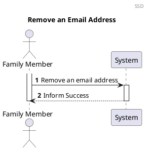
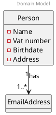
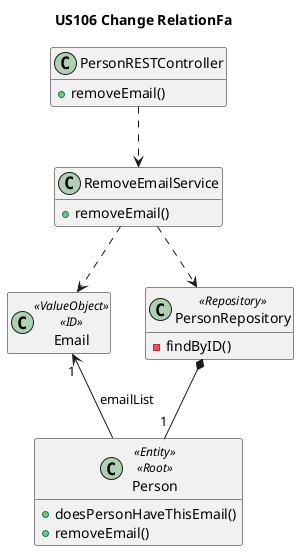

# US152 Delete Email
=======================================

# 1. Requirements

### 1.1 Client Notes

*As a family member, I want to delete a secondary email account from my profile*

We interpreted this requirement as the function of a user to delete an email
account from his profile information.

The email account must exist in the application scope.

### 1.2 Dependencies

### 1.2.1 Pre-conditions

In order for this US to be possible, a Family and that Family's administrator
must already exist in the system.

The Person from whom the email is going to be deleted, must already exist in the
system and associated to a Family.

The email to be removed must be associated with the Person.

### 1.2.2 Other User Stories

This US is dependent of US010, as a family and its administrator must be created
before a person can be added, US101, as a Family Member must already exist in a
Family in order to add an email to that Family Member's profile, and US151 as a
secondary email must first be added in order to be deleted.

## 1.3 Acceptance Criteria

### 1.3.1 Success Cases

An email address is successfully deleted from a Family Member's account.

### 1.3.2 Failure Cases

- Email address not associated with the Person

## 1.4 SSD



# 2. Analysis

## 2.1 Summary

At the moment a person can have one or more email addresses. The required, initial
Email Address serves as the person's unique ID. A valid email address must not
be null, empty or blank, and must adhere to the following rules:

- local-part@domain.extension
- Uppercase and lowercase Latin letters A to Z and a to z
- Digits 0 to 9
- Printable characters !#$%&'*+-/=?^_`{|}~
  dot ., provided that it is not the first or last character and provided also
  that it does not appear consecutively (e.g., John..Doe@example.com is not
  allowed).

The following Domain Model is only referring to this user story. The complete
model can be found in the diagrams folder.

Each email will have one attribute. The attribute is a String that should comply
with the above specifications.

## 2.2. Domain Model Excerpt



# 3. Design

## 3.1. Design decisions

The process to fulfill this requirement requires the actor to select they want
to remove a specific email address from their profile.

The main user's ID will be automatically retrieved by checking who is logged
into the application, as well as the email address to be removed.

Both of these data pieces will be path variables of the request.
## 3.2 Class Diagram



-----------------------------------------------------------------
Onion Architecture
-----------------------------


## 3.3. Functionality Use

- The PersonRESTController invokes the RemoveEmailService.
- The RemoveEmailService will request the target Person object from the PersonRepository
- The RemoveEmailService will manipulate the Person domain object and remove the email.
- The RemoveEmailService give the updated Person domain object to the PersonRepository for persistence storage.
- The PersonRESTController will then return a response depending on
  the success or failure of removing the Email (HTTP Status 200 (OK) or 304(Not Modified), respectively).

# 3.4 Sequence Diagram

````puml
@startuml

autonumber
header Sequence Diagram
title US106 Change Relation

participant ":IFamilyController" as controller <<interface>>
participant ":RelationInput\nDTOAssembler" as assembler
participant "anInputChangeRelationDTO\n:InputChangeRelationDTO" as internal

participant "IChangeRelationService" as service <<interface>>

participant "anOutputRelationDTO\n : OutputRelationDTO" as output

participant "aRelation\n : Relation" as relation
participant "aFamily\n : Family" as family
participant "aFamilyID\n : FamilyID" as familyID
participant "aRelationID\n : RelationID" as personIDA

participant "newRelationDesignation\n : RelationDesignation" as rDesg
participant "IFamilyRepository" as familyRepository <<interface>>


-> controller : changeRelation(changeRelationDTO, familyID)
activate controller
controller -> assembler : toInputRelationDTO(createRelationDTO, familyID)
activate assembler
assembler -> internal** : create(createRelationDTO)  
assembler --> controller : anInputRelationDTO
deactivate assembler

controller -> service : changeRelation(anInputRelationDTO)
activate service

service -> service : familyID = anInputChangeRelationDTO.getFamilyID()
service -> familyID** : create(familyID)

service -> service : relationID = anInputChangeRelationDTO.getRelationID()
service -> personIDA** : create(relationID)

service -> service : relationDesignation = anInputChangeRelationDTO.getRelationDesignation()
service -> rDesg** : create(relationDesignation)


service -> familyRepository : getByID(aFamilyID)
activate familyRepository
return aFamily
deactivate familyRepository

service -> family: changeRelation(aRelationID,newRelationDesignation)
activate family
family -> family: changeRelation(aRelationID, newRelationDesignation)
deactivate family

service -> familyRepository: add(aFamily)
service -> output**: create
service -> controller: anOutputRelationDTO

deactivate service

ref over controller
add SelfLink to anOutputRelationDTO
end
<-- controller : responseEntity(anOutputRelationDTO, Httpstatus.OK)

deactivate controller

@enduml
````

## 3.5. Applied Patterns

We applied the principles of Controller, Information Expert, Creator and
PureFabrication from the GRASP pattern. We also used the SOLID Single
Responsibility Principle.

We applied the following principles:

- GRASP:
    - Information expert:
        - This pattern was used in classes such as the Person Repository, in
          order to apply the "Tell Don't Ask" Principle.

    - Controller:
        - To deal with the responsibility of receiving input from outside the
          system (first layer after the UI) we use a case controller.

    - Pure Fabrication:
        - In this user story the Application and AddEmailService class were
          used, which do not represent a business domain concept. The
          AddEmailService was created to be responsible for all operations
          regarding the creation of an Email.

    - High cohesion and Low Coupling:
        - The creation of the Repository Interface will provide low Coupling and
          high Cohesion.

    - Protected Variation:
        - An Interface will be used in which Polymorphism is going to be applied
          in order to protect the existing classes from future variations.

- SOLID:
    - Single-responsibility principle:
        - This pattern was used in the AddEmailService, in which the only
          responsibility is to add an Email to an already existing Family
          Member.

## 3.6. Tests

### 3.6.1. Creation of a Person/Addition to a Family

#### 3.6.1.1. Success

**Test 1:** Test that it is possible to add a new EmailAddress successfully

```
java
@DisplayName("Successfully add a new email address")
@Test
    void mustReturnTrueAddEmail() {

            AddEmailDTO addEmailDTO = new AddEmailDTO("tonyze@superlatinlover.com");
            assertTrue(addEmailController.addEmail(addEmailDTO));
            }

```

#### 3.6.1.2 Failure

**Test 2:** Test that it is not possible to add a new Email Address if the email
is invalid

```
java
@DisplayName("Unsuccessfully add an email - invalid email")
@ParameterizedTest
@ValueSource(strings = {"  ","invalidemail@@gmail.com","tonyze"})
@NullAndEmptySource
    void mustReturnFalseAddInvalidEmail(String value) {
            AddEmailDTO addEmailDTO = new AddEmailDTO(value);


            assertFalse(addEmailController.addEmail(addEmailDTO));
            }


```

**Test 3:** Test that it is not possible to add a new email if the user already
has that email

```
java
@DisplayName("Unsuccessfully add an email - email already registered to user")
@Test
    void mustReturnFalseAddEmailEmailRegistred() {

            AddEmailDTO addAdminEmailDTO = new AddEmailDTO(adminEmail);
            assertFalse(addEmailController.addEmail(addAdminEmailDTO));
            }
```

**Test 3:** Test that it is not possible to add a new email if another user
already has that email

```
java
@DisplayName("Unsuccessfully add an email - email already registered to another user")
@Test
    void mustReturnFalseAddEmailEmailRegistredAnotherUser() {

            AddEmailDTO addOtherUserEmailDTO = new AddEmailDTO(otherUserEmail);
            assertFalse(addEmailController.addEmail(addOtherUserEmailDTO));
            }
```

# 4. Implementation

1. The EmailAddress is initially instantiated, with respective validations.

```
java
 public void addEmail(AddEmailDTO addEmailDTO) {
        PersonRepository personRepository = application.getPersonRepository();
        EmailAddress loggedUserID = application.getLoggedPersonID();
        
        EmailAddress email = new EmailAddress(addEmailDTO.unpackEmail());
        
        personRepository.addEmailToPerson(email, loggedUserID);
    }
```

2. The Person Repository will check if the email is already registered, and add
   the email to the target person

```
java
   public void addEmailToPerson(EmailAddress email, EmailAddress personID) {
        if (!isEmailAlreadyRegistered(email)) {
        Person loggedUser = getPersonByEmail(personID);
        loggedUser.addEmail(email);
        } else {
        throw new EmailAlreadyRegisteredException();
        }    
        
    } 
   ```

3. Before adding the email, the email is validated in the Person Repository in
   order to guarantee that it is Unique

```
java
      private boolean isEmailAlreadyRegistered(EmailAddress email) {
      boolean emailIsRegistered = false;
      for (Person person : people) {
      if (person.isSameEmail(email)) {
      emailIsRegistered = true;
      }
      }
      return emailIsRegistered;
      }
   ```

# 5. Integration

This functionality uses the same method to check the existence of the Email
Address as the US010 and US101

# 6. Observations

The Person's unique ID is not a part of the email list.