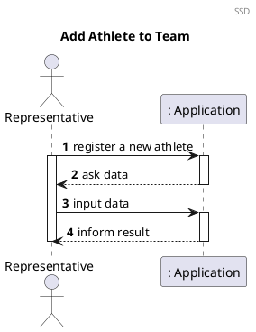
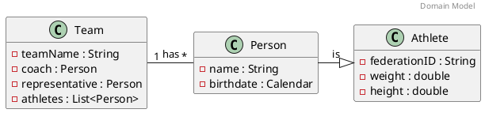
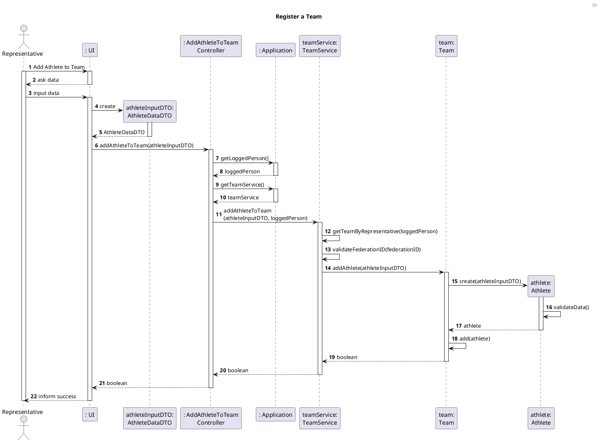
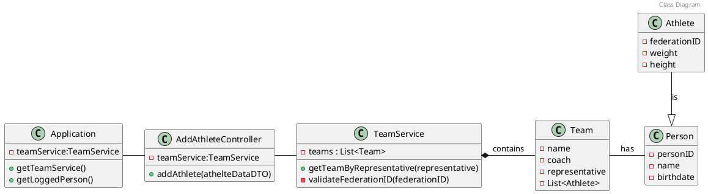

# US11 Add Athlete to Team

# 1. Requirements

\_ As a Team Representative , I want to add an Athlete to my team



# 2. Analysis

A Team is a group of &lt;Person&gt;, which contains a Coach, Representative and
one or more Athletes.

A Person is a general representation of a Human being, that can be either a
Coach, a Representative or any Athlete.

There are several attributes common to these entities, such as Name and
Birthdate.

An Athlete is a kind of Person with several unique attributes like Federation
ID, Weight, Height, etc.

## 2.2 Domain Model Excerpt

For quick reference, there's a relevant extract of the domain model.



# 3. Design

## 3.1. Functionality Development



## 3.2. Class Diagram



## 3.3. Applied Patterns

_Nesta secção deve apresentar e explicar quais e como foram os padrões de design
aplicados e as melhores práticas_

## 3.4. Tests

- Try to add an Athlete with negative height
- Add an athlete to a team successfully

```java
    @Test
    void addAnAthleteSuccessfully(){
            Application application=new Application();
            String teamName="Test Team";
            String repName="Lance Armstrong";
            String repBirthDate="18/09/1978";
            PersonDataDTO personInputDTO=new PersonDataDTO(repName,repBirthDate);
            TeamDataDTO teamInputDTO=new TeamDataDTO(teamName);
            TeamService teamService=application.getTeamService();
            Team team = teamService.getTeamByName(teamName);
            Person representative = team.getRepresentative();
            application.setLoggedPerson(representative);

            String athleteName="Ricardo Batista";
            String federationID="FU71L3Ir0";
            double weight=100;
            double height=1.70;
            AthleteDataDTO athleteInputDTO = new AthleteDataDTO(athleteName, federationID, weight, height);

            AddAthleteToTeamController addAthleteToTeamController=new AddAthleteToTeamController(application);
            boolean result=addAthleteToTeamController.addAthleteToTeam(AthleteDataDTO);

            assertTrue(result);
            }
```

- Add two athletes to a team successfully

```java
    @Test
    void addTwoAthletesSuccessfully(){
            Application application=new Application();
            String teamName="Test Team";
            String repName="Lance Armstrong";
            String repBirthDate="18/09/1978";
            PersonDataDTO personInputDTO=new PersonDataDTO(repName,repBirthDate);
            TeamDataDTO teamInputDTO=new TeamDataDTO(teamName);
            TeamService teamService=application.getTeamService();
            Team team = teamService.getTeamByName(teamName);
            Person representative = team.getRepresentative();
            application.setLoggedPerson(representative);

            String athleteName="Ricardo Batista";
            String federationID="FU71L3Ir0";
            double weight=100;
            double height=1.70;
            AthleteDataDTO athleteInputDTO = new AthleteDataDTO(athleteName, federationID, weight, height);

            String athleteName2="Ricardo Nunes";
            String federationID2="SCh001SH00t3r";
            double weight2=30;
            double height2=1.70;
            AthleteDataDTO athleteInputDTO2 = new AthleteDataDTO(athleteName2, federationID2, weight2, height2);

            AddAthleteToTeamController addAthleteToTeamController=new AddAthleteToTeamController(application);
            addAthleteToTeamController.addAthleteToTeam(AthleteDataDTO2);
            boolean result=AddAthleteToTeamController.addAthleteToTeam(AthleteDataDTO);

            assertTrue(result);
            }
```

- Try to add an athlete with an already registered FederationID

```java
    @Test
    void tryToAddAthletesWithSameFedID(){
            Application application=new Application();
            String teamName="Test Team";
            String repName="Lance Armstrong";
            String repBirthDate="18/09/1978";
            PersonDataDTO personInputDTO=new PersonDataDTO(repName,repBirthDate);
            TeamDataDTO teamInputDTO=new TeamDataDTO(teamName);
            TeamService teamService=application.getTeamService();
            Team team = teamService.getTeamByName(teamName);
            Person representative = team.getRepresentative();
            application.setLoggedPerson(representative);

            String athleteName="Ricardo Batista";
            String federationID="FU71L3Ir0";
            double weight=100;
            double height=1.70;
            AthleteDataDTO athleteInputDTO = new AthleteDataDTO(athleteName, federationID, weight, height);

            String athleteName2="Ricardo Nunes";
            String federationID2="FU71L3Ir0";
            double weight2=30;
            double height2=1.70;
            AthleteDataDTO athleteInputDTO2 = new AthleteDataDTO(athleteName2, federationID2, weight2, height2);

            AddAthleteToTeamController addAthleteToTeamController=new AddAthleteToTeamController(application);
            addAthleteToTeamController.addAthleteToTeam(AthleteDataDTO2);
            boolean result=AddAthleteToTeamController.addAthleteToTeam(AthleteDataDTO);

            assertFalse(result);
            }
```

- Try to add an Athlete with negative weight

```java
   @Test
    void addAnAthleteWithNegativeWeight(){
            Application application=new Application();
            String teamName="Test Team";
            String repName="Lance Armstrong";
            String repBirthDate="18/09/1978";
            PersonDataDTO personInputDTO=new PersonDataDTO(repName,repBirthDate);
            TeamDataDTO teamInputDTO=new TeamDataDTO(teamName);
            TeamService teamService=application.getTeamService();
            Team team = teamService.getTeamByName(teamName);
            Person representative = team.getRepresentative();
            application.setLoggedPerson(representative);

            String athleteName="Ricardo Batista";
            String federationID="NegHeightFU71L3Ir0";
            double weight=-100;
            double height=1.70;
            AthleteDataDTO athleteInputDTO = new AthleteDataDTO(athleteName, federationID, weight, height);

            AddAthleteToTeamController addAthleteToTeamController=new AddAthleteToTeamController(application);
            boolean result=addAthleteToTeamController.addAthleteToTeam(AthleteDataDTO);

            assertFalse(result);
            }
```

- Try to add an Athlete with negative height

```java
    @Test
    void truToAddAnAthleteWithNegHeight(){
            Application application=new Application();
            String teamName="Test Team";
            String repName="Lance Armstrong";
            String repBirthDate="18/09/1978";
            PersonDataDTO personInputDTO=new PersonDataDTO(repName,repBirthDate);
            TeamDataDTO teamInputDTO=new TeamDataDTO(teamName);
            TeamService teamService=application.getTeamService();
            Team team = teamService.getTeamByName(teamName);
            Person representative = team.getRepresentative();
            application.setLoggedPerson(representative);

            String athleteName="Ricardo Batista";
            String federationID="FU71L3Ir0";
            double weight=100;
            double height=-1.70;
            AthleteDataDTO athleteInputDTO = new AthleteDataDTO(athleteName, federationID, weight, height);

            AddAthleteToTeamController addAthleteToTeamController=new AddAthleteToTeamController(application);
            boolean result=addAthleteToTeamController.addAthleteToTeam(AthleteDataDTO);

            assertFalse(result);
            }
```

# 4. Implementação

_Nesta secção a equipa deve providenciar, se necessário, algumas evidências de
que a implementação está em conformidade com o design efetuado. Para além disso,
deve mencionar/descrever a existência de outros ficheiros (e.g. de configuração)
relevantes e destacar commits relevantes;_

_Recomenda-se que organize este conteúdo por subsecções._

# 5. Integração/Demonstração

_Nesta secção a equipa deve descrever os esforços realizados no sentido de
integrar a funcionalidade desenvolvida com as restantes funcionalidades do
sistema._

# 6. Observações

_Nesta secção sugere-se que a equipa apresente uma perspetiva critica sobre o
trabalho desenvolvido apontando, por exemplo, outras alternativas e ou trabalhos
futuros relacionados._

[us02]: US02_Add_Stage_to_Race.md
[us11]: US11_Add_Athlete_to_Team.md
