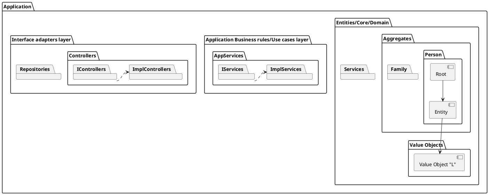

```plantuml

@startuml

top to bottom direction

package "Application" {

package "Entities/Core/Domain" {
left to right direction 


package  "Aggregates" {
    

    package "Person" {
    top to bottom direction
    [Root]   -down-> [Entity]
    
    }
    
    package "Family" {

    }

}

package "Services"  {


}

package "Value Objects" {
    [Entity] -down-> [Value Object "L"]
}


}

package "Application Business rules/Use cases layer" {
top to bottom direction

 package "AppServices" {
 
 package "IServices" {
 top to bottom direction
 }
 
 
 
 package "ImplServices" {
 
 }
 
  IServices.> ImplServices

 
 }

}

package "Interface adapters layer" {
top to bottom direction
package "Controllers" {

package "IControllers" {

}

package "ImplControllers" {

}

IControllers.> ImplControllers

}

package "Repositories" {

}
}


@enduml
```