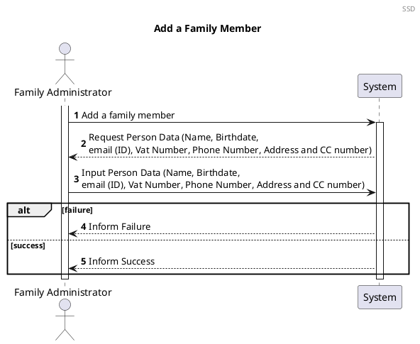
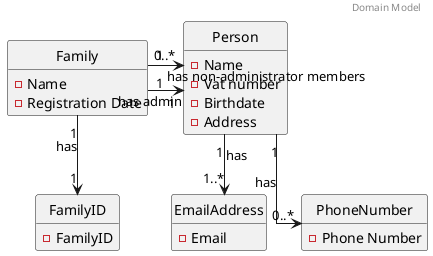
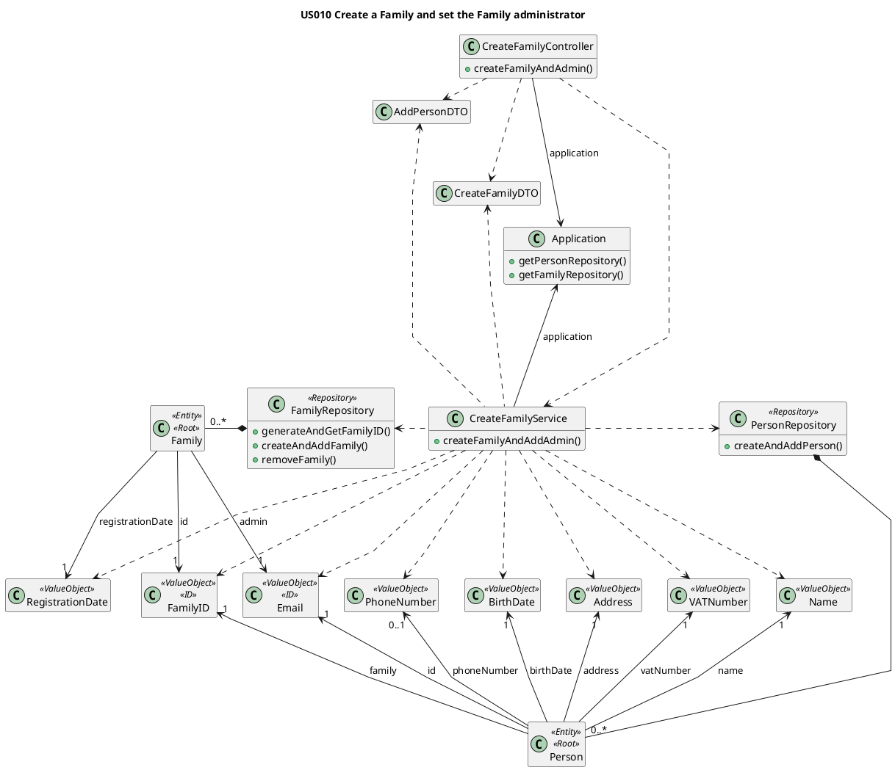

# US101 Add Family Members
=======================================

# 1. Requirements

## 1.1 Client Notes
*As a family administrator, I want to add family members*

We interpreted this requirement as the function of a family administrator adding a new Person to their family. 

This Person's email account must not exist in the Application since it is used as a unique ID.  

- A Person needs to have:
    - ID (email)
    - Name
    - Vat number
    - Address
    - Birthdate
    - Phone (none or one)
    - Family ID


## 1.2 Dependencies

### 1.2.1 Pre-conditions

### 1.2.2 Other User Stories

## 1.3 Acceptance Criteria

### 1.3.1 Success Cases

### 1.3.2 Failure Cases 

## 1.4 SSD



# 2. Analysis

## 2.1 Summary

At the moment a person can have one or no phone numbers when it is created.
Two options:

- Two Person constructors (One with phone number, one without)  
- One constructor with a validation for phone number that accepts a null Phone Number.

[COMMENT]: # (The first one seems better practice than the second one. Validate both)


The following Domain Model is only referring to this user story. The complete model can be found in the diagrams folder.


Each Person will have two types of attributes. The attributes *name*, *CCNumber*, *birthDate*, *address* and *vatNumber*
will have a **single value** but *EmailAddress* and *PhoneNumber* will behave differently. Both *EmailAddress* and *
PhoneNumber* are attributes that a Person can have more than one. A *Person* **must have at least one email**, but it's
possible that has **none or multiple** *PhoneNumbers*.

The **Person** must have the following characteristics with the following rules:

| **_Value Objects_**         | **_Business Rules_**                                                                   |
| :-------------------------- | :------------------------------------------------------------------------------------- |
| **CCNumber**                | Required, unique, CCNumber must have 8 numeric digits and 4 alphanumeric.              |
| **Name**                    | Required, string                                                                       |
| **BirthDate**               | Required, date(year-month-day)                                                         |
| **Address**                 | Required, string                                                                       |
| **VatNumber**               | Required, unique, Vat must have 9 numeric digits                                       |
| **EmailAddress**            | Required, unique, Email must follow a pattern                                          |
| **PhoneNumber**             | Non-Required, PhoneNumber must have 9 digits                                           |


## 2.2. Domain Model Excerpt



# 3. Design

## 3.1. Design decisions

The process to fulfill this requirement requires the actor to select they want to add a new person to their family, which would
prompt the input of the person's data.

The main user's FamilyID will be automatically retrieved by checking who is logged into the application. It will also verify if the main user is the admin of their own family.

Given the current absence of an UI layer the required data will be passed directly into the AddPersonController.

We chose to verify the uniqueness of the Email Address after instancing the email. This way we could minimize the possibility of duplicate emails being added since the verification would occur at the moment of addition to the family repository.


## 3.2. Class Diagram



## 3.3. Functionality Use

The CreateFamilyController creates a new CreateFamilyService object using a inputFamilyDTO, a inputPersonDTO and the
application.
The CreateFamilyService will create all the necessary value objects to create the family and administrator.
The CreateFamilyService will invoke the Application to retrieve the PersonRepository and FamilyRepository.
The CreateFamilyService will invoke the FamilyRepository to create a familyID and then a Family.
The CreateFamilyService will invoke the PersonRepository to create the Person object for the administrator,
providing the email from the admin is unique. If it isn't, the previously created Family will be deleted.
The CreateFamilyController will then return a true or false response depending on the sucess or insuccess
of creating the Family and administrator.


## 3.4. Sequence Diagram

````puml
@startuml

autonumber
header Sequence Diagram
title US101 Add a Family Member

actor "System Manager" as systemManager
participant "UI" as UI
participant ": Create\nFamilyController" as controller
participant ": CreateFamilyService" as FamAdminService
activate systemManager
systemManager -> UI: I want to create a Family \n and set the Administrator
activate UI
return request data
systemManager -> UI : input Family data and Administrator data
activate UI
UI -> controller : createFamilyAndAdmin(inputFamilyDTO,\n inputPersonDTO)
activate controller
controller -> FamAdminService** : create(application)
controller -> FamAdminService : createFamilyAndAddAdmin(inputFamilyDTO,\n inputPersonDTO)
activate FamAdminService

ref over FamAdminService

SequenceDiagram(2):
Service to Family and Person Creation

end

alt #transparent false
autonumber 23

FamAdminService --> controller : success
controller --> UI : success
UI --> systemManager : inform success

else true
autonumber 29

FamAdminService --> controller : fail
deactivate FamAdminService

controller --> UI : fail
deactivate controller
UI --> systemManager : inform failure
deactivate UI


end
@enduml
````

````puml
@startuml

autonumber 6
header Sequence Diagram
title US010 Create a Family and Set Administrator(2)

participant ": CreateFamilyService" as FamAdminService
participant " anApplication : \nApplication" as app
participant "aFamilyRepository \n: FamilyRepository" as frepository
participant "newFamily \n: Family" as family
participant "aPersonRepository \n: PersonRepository" as prepository
participant "administrator : \nPerson" as admin

-> FamAdminService : createFamilyAndAddAdmin(\ncreateFamilyDTO, inputPersonDTO)
activate FamAdminService

FamAdminService -> app : getFamilyRepository()
activate app
return aFamilyRepository
FamAdminService -> app : getPersonRepository()
activate app
return aPersonRepository


FamAdminService -> frepository: generateAndGetFamilyID()
activate frepository
frepository -> frepository : generateFamilyID()
return familyID

FamAdminService -> frepository: createAndAddFamily (familyName, \nfamilyID, registrationDate, adminEmail)
activate frepository

frepository -> family** : create(familyID, adminEmail, \nfamilyName, localDate)
activate family


frepository -> frepository : addToRepository(newFamily)

deactivate family
return


FamAdminService -> prepository : createAndAddPerson(name, birthdate, \nadminEmail, vat, phone, address, cc, familyID)
deactivate frepository


activate prepository
prepository -> prepository : isEmailAlreadyRegistered(email)

alt #transparent false
prepository -> admin** : create
activate admin


prepository -> prepository : addToRepository (admistrator)
prepository --> FamAdminService
deactivate admin
<-- FamAdminService : success

else true
autonumber 26

prepository --> FamAdminService
deactivate prepository
FamAdminService -> frepository : removeFamily(FamilyID)
activate frepository
return
<-- FamAdminService : fail
deactivate FamAdminService
end

@enduml
````


## 3.5. Applied Patterns

We applied the principles of Controller, Information Expert, Creator and PureFabrication from the GRASP pattern. We also
used the SOLID Single Responsibility Principle.

We applied the following principles:

- GRASP:
    - Information expert:
        - This pattern was used in classes that implemented the Account interface, like in this case CashAccount class, for returning a DTO with the account id and description without removing information outside the class;

    - Controller:
        - To deal with the responsibility of receiving input from outside the system (first layer after the UI) we use a case controller.

    - Pure Fabrication:
        - In this user story the Application and AccountService class was used, which does not represent a business domain concept. It was created to be responsible for all operations regarding Account type Classes.

    - High cohesion and Low Coupling:
        - The creation of the AccountService class provided low Coupling and high Cohesion, keeping one Class as the Information Expert.

    - Protected Variation:
        - An Account interface was used in which the polymorphism was used to be implemented in several classes, each representative of a type of Account.

- SOLID:
    - Single-responsibility principle:
        - this pattern was used in the AccountService class, in which it the only responsibility is manage account operations.


## 3.6. Tests

### 3.6.1. XXXX

#### 3.6.1.1. Success

#### 3.6.1.2. Failure


### 3.6.2. YYYY

#### 3.6.2.1. Success

#### 3.6.2.2. Failure


### 3.6.3. ZZZZ

#### 3.6.3.1. Success

#### 3.6.3.2. Failure


Several cases where analyzed in order to test the creation of a new Family

**Test 1:** Test that it is possible to create a new instance of Family with a valid Admin

**Test 2:** Test that it is not possible to create a new instance of Family if admin email is already registered

**Test 3:** Test that it is not possible to create a new instance of Family receiving a **familyName** that is null

**Test 4:** Test that it is not possible to create a new instance of Family receiving a **familyName** that is empty

**Test 5:** Test that it is not possible to create a new instance of Family receiving a **familyName** that is blank

**Additional Tests** Test that its not possible to create a new instance of Family if any attribure is empty, blank or
null The whole user story was tested for the case of success and for failure

**Test 5:** Success

```` 
@DisplayName("Test if a family can be successfully created")  
@Test
 void shouldBeTrueCreateFamily() {
        Application application = new Application();
        Create Family Controller controller = new Create Family Controller(application);
        CreateFamilyDTO inputFamilyDTO = new CreateFamilyDTO("tonyze@hotmail.com", "Silva", "Tony", "12/12/1990", 999999999, 919999999, "Rua das Flores", "Porto", 69, "4400-000", "139861572ZW2");
        
        assertTrue(controller.createFamilyAndAdmin(inputFamilyDTO));    
    }
````

**Test 6:** Failure

````
@DisplayName ("Test if a family isnt created if the admin email is already registered in the app")  
@Test
    void shouldBeFalseCreateFamilyEmailAlreadyregistered() {
        Application application = new Application();
        Create Family Controller controller = new Create Family Controller(application);
        CreateFamilyDTO createFamilyDTO1 = new CreateFamilyDTO("tonyze@hotmail.com", "Silva", "Tony", "12/12/1990", 999999999, 919999999, "Rua das Flores", "Porto", 69, "4400-000", "139861572ZW2");
        CreateFamilyDTO inputFamilyDTO2 = new CreateFamilyDTO("tonyze@hotmail.com", "Pereira", "Rita", "12/12/1990", 999999999, 919999999, "Rua das Flores", "Porto", 69, "4400-000", "139861572ZW2");
        controller.createFamilyAndAdmin(createFamilyDTO1);
        assertFalse(controller.createFamilyAndAdmin(inputFamilyDTO2));    
    }
    }
````

# 4. Implementation

[comment]: # (NOTE: Only critical methods for the US implementation)

1. All the Value Objects are initially instanced (instantiated), with respective validations.


      public boolean createFamilyAndAddAdmin() {
      boolean result;
      EmailAddress adminEmail = new EmailAddress(inputPersonDTO.unpackEmail());
      FamilyName familyName = new FamilyName(inputFamilyDTO.unpackFamilyName());
      Name name = new Name(inputPersonDTO.unpackName());
      BirthDate birthdate = new BirthDate(inputPersonDTO.unpackBirthDate());
      VATNumber vat = new VATNumber(inputPersonDTO.unpackVAT());
      PhoneNumber phone = new PhoneNumber(inputPersonDTO.unpackPhone());
      Address address = new Address(inputPersonDTO.unpackStreet(), inputPersonDTO.unpackCity(), inputPersonDTO.unpackZipCode(), inputPersonDTO.unpackHouseNumber());
      CCnumber cc = new CCnumber(inputPersonDTO.unpackCCNumber());
      RegistrationDate registrationDate = new RegistrationDate(inputFamilyDTO.unpackLocalDate());

2. Family ID is automatically generated by the Family Repository (Information Expert)


      public FamilyID generateAndGetFamilyID() {
        FamilyID familyID = new FamilyID(UUID.randomUUID());
        if (checkIfFamilyIDExists(familyID)) {
            familyID = generateAndGetFamilyID();
        }
        return familyID;
      }

3. AdminEmail is added to the Family upon its instantiation. The Family is immediately added to the FamilyRepository (
   The administrator email validation will come later.)


      public void createAndAddFamily(FamilyName familyName, FamilyID familyID, RegistrationDate registrationDate, EmailAddress adminEmail) {
        Family family = new Family(familyID, familyName, registrationDate, adminEmail);
        this.families.add(family);
      }

4. Before creating the Administrator, the email is validated in the Person Repository in order to guarantee that it is
   Unique


      private boolean isEmailAlreadyRegistered(EmailAddress email) {
        boolean emailIsRegistered = false;
        for (Person person : people) {
            if (person.isSameEmail(email)) {
                emailIsRegistered = true;
            }
        }
        return emailIsRegistered;
      }

5. If the Email fails verification, the Family is removed from the FamilyRepository and the process fails.


      try {
        personRepository.createAndAddPerson(name, birthdate, adminEmail, vat, phone, address, cc, familyID);
        result = true;
      } catch (EmailAlreadyRegisteredException e) {
        familyRepository.removeFamily(familyID);
        result = false;
      }
      return result;


# 5. Integration

[comment]: # (All other US's/features that this one will be added on !!!!!!)

The development of this user story was the basis for the family structure where the FamilyMembers are stored and was
thus crucial for the development of the other User Stories

# 6. Observations

[comment]: # (Tudo o que nao encaixe em lado nenhum vai para aqui AKA LIXOOOOOOO !!!!!!!)

As with the Standard Category the family ID will probably need to be reworked in a future sprint to allow for more
complex ID information if needed (probably using a UUID)